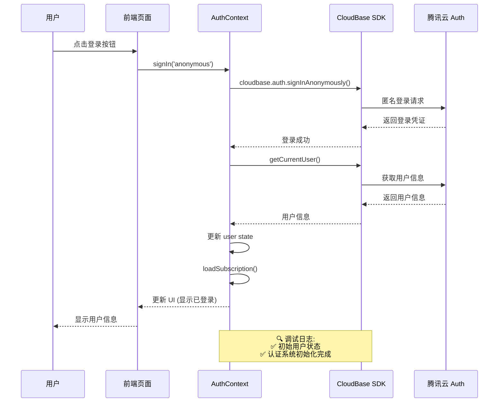
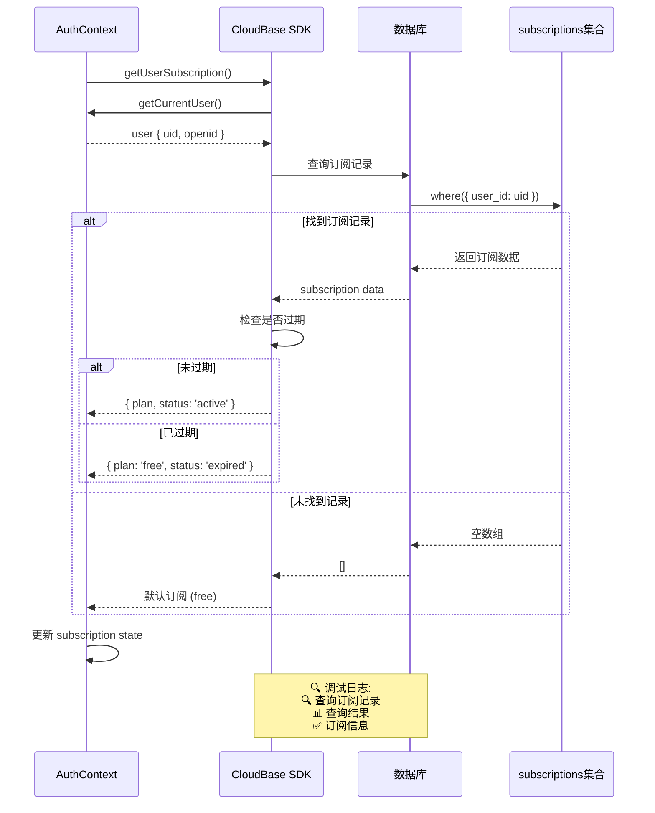
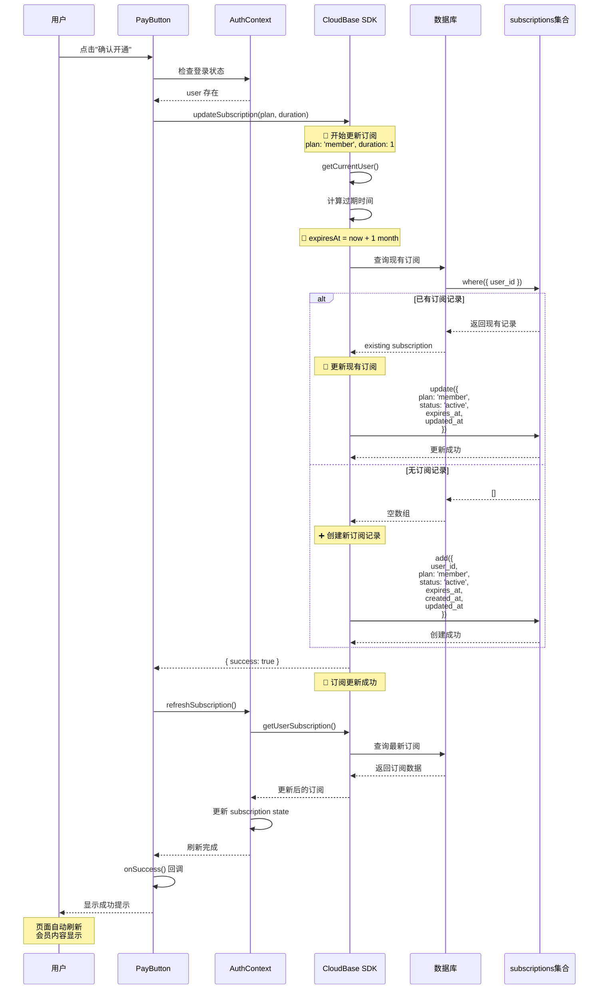
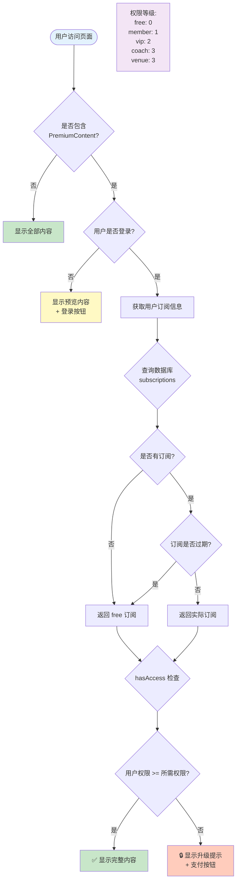
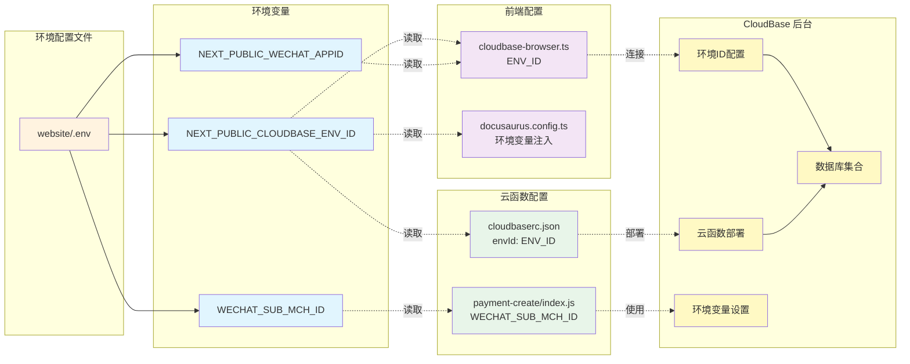
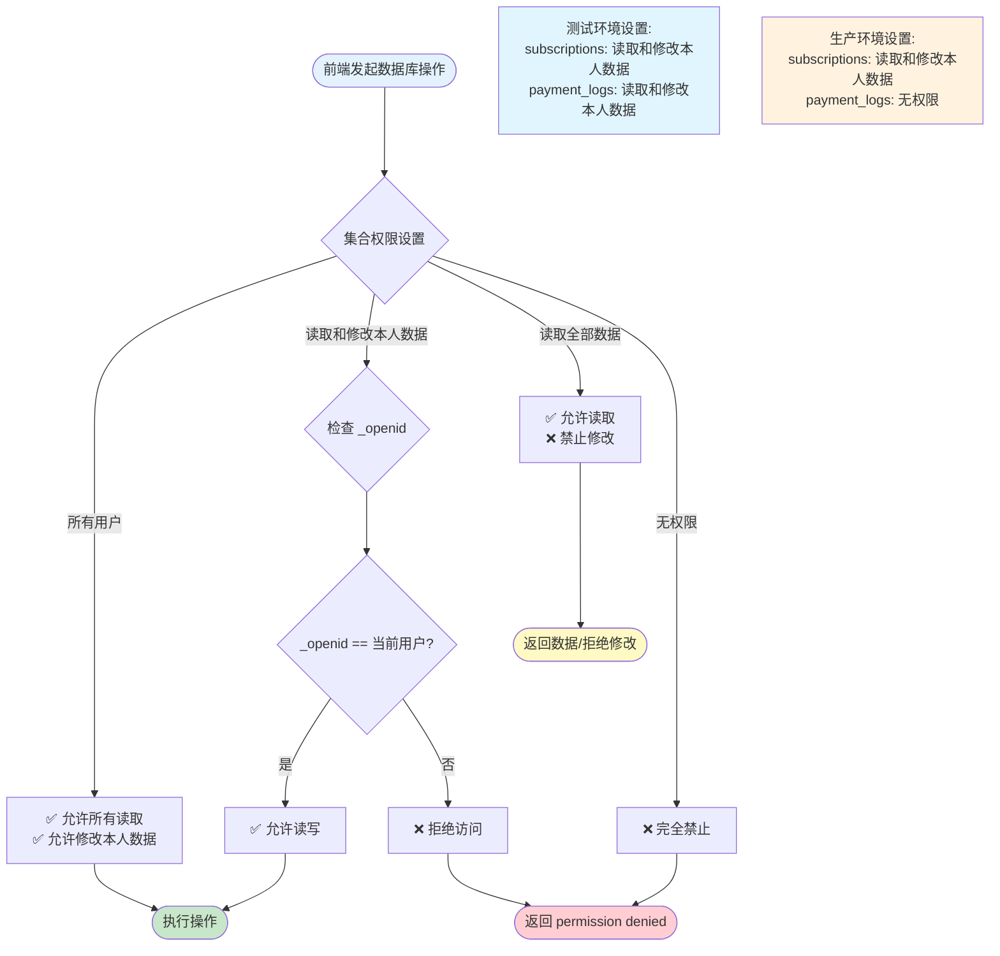
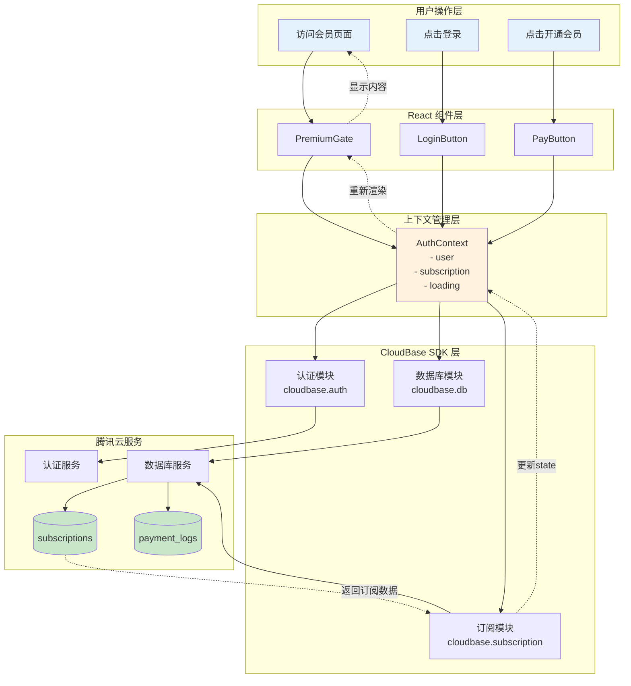
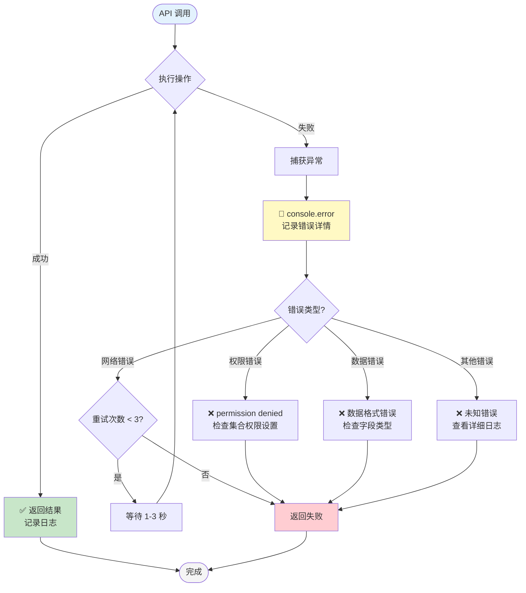

# CloudBase 数据库和支付系统设置指南

## 📌 快速操作指南

### 立即需要做的事：

1. **创建两个数据库集合** (5分钟)
   - 访问: https://console.cloud.tencent.com/tcb
   - 选择 `badminton-kb` 环境
   - 创建 `subscriptions` 集合，权限：**"读取和修改本人数据"**
   - 创建 `payment_logs` 集合，权限：**"读取和修改本人数据"** (测试用)

2. **测试支付流程** (2分钟)
   ```bash
   cd website
   npm start
   ```
   - 打开浏览器按 F12 查看控制台
   - 匿名登录 → 访问会员内容页 → 点击开通 → 查看日志

3. **验证结果**
   - 页面内容立即显示
   - CloudBase 控制台能看到订阅记录

---

## 当前状态

✅ CloudBase 环境已创建: `badminton-kb-0g3ceetq971337db`
✅ 前端认证系统已修复
✅ 调试日志已添加
❌ 数据库集合未创建 ← **你需要手动创建**
❌ 云函数未部署 (测试阶段不需要)

## 需要完成的步骤

### 1. 创建数据库集合

由于 CloudBase Node SDK 需要配置腾讯云密钥，建议通过 **Web 控制台** 手动创建集合。

#### 操作步骤：

1. **访问 CloudBase 控制台**
   https://console.cloud.tencent.com/tcb

2. **选择环境**
   选择 `badminton-kb` 环境

3. **进入数据库管理**
   左侧菜单 → 数据库 → 集合管理

4. **创建 `subscriptions` 集合**
   - 点击"新建集合"
   - 集合名称: `subscriptions`
   - **权限设置**: 选择 **"读取和修改本人数据"**
     - 适用场景：用户只能查看和修改自己的订阅信息
     - CloudBase 会自动添加 `_openid` 字段进行权限控制

   **字段结构**:
   ```json
   {
     "_openid": "string",        // CloudBase自动添加的用户标识
     "user_id": "string",        // 用户ID (与_openid相同)
     "plan": "string",           // 订阅计划: free/member/vip
     "status": "string",         // 状态: active/expired/cancelled
     "expires_at": "string",     // 过期时间 (ISO格式)
     "created_at": "string",     // 创建时间
     "updated_at": "string"      // 更新时间
   }
   ```

   **注意**:
   - `_openid` 字段会被 CloudBase 自动添加，不需要手动创建
   - 权限系统会确保用户只能访问自己的订阅记录

5. **创建 `payment_logs` 集合**
   - 点击"新建集合"
   - 集合名称: `payment_logs`
   - **权限设置**: 选择 **"无权限"**
     - 适用场景：敏感的支付日志，只允许云函数访问
     - 用户无法直接读取或修改支付记录

   **字段结构**:
   ```json
   {
     "_openid": "string",        // CloudBase自动添加的用户标识
     "user_id": "string",        // 用户ID
     "order_no": "string",       // 订单号
     "amount": "number",         // 金额(分)
     "plan": "string",           // 订阅计划
     "status": "string",         // 状态: pending/success/failed
     "transaction_id": "string", // 微信交易号
     "created_at": "string",     // 创建时间
     "updated_at": "string"      // 更新时间
   }
   ```

   **注意**:
   - 此集合设置为"无权限"，确保用户无法直接操作支付日志
   - 实际生产环境中，支付日志应该只由云函数写入

### 权限设置说明

**重要提示**: 由于我们目前在测试阶段，**建议两个集合都暂时设置为"读取和修改本人数据"**，方便浏览器端直接测试。

**测试阶段权限** (推荐):
- ✅ `subscriptions`: **"读取和修改本人数据"**
- ✅ `payment_logs`: **"读取和修改本人数据"** (临时，方便调试)

**生产环境权限** (部署云函数后):
- ✅ `subscriptions`: **"读取和修改本人数据"**
- ✅ `payment_logs`: **"无权限"** (只允许云函数访问)

### 2. 测试支付流程

完成数据库集合创建后，按以下步骤测试：

#### 步骤 1: 启动开发服务器

```bash
cd website
npm start
```

#### 步骤 2: 打开浏览器控制台

- 按 F12 打开开发者工具
- 切换到 Console 标签页
- 观察调试日志输出

#### 步骤 3: 测试登录

1. 点击"登录"按钮
2. 选择"匿名登录"（测试用）
3. 观察控制台日志:
   ```
   🔄 初始化认证系统...
   ✅ 初始用户状态: {...}
   ✅ 认证系统初始化完成
   ```

#### 步骤 4: 测试支付

1. 访问会员内容页面（如 `/example-with-premium`）
2. 点击"升级到普通会员"按钮
3. 在弹窗中点击"确认开通"
4. 观察控制台日志:
   ```
   📝 开始更新订阅: {plan: 'member', duration: 1}
   ✅ 用户信息: {...}
   ✅ 数据库已初始化
   📅 计算过期时间: ...
   🔍 查询现有订阅...
   📊 查询结果: []
   ➕ 创建新订阅记录...
   ✅ 创建结果: {...}
   🎉 订阅更新成功！
   ```

5. 页面应该自动刷新并显示会员内容

#### 步骤 5: 验证数据

1. 返回 CloudBase 控制台
2. 进入数据库 → `subscriptions` 集合
3. 应该能看到新创建的订阅记录

### 3. 常见问题排查

#### 问题 1: 点击"确认开通"后页面内容不显示

**可能原因**:
- 数据库集合未创建
- 数据写入失败（权限问题）
- 状态刷新失败

**排查方法**:
1. 检查控制台日志中的错误信息
2. 确认数据库集合已创建
3. **检查集合权限设置是否为"读取和修改本人数据"**
4. 确认订阅记录已写入数据库
5. 刷新页面查看是否显示内容

#### 问题 1.1: 数据库操作失败 (permission denied)

**错误信息示例**:
```
❌ 更新订阅失败: permission denied
```

**原因**: 数据库集合权限设置不正确

**解决方法**:
1. 进入 CloudBase 控制台 → 数据库 → 集合管理
2. 找到 `subscriptions` 集合
3. 点击"权限设置"
4. 选择 **"读取和修改本人数据"**
5. 保存设置
6. 重新测试

#### 问题 2: 登录失败

**可能原因**:
- CloudBase SDK 初始化失败
- 环境ID配置错误

**排查方法**:
1. 检查 `.env` 文件中的 `NEXT_PUBLIC_CLOUDBASE_ENV_ID`
2. 确认值为: `badminton-kb-0g3ceetq971337db`
3. 重新启动开发服务器

#### 问题 3: 数据库查询失败

**可能原因**:
- 集合名称拼写错误
- 权限设置不正确

**排查方法**:
1. 确认集合名称: `subscriptions` (小写,复数)
2. 检查集合权限设置
3. 查看控制台错误信息

### 4. 云函数部署（可选）

目前使用的是**模拟支付**，不需要部署云函数。如需真实支付，按以下步骤部署：

```bash
# 部署所有云函数
cloudbase functions:deploy payment-create
cloudbase functions:deploy payment-callback
cloudbase functions:deploy check-subscription
cloudbase functions:deploy expire-subscriptions
```

**注意**: 真实支付需要配置微信支付商户号和密钥。

### 5. 生产环境部署

```bash
# 1. 构建网站
cd website
npm run build

# 2. 部署到 CloudBase
cloudbase hosting:deploy ./build -e badminton-kb-0g3ceetq971337db
```

## 调试日志说明

### 认证流程日志

- 🔄 初始化认证系统
- ✅ 用户状态/信息
- ❌ 错误信息

### 订阅流程日志

- 📝 开始更新订阅
- 🔍 查询订阅记录
- 📊 查询结果
- ➕ 创建新订阅
- 🔄 更新现有订阅
- ✅ 操作成功
- ❌ 操作失败

### 支付流程日志

- 💳 支付相关操作
- 📅 日期计算
- 🎉 流程完成

## 下一步建议

1. ✅ 完成数据库集合创建
2. ✅ 测试完整支付流程
3. 🔧 根据调试日志排查问题
4. 📊 验证数据库记录
5. 🚀 部署到生产环境

## 系统架构与流程图

### 1. 整体系统架构

```mermaid
graph TB
    subgraph "前端 Frontend"
        A[Docusaurus 静态站点]
        B[React 组件]
        C[AuthContext 认证上下文]
        D[PremiumGate 权限控制]
        E[PayButton 支付按钮]
    end

    subgraph "CloudBase SDK"
        F[cloudbase-browser.ts]
        G[@cloudbase/js-sdk]
    end

    subgraph "腾讯云 CloudBase"
        H[认证服务 Auth]
        I[数据库 Database]
        J[云函数 Functions]
        K[云存储 Storage]
    end

    subgraph "数据库集合"
        L[(subscriptions)]
        M[(payment_logs)]
    end

    A --> B
    B --> C
    C --> F
    D --> C
    E --> C
    F --> G
    G --> H
    G --> I
    I --> L
    I --> M
    J --> I

    style A fill:#e1f5ff
    style H fill:#fff4e6
    style I fill:#fff4e6
    style J fill:#fff4e6
    style L fill:#e8f5e9
    style M fill:#e8f5e9
```

### 2. 用户认证流程



### 3. 订阅查询流程



### 4. 支付开通流程 (模拟支付)



### 5. 权限校验流程



### 6. 配置参数位置与说明



### 7. 配置参数详细说明

| 参数名称 | 位置 | 用途 | 示例值 |
|---------|------|------|--------|
| `NEXT_PUBLIC_CLOUDBASE_ENV_ID` | `.env` | CloudBase 环境ID | `badminton-kb-0g3ceetq971337db` |
| `NEXT_PUBLIC_WECHAT_APPID` | `.env` | 微信公众号/小程序 AppID | `wx1234567890abcdef` |
| `WECHAT_SUB_MCH_ID` | `.env` | 微信支付子商户号 | `1234567890` |

#### 配置文件示例:

**website/.env**
```bash
# CloudBase 环境ID (必须以 NEXT_PUBLIC_ 开头，才能在浏览器端访问)
NEXT_PUBLIC_CLOUDBASE_ENV_ID=badminton-kb-0g3ceetq971337db

# 微信公众号/小程序 AppID
NEXT_PUBLIC_WECHAT_APPID=your_wechat_appid

# 微信支付子商户号 (仅云函数使用，不需要 NEXT_PUBLIC_ 前缀)
WECHAT_SUB_MCH_ID=your_sub_mch_id
```

#### 使用位置:

1. **cloudbase-browser.ts** (第 26 行)
   ```typescript
   const ENV_ID = process.env.NEXT_PUBLIC_CLOUDBASE_ENV_ID || 'badminton-kb-0g3ceetq971337db';
   ```

2. **cloudbaserc.json** (第 4 行)
   ```json
   "envId": "{{env.ENV_ID}}"
   ```

3. **payment-create/index.js** (第 74 行)
   ```javascript
   subMchId: process.env.WECHAT_SUB_MCH_ID
   ```

### 8. 数据库权限校验流程



### 9. 完整数据流向图



### 10. 错误处理与重试机制



## 帮助资源

- CloudBase 文档: https://docs.cloudbase.net/
- CloudBase 控制台: https://console.cloud.tencent.com/tcb
- 项目文档: `CLOUDBASE_QUICKSTART.md`
