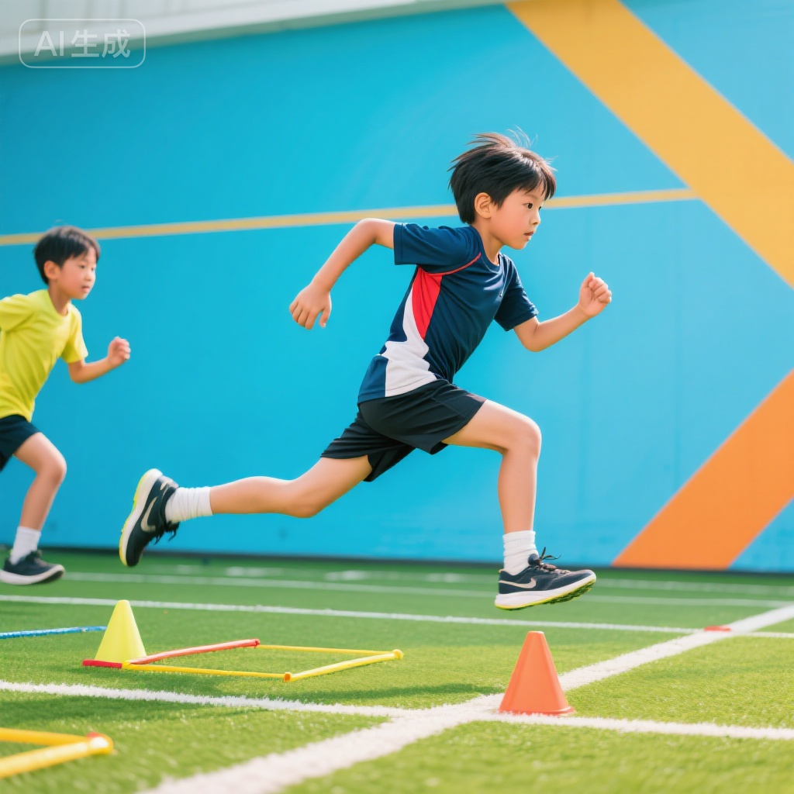
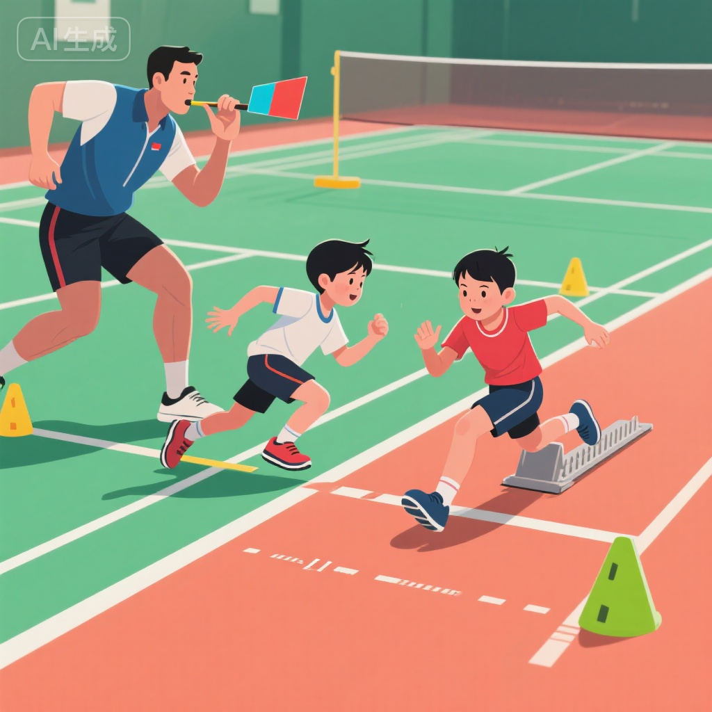
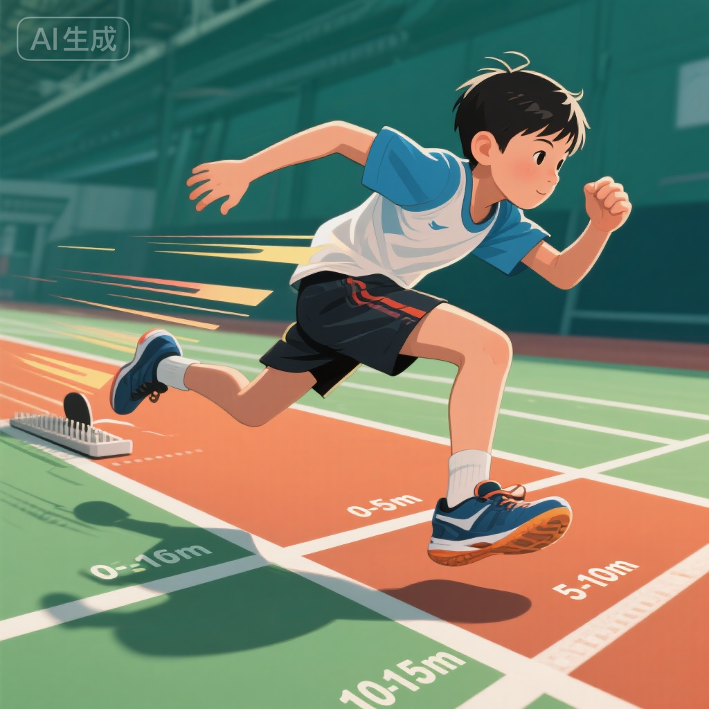
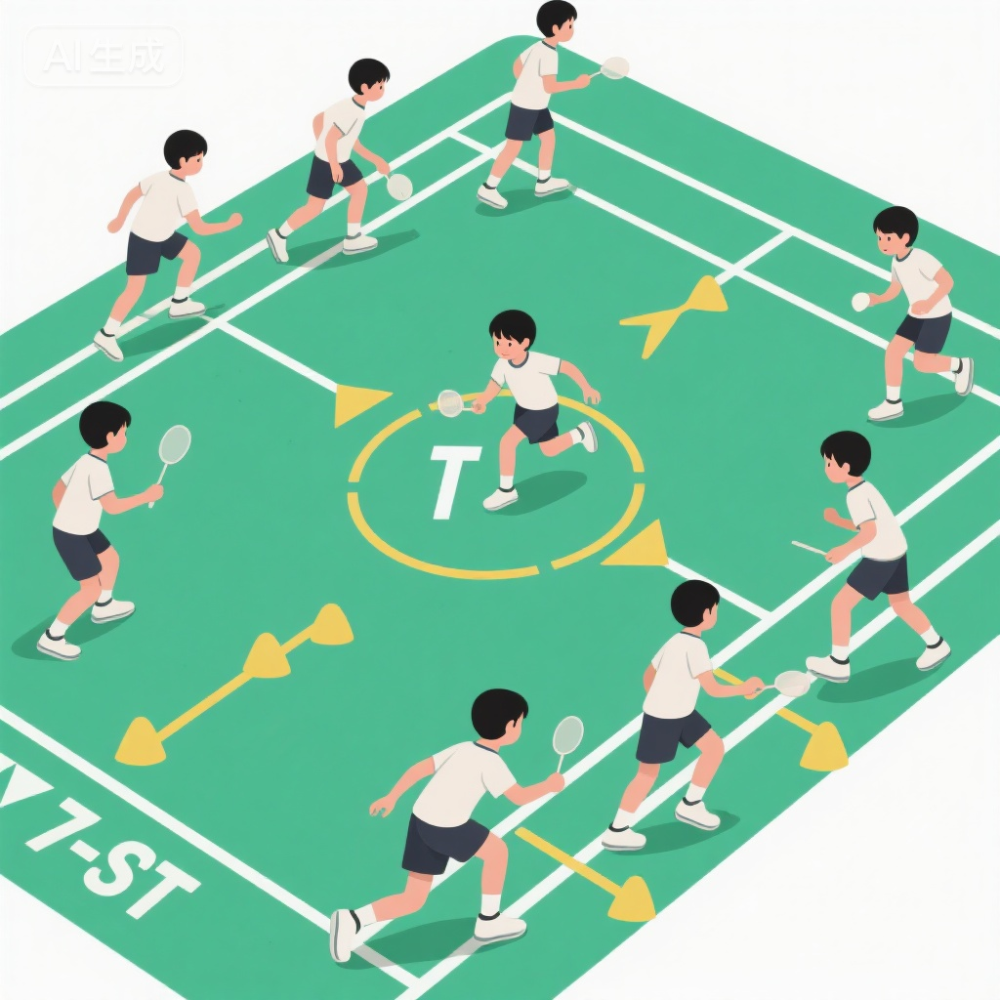
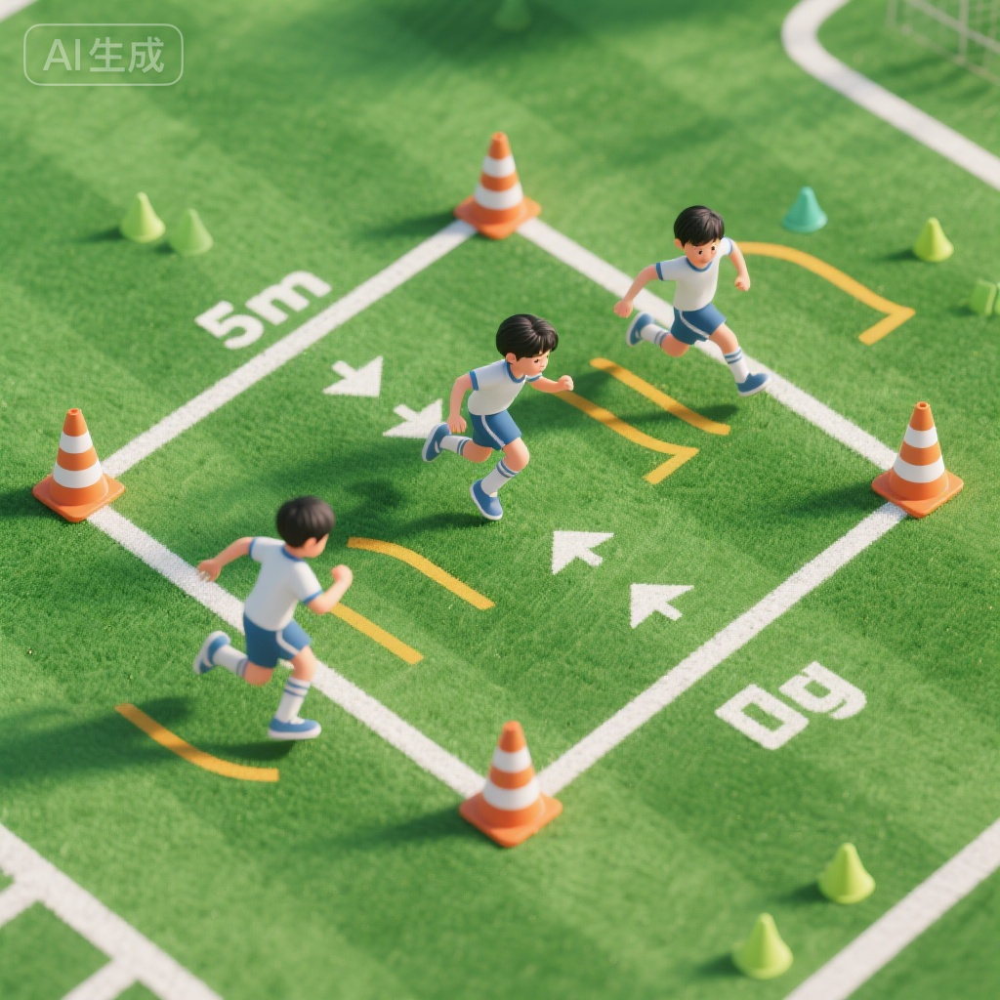
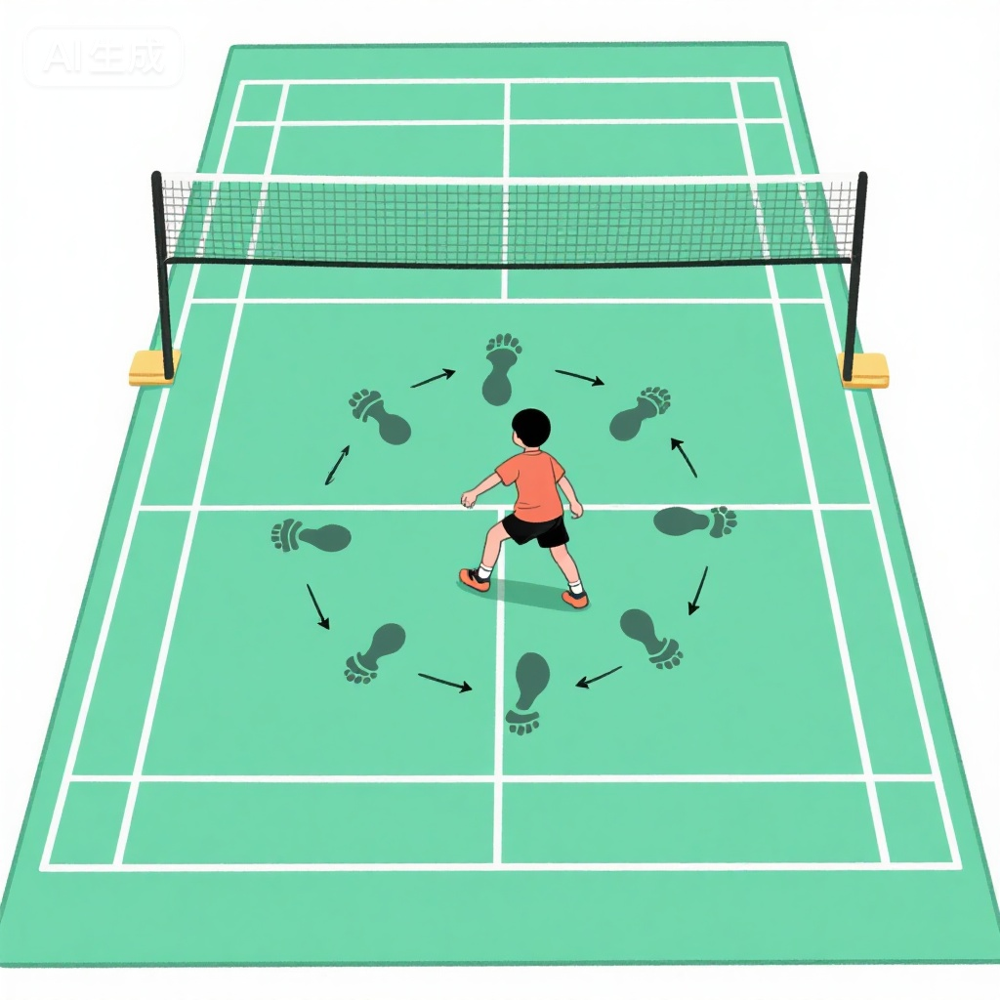
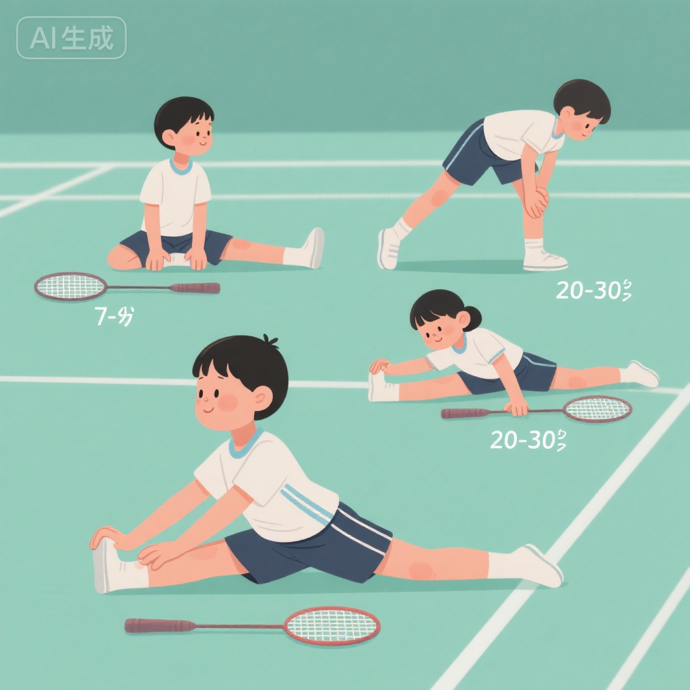

# 速度与敏捷性训练 - 7-9岁基础期

> **适用年龄**: 7-9岁 | **训练类型**: 速度敏捷 | **难度**: 进阶 | **时长**: 40-50分钟

## 📝 训练目标

7-9岁是速度素质发展的"黄金窗口期"，本训练方案旨在：

- **反应速度**: 缩短从接收信号到启动动作的时间（<0.3秒）
- **加速能力**: 提升起动后5-10米的加速度
- **方向转换**: 增强快速改变移动方向的能力
- **移动敏捷性**: 提高在复杂环境中的灵活移动
- **专项结合**: 为羽毛球步法（并步、交叉步、跳步）建立基础

## 🎯 科学依据

### 7-9岁速度敏感期特征

**生理发育优势**:
- **神经系统**: 7-9岁是神经反应速度发展的第一高峰期，大脑信息处理速度显著提升
- **肌纤维**: 快肌纤维（II型）开始分化发育，具备发展爆发力的生理基础
- **能量系统**: 磷酸原系统（ATP-CP）发育成熟，支持短时高强度运动
- **骨骼肌肉**: 骨骼生长速度较快，但肌肉力量相对较弱，适合发展速度而非最大力量

**运动能力发展**:
- 10米冲刺时间：7岁约3.5秒，9岁约3.0秒
- 反应时间：7岁约0.4秒，9岁约0.3秒
- 方向转换次数：7岁每10秒3次，9岁每10秒5次

### 训练理论基础

> **速度敏感期理论**: 7-9岁儿童神经系统兴奋性高、灵活性好，是发展反应速度和动作速度的最佳时期。错过此阶段，后期弥补难度大幅增加。

> **专项适应原则**: 速度训练需结合羽毛球专项特点（前后左右移动、急停急起、小范围折返），才能有效转化为比赛能力。

## 🏃 训练内容

### 热身活动（8-10分钟）



#### 阶段1: 动态拉伸（3分钟）

**1. 高抬腿行进**
- 大腿抬至水平
- 保持上身挺直
- 距离：20米 × 2次

**2. 后踢腿跑**
- 脚跟踢至臀部
- 保持躯干稳定
- 距离：20米 × 2次

**3. 侧向交叉步**
- 双脚交叉侧向移动
- 保持面向前方
- 距离：15米 × 2次（左右各1次）

#### 阶段2: 激活性练习（5分钟）

**快速小步跑**:
- 频率：每秒3-4步
- 距离：10米 × 3次
- 重点：快速脚步频率

**A-Skip跑**:
- 单腿高抬膝盖，另一腿跳起
- 强调膝关节快速上抬
- 距离：15米 × 2次

### 主要训练（30-35分钟）

#### 训练模块1：反应速度训练



**目的**: 缩短从视觉/听觉信号到启动的时间

**训练1: 信号启动冲刺**

**设置**:
- 起跑线后3米准备
- 教练发出信号（哨声/手势/颜色卡）
- 儿童快速冲刺10米

**信号变化**:
- 听觉信号：哨声、口令（"跑！"）
- 视觉信号：挥手、彩色卡片
- 组合信号：特定颜色配特定动作

**训练参数**:
- 每组：8次冲刺
- 组间休息：2分钟
- 完成：3组

**进阶变化**:
- 不同起始姿势（站立、蹲姿、俯卧、背对）
- 延迟信号（预备-停顿-信号）
- 假信号干扰（错误信号不启动）

**训练2: 追光游戏**

**游戏规则**:
- 墙上投射光点（手电筒或激光笔）
- 光点随机移动
- 儿童快速跑向并触碰光点
- 计时1分钟内触碰次数

**训练价值**:
- 提高视觉追踪能力
- 训练快速启动和急停
- 增强预判和反应

#### 训练模块2：加速度训练



**训练1: 分段加速跑**

**训练设计**:
```
0-5米：爆发加速（全力冲刺）
5-10米：维持速度
10-15米：减速区（缓冲）
```

**技术要点**:
- 前倾身体角度（约45度）
- 快速有力蹬地
- 手臂配合摆动（前90度，后120度）
- 小步幅高频率（前5米）

**训练参数**:
- 单次距离：15米
- 重复次数：6-8次
- 组间休息：90秒

**训练2: 坡度冲刺**（可选）

**场地要求**:
- 缓坡（坡度5-10度）
- 长度15-20米

**训练方法**:
- 上坡冲刺：发展爆发力和力量
- 下坡冲刺：提高步频和速度感
- 平地冲刺：巩固技术

#### 训练模块3：敏捷性与方向转换



**训练1: T字敏捷测试训练**

**场地布置**:
```
       C (5m)
        |
A ---5m---B---5m--- D
        |
       起点
```

**动作流程**:
1. 从起点冲刺到B点（前进）
2. 侧滑步到C点（左移）
3. 侧滑步经B到D点（右移）
4. 侧滑步回到B点
5. 倒退跑回起点

**技术要求**:
- 每个转折点必须触碰地面标记
- 保持低重心
- 快速转换方向
- 全程面向前方（侧移时不转身）

**训练参数**:
- 计时完成：记录最佳成绩
- 重复次数：5次
- 组间休息：2分钟

**标准时间**（秒）:
- 7岁：<13秒
- 8岁：<12秒
- 9岁：<11秒

**训练2: Z字绕桩跑**

**场地设置**:
- 5个标志盘，间隔3米，Z字排列
- 总长度：约15米

**动作要求**:
- 快速绕过每个标志盘
- 外侧脚用力蹬地转向
- 身体前倾保持平衡
- 手臂配合身体转向

**变化训练**:
- 正向Z字跑
- 反向Z字跑
- 单脚跳Z字（高级）

**训练3: 四角折返跑**



**场地**: 5m × 5m正方形

**训练流程**:
1. 从A角出发，冲刺到B角（触地）
2. 转身冲刺回A角（触地）
3. 冲刺到C角（对角线，触地）
4. 冲刺回A角（触地）
5. 重复B、C、D三个角

**评分标准**:
- 完成时间：<20秒（优秀）
- 触地次数：8次（必须完成）
- 动作规范：转身快速、无多余步伐

#### 训练模块4：羽毛球专项步法结合



**训练1: 六点移动**

**场地布置**: 模拟羽毛球场六个击球点
```
    左前场    右前场
        \  |  /
         \ | /
          中心
         / | \
        /  |  \
   左后场    右后场
```

**动作模式**:
- 中心→前场：并步/交叉步前进
- 中心→后场：后退步/交叉步后退
- 前场→中心：后撤步
- 后场→中心：快速回动

**训练流程**:
1. 站在中心位置
2. 教练随机指示方向
3. 快速移动到指定位置（模拟击球）
4. 迅速回到中心位置
5. 持续1分钟

**技术强调**:
- 启动时第一步要小而快
- 移动中保持低重心
- 到位后制动要稳
- 回动积极迅速

**训练2: 米字步法训练**

**动作要点**:
- 前两点：并步+跨步
- 后两点：后退交叉步
- 左右两点：侧向并步
- 四个斜角：斜向交叉步

**训练参数**:
- 每个方向：5次
- 完整循环：2组
- 组间休息：3分钟

### 放松整理（5-8分钟）



#### 静态拉伸序列

**1. 大腿后侧（腘绳肌）**
- 坐姿体前屈
- 保持30秒 × 2次

**2. 大腿前侧（股四头肌）**
- 站立拉腿至臀部
- 保持25秒 × 2次（每侧）

**3. 小腿（腓肠肌）**
- 弓步压腿
- 保持30秒 × 2次（每侧）

**4. 髋部拉伸**
- 蝴蝶式坐姿
- 保持30秒

#### 深呼吸恢复

- 慢走2分钟
- 深呼吸练习（腹式呼吸）
- 心率恢复至120次/分以下

## ⚠️ 安全注意事项

::: warning 速度训练特别提示

### 训练前准备
- ✓ **充分热身**: 至少8-10分钟动态热身
- ✓ **检查场地**: 确保地面平整、干燥、无杂物
- ✓ **合适装备**: 必须穿运动鞋（有缓冲、防滑）
- ✓ **身体状态**: 确认无伤病、充足睡眠、非空腹

### 训练强度监控
- ⚠️ **心率监控**: 训练中心率不超过170次/分
- ⚠️ **休息充分**: 高强度冲刺间隔≥90秒
- ⚠️ **技术优先**: 动作变形时降低速度
- ⚠️ **疲劳识别**: 反应迟钝、失误增多→立即休息

### 运动损伤预防
- 🚨 **常见风险**: 肌肉拉伤、踝关节扭伤、膝盖过度使用
- 🚨 **预防措施**:
  - 渐进加量（每周增加<10%）
  - 力量训练配合（核心、下肢）
  - 充足恢复时间（48小时）
  - 正确技术指导

### 急停制动安全
- ✓ 设置足够减速区（≥3米）
- ✓ 教授正确制动技术
- ✓ 避免急转弯造成扭伤
:::

## 📊 训练效果评估

### 即时测试指标

| 测试项目 | 7岁标准 | 8岁标准 | 9岁标准 | 测试方法 |
|---------|---------|---------|---------|---------|
| 10米冲刺 | 3.5秒 | 3.2秒 | 3.0秒 | 电子计时 |
| 反应时间 | 0.40秒 | 0.35秒 | 0.30秒 | 光电门测试 |
| T字敏捷 | 13秒 | 12秒 | 11秒 | 手动计时 |
| 四角折返 | 22秒 | 20秒 | 18秒 | 手动计时 |

### 阶段性评估（8周）

**体能测试**:
1. **30米冲刺**: 进步≥0.3秒
2. **立定跳远**: 增加≥10cm
3. **折返跑**: 效率提升≥15%

**专项能力**:
1. **六点移动**: 完成时间缩短≥5秒
2. **米字步法**: 动作规范度提升
3. **实战应用**: 场上移动速度提高

## 💡 教练专业指导

::: tip 速度训练核心要点

### 训练频率安排

**周计划**:
- 周一：反应速度 + 技术
- 周三：加速度 + 专项步法
- 周五：敏捷性 + 综合游戏
- 周末：休息或轻度活动

**单次时长**:
- 纯速度训练：20-25分钟
- 含热身整理：40-50分钟
- 避免超过60分钟

### 技术教学重点

**起跑技术**:
1. 身体前倾（重心在前脚）
2. 第一步小而快
3. 积极摆臂提供动力

**转向技术**:
1. 降低重心
2. 外侧脚用力蹬地
3. 身体向转向方向倾斜

**制动技术**:
1. 提前减速（最后2-3步）
2. 降低重心
3. 小步快频调整

### 常见错误纠正

| 错误表现 | 原因分析 | 纠正方法 |
|---------|---------|---------|
| 起跑反应慢 | 注意力不集中 | 强化专注力训练，变化信号 |
| 冲刺步幅过大 | 追求步幅忽视频率 | 强调小步高频，画线控制 |
| 转向时减速明显 | 技术不熟练 | 降低速度练习转向技术 |
| 快速疲劳 | 休息不足 | 延长间歇时间，控制组数 |
:::

## 🏠 家庭辅助训练

### 日常速度游戏

**"红绿灯"游戏**（客厅/走廊）:
- 绿灯：快速移动
- 黄灯：慢速移动
- 红灯：立即停止
- 时长：5分钟

**"影子游戏"**（户外）:
- 一人领队，快速变换方向
- 另一人跟随，模仿动作
- 锻炼反应和敏捷

### 周末户外活动

**公园趣味训练**:
- 🏃 追逐游戏：捉迷藏、老鹰捉小鸡
- 🎯 折返跑：设置标志物往返冲刺
- 🌳 绕树跑：绕树做Z字跑

## 📚 延伸阅读

- [羽毛球基本步法教学](../technical-fundamentals/footwork-basics.md)
- [反应能力专项训练](./reaction-training-advanced.md)
- [青少年力量训练基础](../../theory/physical-training-science/youth-strength-training.md)
- [运动损伤预防 - 下肢](../../theory/injury-prevention/lower-body-injury-prevention.md)

## 🔗 术语解释

- **反应速度**: 从接收刺激到开始动作的时间，主要由神经系统决定。([详细](../../glossary/terminology.md#reaction-speed))
- **加速度**: 单位时间内速度的变化率，体现启动和冲刺能力。([详细](../../glossary/terminology.md#acceleration))
- **敏捷性**: 快速改变身体位置和方向的能力，包含速度和协调性。([详细](../../glossary/terminology.md#agility))

---

**参考文献**:
1. Balyi, I., Way, R., & Higgs, C. (2023). Long-Term Athlete Development
2. 《青少年速度训练指南》，中国田径协会，2023年
3. Lloyd, R. S., & Oliver, J. L. (2020). Strength and Conditioning for Young Athletes (2nd ed.)

**版权声明**: 青少年羽毛球训练知识库原创内容 | **审核**: ✓ 已审核 | **更新**: 2025-11-10
