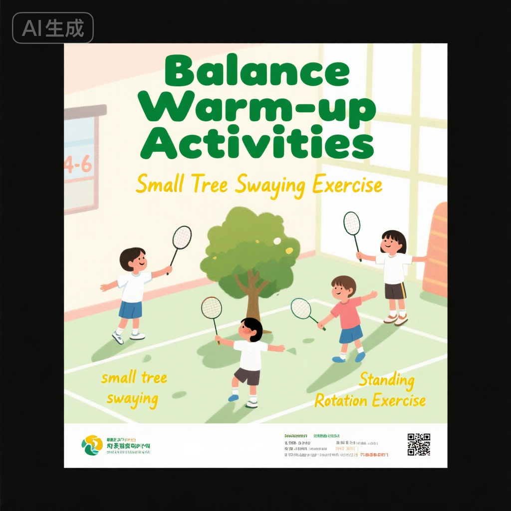
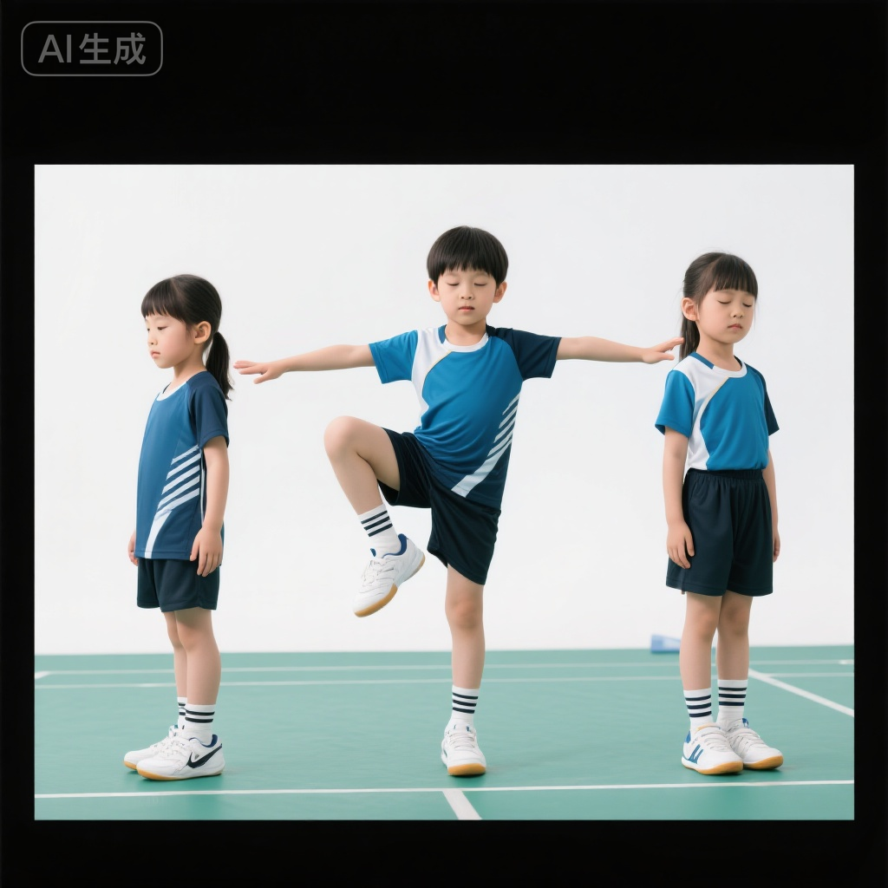
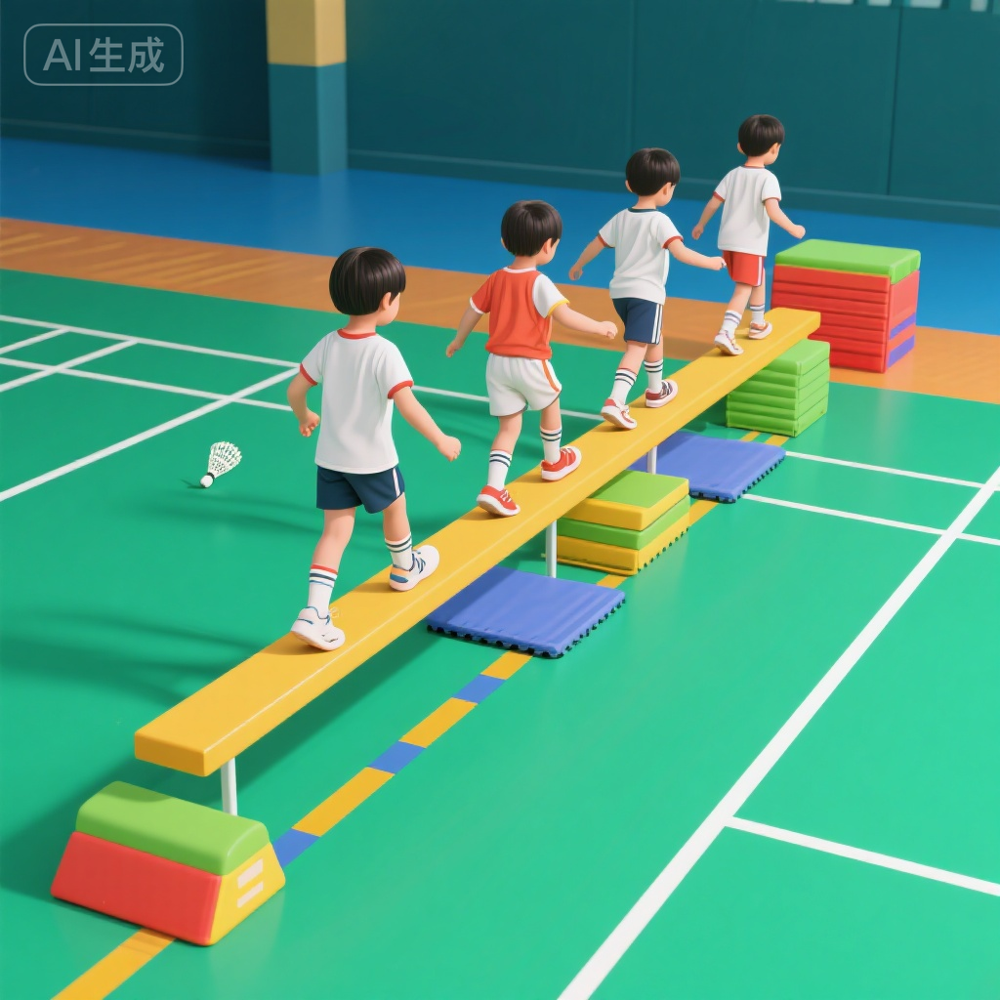
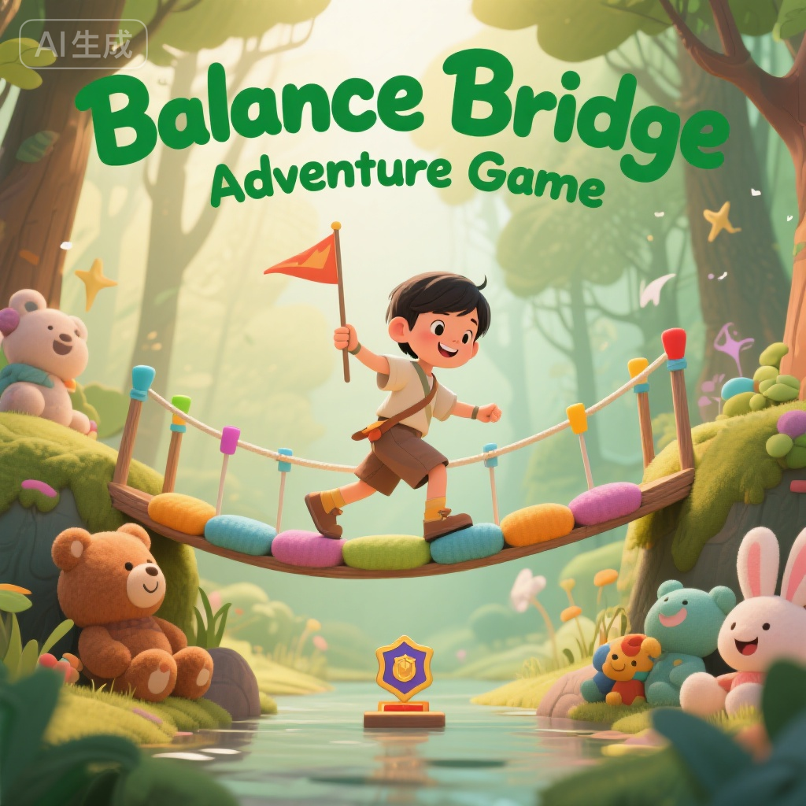
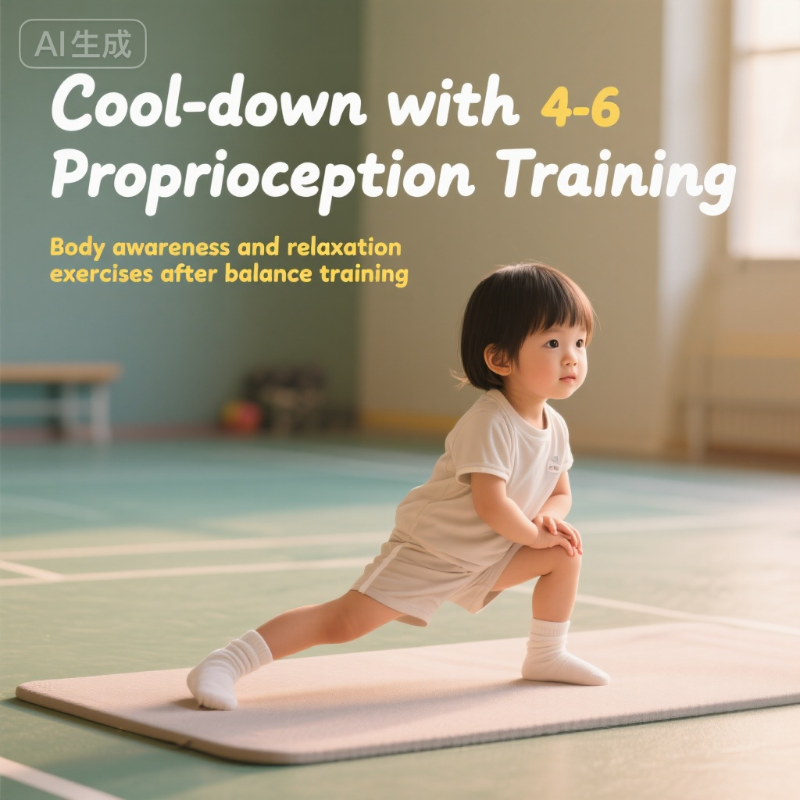

# 平衡能力训练 - 4-6岁儿童基础

> **适用年龄**: 4-6岁 | **训练类型**: 体能训练 | **难度**: 基础 | **时长**: 30-40分钟

## 📝 训练目标

通过系统的平衡训练帮助4-6岁儿童建立稳定的身体控制能力：

- **静态平衡**: 在固定姿势下保持身体稳定的能力
- **动态平衡**: 在移动过程中控制身体平衡的能力
- **本体感觉**: 提高对自身身体位置和姿态的感知
- **核心力量**: 发展维持平衡所需的核心肌群力量
- **自信心建立**: 通过挑战性活动增强自我效能感

## 🎯 科学依据

### 发育特点与训练窗口期

4-6岁儿童平衡能力发展的关键特征：

**生理发育**:
- **前庭系统**: 内耳平衡器官快速发育，对身体倾斜、旋转敏感度提高
- **视觉系统**: 双眼协调能力增强，能够利用视觉信息辅助平衡
- **本体感受**: 肌肉、关节感受器发育，身体位置感知能力提升
- **核心肌群**: 腹部、背部肌肉力量增长，为平衡提供支撑

**运动发展阶段**:
- 3-4岁：单脚站立1-5秒
- 4-5岁：单脚站立5-10秒，能够走窄线
- 5-6岁：单脚站立10秒以上，可以单脚跳跃

### 理论依据

> **平衡能力发展模型**: 儿童平衡能力发展遵循"静态平衡 → 动态平衡 → 复杂环境平衡"的渐进规律。4-6岁是建立基础平衡感的关键期。

> **感觉统合理论**: 平衡训练能够促进前庭觉、本体觉、视觉的整合，提升大脑对身体的控制能力，对儿童整体运动发展有重要作用。

## 🏃 训练内容

### 热身活动（5-8分钟）

目标：激活平衡相关肌群，建立身体感知



#### 1. 身体摇摆游戏

**"小树摇摇"**:
- 双脚并拢站立，想象自己是一棵小树
- 微风吹来：身体轻轻左右摇摆
- 大风吹来：加大摇摆幅度，但脚不能移动
- 时长：2分钟

**教学要点**:
- 保持双脚稳定，只有上半身摇摆
- 鼓励儿童找到身体的"摇摆极限"
- 配合语言："风停了，小树站稳了"

#### 2. 原地旋转

**动作要求**:
- 双臂侧平举
- 原地慢速旋转3-5圈
- 停止后保持站立3秒
- 重复2-3次（左右方向各一次）

**安全提示**:
- 控制旋转速度，避免眩晕
- 旋转后给予10-15秒恢复时间
- 观察儿童反应，及时调整

### 主要训练（20-25分钟）

#### 训练项目1：静态平衡 - 单脚站立挑战



**训练目的**: 建立静态平衡基础，增强下肢力量和稳定性

**进阶训练序列**:

**Level 1: 双脚站立基础**（适合初学者）
- 双脚并拢站立，保持10秒
- 双臂自然下垂或侧平举
- 目标：身体不晃动

**Level 2: 单脚站立入门**
- 抬起一只脚，膝盖微屈
- 抬起的脚不接触支撑腿
- 保持时间：3-5秒
- 重复：左右脚各5次

**Level 3: 闭眼单脚站立**（挑战级）
- 先睁眼单脚站立稳定后
- 轻轻闭上眼睛
- 保持时间：3秒
- 重复：左右脚各3次

**Level 4: 动态单脚平衡**
- 单脚站立时，双臂做各种动作
  - 上举、侧举、画圈
  - 抬起的脚前后摆动
- 保持身体稳定不晃动

**训练参数**:
- 每个Level完成后休息30秒
- 根据儿童能力选择合适起点
- 鼓励儿童挑战更高级别

**教学技巧**:
| 常见问题 | 解决方法 |
|---------|---------|
| 身体晃动严重 | 提供支撑物辅助（墙壁、椅背），逐渐减少依赖 |
| 注意力不集中 | 设置目标物（如贴纸），要求盯着看 |
| 容易放弃 | 降低难度要求，多鼓励小进步 |

#### 训练项目2：动态平衡 - 平衡木行走系列



**训练目的**: 发展动态平衡和身体协调能力

**器材准备**:
- 平衡木（宽10-15cm，高10-20cm）或地面彩带
- 软垫保护
- 趣味障碍物（软质玩具、彩色标记）

**训练进阶**:

**阶段1: 地面直线行走**
- 沿地面彩带或直线行走
- 双臂侧平举保持平衡
- 距离：5米 × 3次

**阶段2: 低平衡木正常行走**
- 平衡木高度：10cm
- 正常步态，脚跟对脚尖行走
- 距离：3米 × 3次

**阶段3: 变化步态**
- 侧向走：面向侧方移动
- 倒退走：背对前进方向
- 踮脚走：脚尖行走
- 每种方式：2米 × 2次

**阶段4: 障碍跨越**
- 在平衡木上设置小障碍（高5-10cm）
- 跨越障碍同时保持平衡
- 障碍数量：3-4个

**阶段5: 平衡木上传接球**（高级挑战）
- 在平衡木上行走
- 同时进行简单接球动作
- 结合平衡和手眼协调

**安全保护**:
- 教练或家长在旁保护
- 平衡木两侧铺设软垫
- 控制平衡木高度（` <20cm）`

#### 训练项目3：趣味平衡游戏 - 独木桥探险



**游戏设计**: 将平衡训练包装成冒险故事

**故事背景**: "小勇士要通过魔法森林的独木桥，去拯救被困的小动物"

**游戏关卡**:

**第1关：平衡起点**
- 在起点线上单脚站立5秒（证明勇气）
- 成功后获得"勇士徽章"

**第2关：独木桥穿越**
- 走过3米平衡木
- 中途有"摇晃挑战"（教练轻轻晃动平衡木）
- 不掉下去视为成功

**第3关：障碍跨越**
- 跨越3个"魔法石"（软质障碍物）
- 每跨越一个获得一颗"魔法星星"

**第4关：终点挑战**
- 到达终点后单脚站立10秒
- 完成后"解救小动物"（获得玩具奖励）

**游戏规则**:
- 掉下平衡木重新开始该关卡
- 每个儿童至少完成一次完整流程
- 可以多次挑战，争取最快时间

**教育价值**:
- ✓ 提高平衡能力的同时培养勇气
- ✓ 设置多个成功点，增强自信
- ✓ 团队观摩学习，相互鼓励

### 放松整理（5-8分钟）



#### 静态拉伸

**1. 单腿平衡拉伸**
- 单脚站立，另一只脚抓住向后拉
- 拉伸大腿前侧
- 保持15秒 × 2次（每侧）

**2. 小腿拉伸**
- 弓步姿势，后脚跟着地
- 感受小腿后侧拉伸
- 保持20秒 × 2次（每侧）

#### 本体感觉练习

**"身体部位感知游戏"**:
- 闭上眼睛
- 教练说身体部位名称
- 儿童用手指触摸对应部位
- 例如："摸摸你的左脚膝盖"

**深呼吸放松**:
- 单脚站立深呼吸
- 吸气3秒，呼气3秒
- 体会平衡时的身体感受

## ⚠️ 安全注意事项

::: warning 平衡训练特别提醒

### 场地安全
- ✓ 在平衡木/平衡垫周围铺设厚度≥5cm的软垫
- ✓ 清除训练区域内所有尖锐物品和障碍物
- ✓ 确保地面防滑，避免穿袜子训练
- ✓ 充足的活动空间（每人至少4平方米）

### 训练强度控制
- ✓ 单次平衡训练不超过3分钟
- ✓ 每个动作间隔30-60秒休息
- ✓ 观察儿童疲劳信号：面色苍白、频繁失误、情绪烦躁
- ✓ 出现眩晕立即停止，休息至症状消失

### 保护措施
- ✓ 高度`> 15cm的平衡木必须有成人保护`
- ✓ 保护者站在儿童侧方，双手准备接应
- ✓ 不强迫儿童进行恐惧的动作
- ✓ 准备急救包和冰袋

### 禁忌症
- ⚠️ 急性疾病期间禁止训练
- ⚠️ 前庭功能障碍儿童需医生指导
- ⚠️ 餐后30分钟内避免旋转类训练
- ⚠️ 有眩晕病史者降低旋转频率
:::

## 📊 训练效果评估

### 即时评估标准

| 评估维度 | 测试方法 | 4岁标准 | 5岁标准 | 6岁标准 |
|---------|---------|---------|---------|---------|
| 单脚站立 | 闭眼单脚站立时长 | ≥3秒 | ≥5秒 | ≥8秒 |
| 平衡木行走 | 3米距离步数 | ` <15步` | ` <12步` | ` <10步` |
| 动态平衡 | 直线倒退走5米 | 偏离` <50cm` | 偏离` <30cm` | 偏离` <20cm` |
| 本体感觉 | 闭眼触摸准确率 | ≥60% | ≥75% | ≥85% |

### 4周进阶评估

**平衡能力测试套组**:

1. **静态平衡测试**
   - 双脚并拢闭眼站立：≥20秒
   - 单脚睁眼站立：≥15秒
   - 单脚闭眼站立：≥5秒

2. **动态平衡测试**
   - 平衡木行走（3米）：` <8步，0次掉落`
   - 单脚跳跃5次：连续成功
   - 旋转后站立：3圈后稳定站立≥5秒

3. **功能性平衡**
   - 穿鞋单脚站立：能够独立完成
   - 捡起地面物品：弯腰后平稳站起
   - 上下台阶：单脚支撑交替上下

## 💡 教练专业建议

::: tip 平衡训练教学要点

### 渐进式难度设计

**3个进阶维度**:
1. **支撑面积**: 双脚 → 单脚 → 脚尖
2. **视觉依赖**: 睁眼 → 半闭眼 → 闭眼
3. **高度挑战**: 地面 → 低平衡木(10cm) → 高平衡木(20cm)

### 个性化调整策略

**能力分层教学**:
- **A组（能力强）**: 增加挑战性（闭眼、动态任务）
- **B组（普通水平）**: 按标准流程训练
- **C组（需要帮助）**: 降低难度，提供更多保护和鼓励

**特殊情况应对**:
| 儿童表现 | 可能原因 | 应对方法 |
|---------|---------|---------|
| 极度恐惧平衡木 | 前庭敏感、缺乏安全感 | 从地面练习开始，逐步增高 |
| 平衡极差 | 本体感觉发育迟缓 | 增加闭眼训练，强化感知 |
| 注意力分散 | 年龄特点 | 缩短单次时间，增加游戏元素 |

### 趣味性维持技巧

**故事化包装**:
- "走钢丝的小丑"
- "飞跃小河的青蛙"
- "勇敢的登山家"

**竞争性游戏**:
- 计时挑战：谁最快完成
- 稳定性比赛：谁站得最稳
- 团队接力：平衡木接力赛

**即时反馈机制**:
- 完成动作立即鼓掌
- 设置可视化进度表（贴星星）
- 颁发"平衡小达人"证书
:::

## 🏠 家庭延伸训练

### 每日平衡小练习（5分钟）

**早晨醒脑平衡操**:
```
1. 床边单脚站立 - 左右各15秒
2. 刷牙时单脚站立 - 2分钟
3. 单脚穿鞋袜 - 培养实用技能
```

**睡前平衡游戏**:
```
1. "金鸡独立"比赛（与家长）- 1分钟
2. 闭眼摸身体部位 - 10次
3. 单脚站立深呼吸 - 5次
```

### 家庭趣味平衡活动

**"客厅平衡大冒险"**（周末活动）:
- 用抱枕、毛巾在地板上创建"平衡之路"
- 设计不同难度路线
- 全家一起挑战，录像记录进步

**户外平衡游戏**:
- 🌳 公园小树林：走树根、平衡木
- 🏞️ 河边石头路：跳石头过河
- 🏖️ 沙滩行走：在不稳定表面练习平衡
- 🎢 游乐场：滑梯、秋千等设施都能练平衡

### 生活场景融入

**日常生活中的平衡训练**:
- 上下楼梯：单脚跳台阶
- 穿衣服：单脚站立穿裤子
- 洗澡：单脚站立擦洗另一只脚
- 等电梯：单脚站立等待

## 📚 延伸阅读

- [协调性训练基础](./coordination-training-basics.md)
- [柔韧性训练入门](./flexibility-training-basics.md)
- [前庭系统发育与平衡能力](../../theory/physical-training-science/vestibular-development.md)
- [儿童本体感觉训练](../../theory/physical-training-science/proprioception-training.md)
- [家长如何辅助平衡训练](../../guidance/parent-handbook/balance-training-support.md)

## 🔗 术语解释

- **静态平衡**: 身体保持在相对固定位置时的稳定能力，如单脚站立。([详细定义](../../glossary/terminology.md#static-balance))

- **动态平衡**: 身体在运动过程中保持稳定的能力，如行走、跑步时的平衡控制。([详细定义](../../glossary/terminology.md#dynamic-balance))

- **本体感觉**: 身体对自身位置、姿势、运动状态的感知，不依赖视觉。([详细定义](../../glossary/terminology.md#proprioception))

- **前庭系统**: 位于内耳的平衡感受器官，负责感知头部位置和运动。([详细定义](../../glossary/terminology.md#vestibular-system))

---

**参考文献**:
1. Gallahue, D. L. (2021). Developmental Physical Education for All Children (5th ed.)
2. 《儿童平衡能力发展与训练》，北京体育大学出版社，2023年
3. Fisher, A. G., Murray, E. A., & Bundy, A. C. (2020). Sensory Integration: Theory and Practice (3rd ed.)
4. 《学龄前儿童运动发展指南》，中国教育科学研究院，2022年

**版权声明**: 本文内容由专业教练团队原创，仅供教育和非商业用途。转载请注明出处：青少年羽毛球训练知识库。

**最后更新**: 2025-11-10 | **审核状态**: ✓ 已审核 | **审核专家**: 李专家（运动医学博士）
