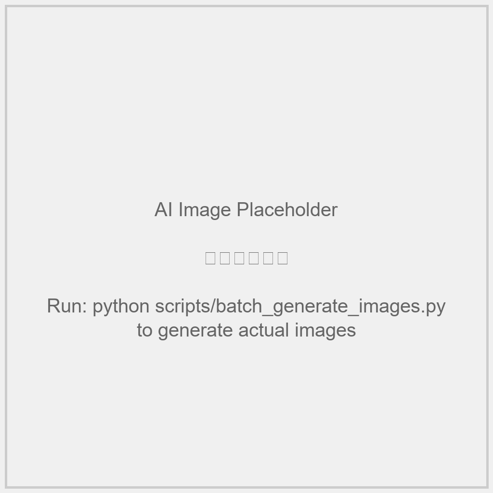
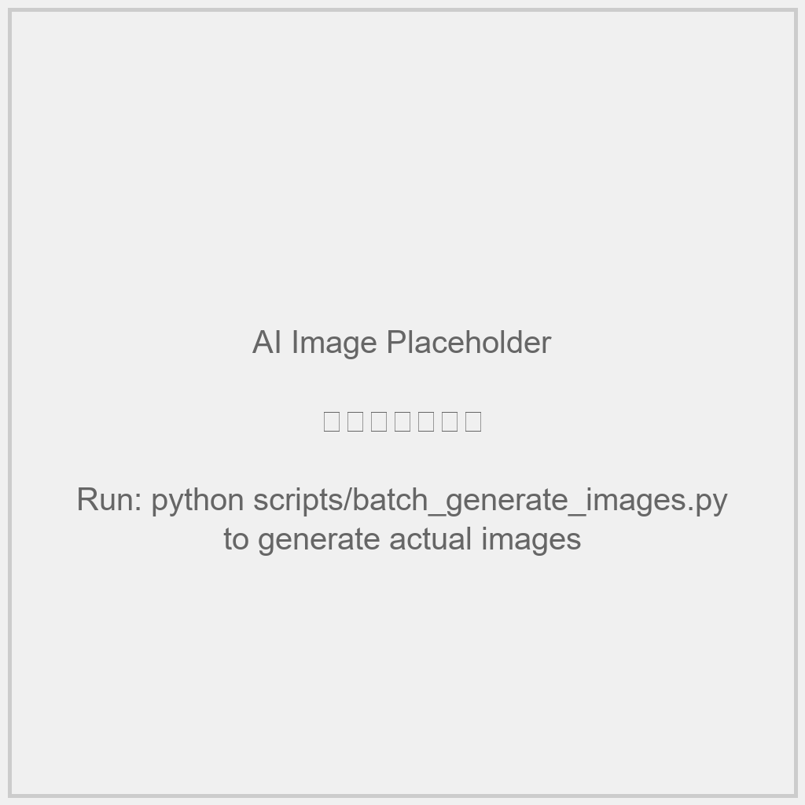
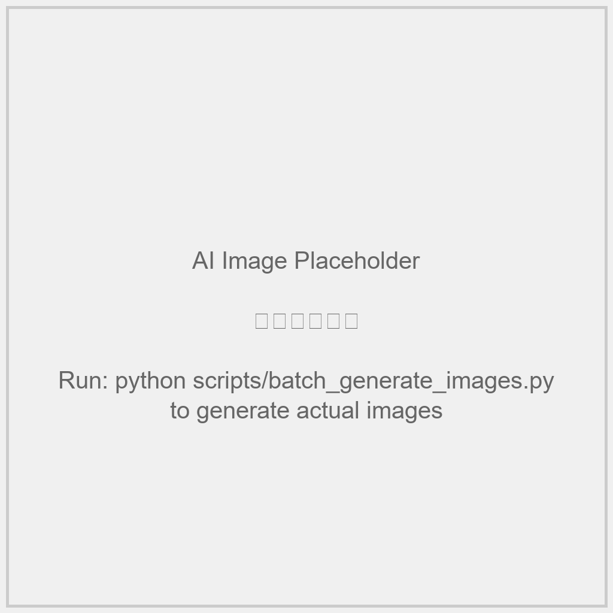
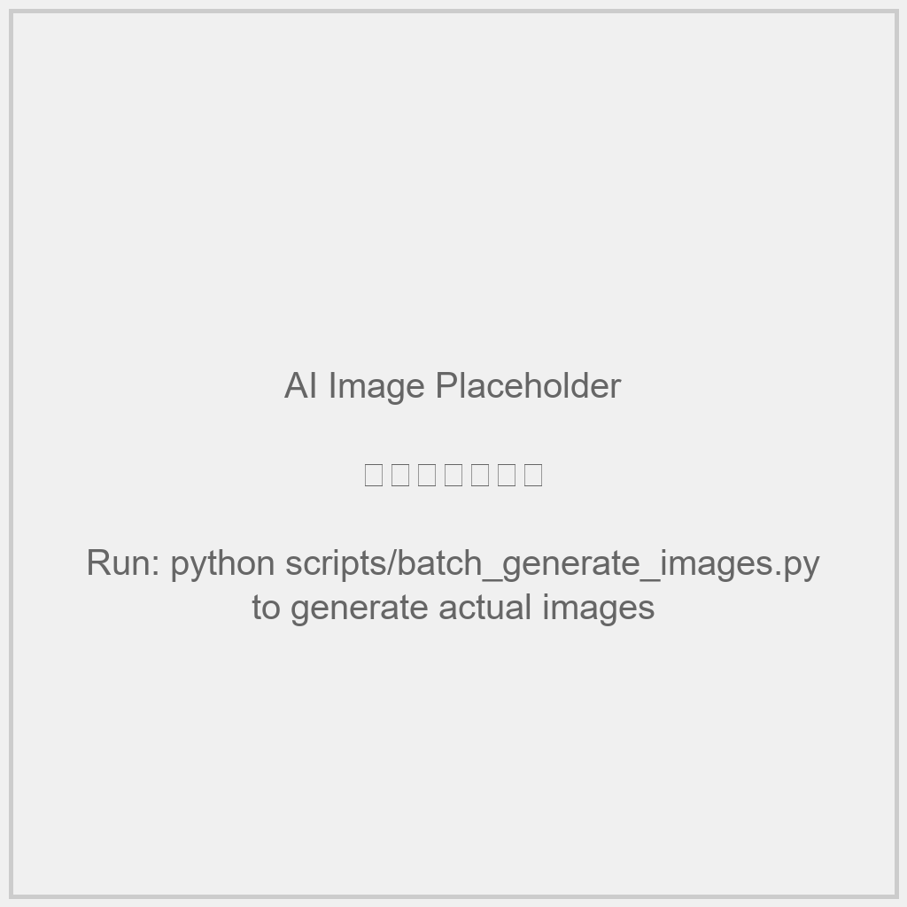
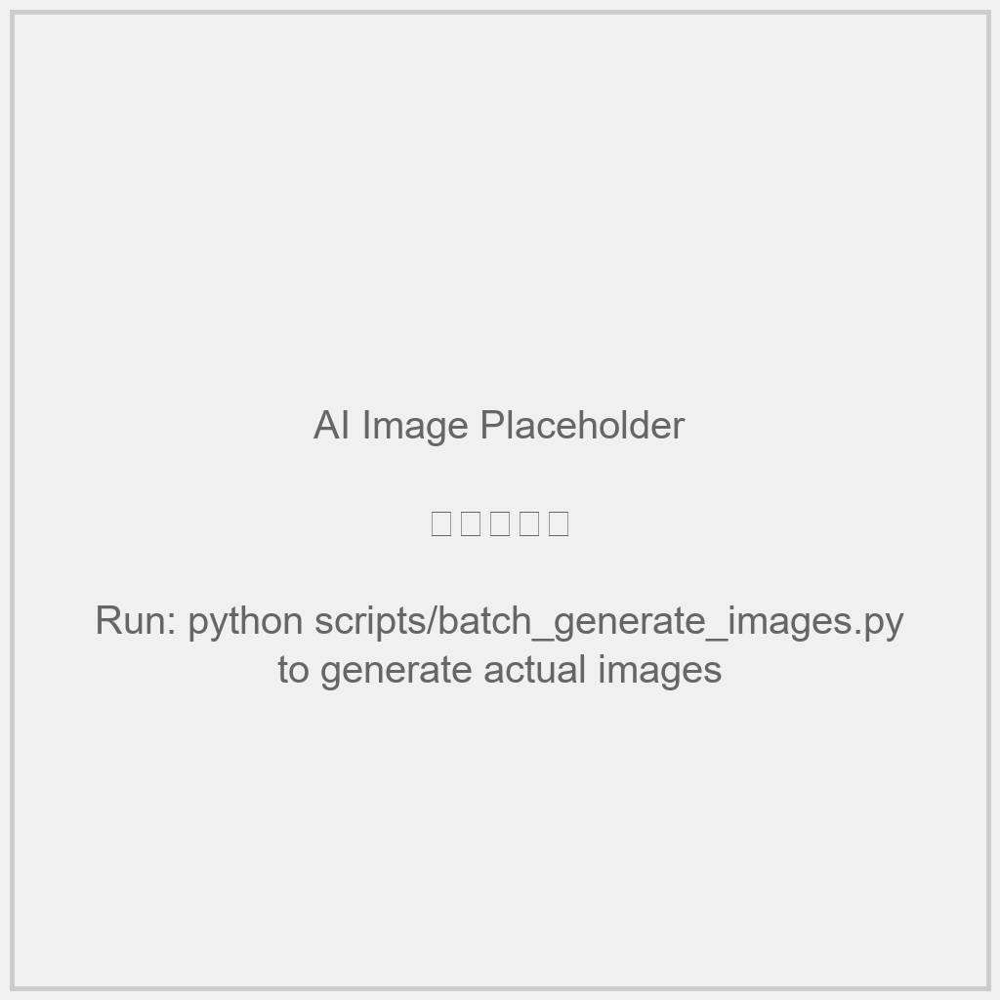

# 柔韧性入门训练 | Flexibility Training Basics (4-6岁)

## 训练目标 | Training Objectives

本训练方案专为4-6岁幼儿设计，旨在通过安全、有趣的拉伸活动，培养良好的柔韧性基础：

1. **提升关节活动度** - 增加髋关节、肩关节、踝关节等主要关节的活动范围
2. **增强肌肉弹性** - 改善腿部、背部、肩部肌肉的延展性和柔软度
3. **预防运动损伤** - 通过柔韧性训练降低肌肉拉伤和关节扭伤风险
4. **培养训练习惯** - 建立规律性拉伸习惯，理解热身和放松的重要性
5. **促进身体协调** - 柔韧性与协调性、平衡性相互促进，全面发展

---

## 科学依据 | Scientific Basis

### 幼儿柔韧性发育特点

**生理优势**:
- **关节柔软性高** - 4-6岁儿童关节囊和韧带较松弛，柔韧性训练效果显著
- **肌肉延展性好** - 肌肉纤维尚未完全发育，弹性和可塑性强
- **骨骼软骨比例大** - 软骨成分多，关节活动度自然较高
- **黄金训练期** - 研究表明，6-12岁是柔韧性发展的敏感期，4-6岁为启蒙阶段

**训练原则**:
1. **循序渐进** - 从小幅度到大幅度，逐步增加拉伸强度
2. **动静结合** - 动态拉伸为主，静态拉伸为辅，符合幼儿活动特点
3. **趣味性优先** - 以游戏形式进行，避免枯燥重复
4. **安全第一** - 绝不强求过度拉伸，避免韧带和肌肉损伤
5. **双侧均衡** - 左右两侧对称训练，防止不对称发展

### 柔韧性与羽毛球运动

优秀的柔韧性对羽毛球运动至关重要：
- **扩大击球范围** - 良好的髋关节柔韧性使步法覆盖更广
- **提升击球力量** - 肌肉延展性好，发力行程更长，爆发力更强
- **减少损伤风险** - 柔韧肌肉可吸收冲击力，降低拉伤概率
- **改善动作质量** - 肩关节柔韧性提升，挥拍动作更流畅舒展

---

## 训练内容 | Training Content

### 第一部分：动态热身拉伸 (8-10分钟)

动态拉伸通过有控制的动作，逐步提升肌肉温度和关节活动度，适合幼儿活泼好动的特点。

#### 1. 大风车转肩 (2分钟)

**动作要领**:
- 双脚与肩同宽站立，双臂自然下垂
- 双臂前后转圈，像风车一样转动
- 先向前转10次，再向后转10次
- 逐渐加大转动幅度

**训练价值**:
- 充分活动肩关节
- 增加肩部肌肉延展性
- 为羽毛球挥拍动作做准备

**注意事项**:
- 动作要流畅，不要猛甩手臂
- 保持躯干稳定，不要晃动身体
- 转动速度适中，控制好节奏

#### 2. 小猫伸懒腰 (2分钟)

**动作要领**:
- 四肢着地，双手与肩同宽
- 像小猫一样弓起背部，头低下
- 然后塌腰抬头，腹部下沉
- 反复进行10-15次

**训练价值**:
- 拉伸背部和腹部肌肉
- 提升脊柱灵活性
- 增强核心控制能力

**趣味提示**:
- 模仿小猫的叫声"喵~"
- 让孩子想象自己是刚睡醒的小猫
- 可以在垫子上进行，增加舒适感

#### 3. 腿部摆动拉伸 (2分钟)

**动作要领**:
- 单手扶墙或椅子保持平衡
- 一条腿前后摆动，像钟摆一样
- 每条腿摆动15-20次
- 逐渐加大摆动幅度

**训练价值**:
- 动态拉伸大腿前后侧肌肉
- 提升髋关节活动度
- 改善腿部灵活性

**进阶变化**:
- 左右侧向摆动
- 画小圆圈摆动
- 加快摆动频率

#### 4. 踝关节旋转 (2分钟)

**动作要领**:
- 坐在地上或站立抬起一只脚
- 用脚尖在空中画圆圈
- 顺时针和逆时针各10次
- 换另一只脚重复

**训练价值**:
- 增强踝关节灵活性
- 预防踝关节扭伤
- 为羽毛球步法训练打基础

---

### 第二部分：趣味性拉伸游戏 (15-20分钟)

#### 训练项目1：青蛙跳与青蛙趴 (5分钟)

**游戏设置**:
- 在地板上放置软垫
- 设定起点和终点(5-8米)
- 准备青蛙玩具或图片作为引导

**青蛙跳动作**:
1. 双脚比肩略宽，深蹲
2. 双手放在地上，指尖向前
3. 向前跳跃，像青蛙一样
4. 连续跳5-8次

**青蛙趴拉伸**:
1. 跳到终点后，做"青蛙趴"
2. 双膝分开，脚底相对
3. 上身慢慢向前倾
4. 保持15-20秒

**训练价值**:
- 动态拉伸髋关节内收肌
- 提升大腿内侧柔韧性
- 增强下肢力量和爆发力
- 通过跳跃增加趣味性

**安全提示**:
- 垫子防滑，避免滑倒
- 拉伸时不要强求压得很低
- 感觉舒适的拉伸即可

**进阶挑战**:
- 增加跳跃距离
- 设置障碍物(软垫、泡沫块)
- 计时比赛,谁跳得又快又好

#### 训练项目2：坐姿分腿游戏 (5分钟)

**基础动作**:
1. 坐在地上，双腿尽量分开
2. 背部挺直，双手放在膝盖上
3. 保持这个姿势10-15秒
4. 重复3-4次

**游戏化设计 - "摘星星"**:
1. 在孩子前方、左侧、右侧各放一个玩具(星星)
2. 保持双腿分开，上身向前够"前面的星星"
3. 然后转向左侧够"左边的星星"
4. 最后转向右侧够"右边的星星"
5. 每个方向保持5-10秒

**训练价值**:
- 拉伸大腿内侧肌肉(内收肌群)
- 增加髋关节外展活动度
- 提升腰部和背部柔韧性
- 改善坐姿平衡能力

**教练指导**:
- 鼓励孩子"坐得像字母V一样"
- 不要强求腿分得特别开
- 背部保持挺直,不要弓背
- 如果够不到,可以用小毛巾辅助

**趣味变化**:
- 改变玩具位置,增加挑战
- 加入音乐,按节奏拉伸
- 家长或教练一起做,增加互动

#### 训练项目3：蝴蝶拍翅膀 (5分钟)

**动作步骤**:
1. 坐在地上，双脚脚底相对
2. 双手握住脚踝或脚尖
3. 双膝上下摆动，像蝴蝶拍翅膀
4. 摆动20-30次

**静态拉伸阶段**:
1. 停止摆动，双膝尽量贴近地面
2. 上身慢慢向前倾
3. 保持10-15秒
4. 重复2-3次

**训练价值**:
- 拉伸大腿内侧和髋关节
- 增加髋关节灵活性
- 放松臀部肌肉
- 改善下肢血液循环

**游戏故事**:
- "你是一只美丽的蝴蝶"
- "拍动翅膀,准备飞翔"
- "飞累了,休息一下"(静态拉伸)
- "加油,再飞一会儿"(继续摆动)

**注意事项**:
- 摆动时膝盖不要用力压
- 向前倾时保持背部挺直
- 如果感觉不适,立即停止
- 不要与别人比较柔软程度

#### 训练项目4：小桥拉伸 (5分钟)

**基础动作**:
1. 仰卧,双膝弯曲,双脚平放
2. 双手放在身体两侧
3. 抬起臀部,像搭一座小桥
4. 保持5-10秒,慢慢放下
5. 重复8-10次

**进阶动作 - 高桥**:
1. 在小桥基础上,臀部抬得更高
2. 胸部向天花板顶
3. 保持3-5秒
4. 重复5-8次

**训练价值**:
- 拉伸腹部和髋部前侧肌肉
- 增强背部和臀部力量
- 改善脊柱灵活性
- 平衡前侧拉伸(前面多为后侧拉伸)

**游戏化设计**:
- "我们要搭一座高高的桥"
- "小汽车要从桥下经过"(用玩具车)
- "桥越高,车子越安全"
- 计数鼓励:"1, 2, 3...坚持!"

**安全提示**:
- 在软垫或瑜伽垫上进行
- 颈部放松,不要用力
- 抬起和放下动作要缓慢
- 如果感觉腰部不适,降低高度

---

### 第三部分：静态拉伸放松 (8-10分钟)

训练后的静态拉伸有助于肌肉恢复和柔韧性提升。

#### 1. 站姿大腿前侧拉伸 (2分钟)

**动作要领**:
- 单手扶墙保持平衡
- 另一只手抓住同侧脚踝
- 将脚跟拉向臀部
- 保持15-20秒,换另一侧

**训练价值**:
- 拉伸股四头肌(大腿前侧)
- 增加膝关节灵活性
- 缓解训练后肌肉紧张

**注意事项**:
- 膝盖指向地面,不要外翻
- 上身保持直立
- 拉伸腿与支撑腿平行

#### 2. 坐姿体前屈 (2分钟)

**动作要领**:
- 坐在地上,双腿并拢伸直
- 双手向前伸,够向脚尖
- 上身慢慢向前倾
- 保持15-20秒,重复2-3次

**训练价值**:
- 拉伸大腿后侧(腘绳肌)
- 拉伸下背部肌肉
- 增加脊柱前屈灵活性

**辅助方法**:
- 可以用毛巾套在脚上辅助拉伸
- 膝盖可以微微弯曲
- 不要强求手够到脚尖

#### 3. 肩部和颈部拉伸 (2分钟)

**肩部拉伸**:
- 一只手臂横跨胸前
- 另一只手抱住肘部,轻轻拉
- 保持10-15秒,换另一侧

**颈部拉伸**:
- 头慢慢向一侧倾
- 用同侧手轻轻辅助
- 保持10-15秒,换另一侧

**训练价值**:
- 放松肩颈肌肉
- 缓解上肢紧张
- 预防肩部僵硬

#### 4. 婴儿式放松 (2分钟)

**动作要领**:
- 跪在地上,臀部坐在脚跟上
- 上身向前趴,额头贴地
- 双臂向前伸或放在身体两侧
- 深呼吸,完全放松
- 保持30-60秒

**训练价值**:
- 全面放松背部和肩部
- 拉伸脊柱
- 平静身心,结束训练

---

## 安全注意事项 | Safety Guidelines

::: warning 重要安全警告
柔韧性训练虽然温和,但4-6岁幼儿骨骼肌肉尚未发育成熟,必须格外注意安全!
:::

### 训练前准备

1. **场地安全**
   - 使用软垫或瑜伽垫,避免硬地面
   - 清除场地杂物和尖锐物品
   - 确保地面防滑

2. **服装要求**
   - 穿着宽松舒适的运动服
   - 赤脚或穿防滑袜
   - 避免紧身或限制活动的衣物

3. **身体状态检查**
   - 确认孩子无发烧、感冒等不适
   - 关节无疼痛或肿胀
   - 精神状态良好,愿意参与

### 训练过程监督

1. **拉伸强度控制**
   - **绝对禁止** 强行压腿或过度拉伸
   - 拉伸到轻微不适即可,不应感到疼痛
   - 遵循"舒适拉伸"原则,不追求极限
   - 任何拉伸都不应该引起疼痛或抗拒

2. **动作规范性**
   - 教练或家长全程陪同指导
   - 及时纠正错误姿势
   - 示范动作要标准清晰
   - 用孩子能理解的语言解释

3. **呼吸指导**
   - 教导孩子拉伸时不要憋气
   - 自然呼吸或深呼吸
   - 呼气时可以轻微增加拉伸幅度

4. **时间控制**
   - 单次静态拉伸不超过20秒
   - 总训练时间30-40分钟为宜
   - 根据孩子状态灵活调整

### 特殊情况处理

1. **出现疼痛**
   - 立即停止当前拉伸
   - 检查是否受伤
   - 冰敷(如有肿胀)
   - 必要时就医

2. **孩子抗拒**
   - 不要强迫继续
   - 询问原因(累了/无聊/不舒服)
   - 调整训练内容或休息
   - 保持训练趣味性

3. **天气炎热**
   - 选择凉爽时段训练
   - 充分补水
   - 避免过度拉伸导致脱水

### 禁忌动作

::: danger 严禁以下动作
- ❌ 过度后弯腰部(超过自然范围)
- ❌ 强行压腿或劈叉
- ❌ 快速弹振式拉伸
- ❌ 让孩子之间相互施力拉伸
- ❌ 负重拉伸(幼儿阶段完全不需要)
:::

---

## 训练效果评估 | Progress Assessment

### 柔韧性测试标准 (4-6岁)

#### 1. 坐位体前屈测试

**测试方法**:
- 坐在地上,双腿并拢伸直
- 脚尖回勾,脚底垂直地面
- 双手重叠,手臂伸直向前够
- 保持2秒,记录手指超过脚尖的距离

**评分标准**:
- **优秀** - 手指超过脚尖5cm以上
- **良好** - 手指能够到脚尖(±2cm)
- **合格** - 手指距离脚尖5cm以内
- **需改进** - 手指距离脚尖5cm以上

**注意事项**:
- 膝盖不能弯曲
- 动作要缓慢,不要猛冲
- 不要与其他孩子比较

#### 2. 肩关节柔韧性测试

**测试方法**:
- 一只手从肩上向后,另一只手从下方向上
- 尝试双手在背后相扣
- 左右两侧都要测试

**评分标准**:
- **优秀** - 双手手指能相扣
- **良好** - 双手手指能相碰
- **合格** - 双手距离5cm以内
- **需改进** - 双手距离5cm以上

#### 3. 髋关节柔韧性观察

**观察方法**:
- 观察蝴蝶式拉伸时双膝高度
- 观察分腿坐时的角度
- 观察青蛙趴时的姿态

**参考指标**:
- **优秀** - 蝴蝶式双膝贴近地面,分腿角度>90°
- **良好** - 蝴蝶式双膝距地10cm内,分腿角度约90°
- **合格** - 蝴蝶式双膝距地20cm内,分腿角度<90°
- **需改进** - 明显僵硬,活动受限

### 训练进度记录

建议每2周进行一次简单评估,记录以下内容:

**记录表格示例**:

| 日期 | 坐位体前屈 | 肩关节柔韧 | 髋关节柔韧 | 训练感受 | 备注 |
|------|------------|------------|------------|----------|------|
| Week 1 | -3cm | 手指相距8cm | 合格 | 很开心 | 初次训练 |
| Week 3 | 0cm | 手指相距5cm | 良好 | 喜欢青蛙跳 | 进步明显 |
| Week 5 | +2cm | 手指相碰 | 良好 | 更灵活了 | 继续加油 |

**关键观察点**:
- 柔韧性提升是否稳定
- 孩子的兴趣和积极性
- 是否出现疼痛或不适
- 训练动作是否规范

### 长期发展目标 (3-6个月)

**初期目标 (1-2个月)**:
- 建立规律训练习惯
- 掌握基础拉伸动作
- 培养训练兴趣

**中期目标 (3-4个月)**:
- 坐位体前屈达到"良好"
- 肩关节左右两侧都能基本相扣
- 髋关节灵活性明显提升

**长期目标 (5-6个月)**:
- 整体柔韧性达到"优秀"水平
- 能够独立完成拉伸序列
- 理解拉伸对运动的重要性

---

## 教练指导建议 | Coaching Tips

### 教学技巧

1. **示范要清晰**
   - 教练亲自示范每个动作
   - 慢动作演示,强调关键点
   - 从侧面、正面多角度展示
   - 使用镜子让孩子看到自己的动作

2. **语言要生动**
   - 用比喻和故事化描述
   - "像小猫一样伸懒腰"
   - "假装自己是一只青蛙"
   - "我们一起搭一座高高的桥"

3. **鼓励要及时**
   - 表扬具体行为:"你的背挺得真直!"
   - 鼓励努力过程,不只看结果
   - 建立"进步墙",记录每次提升
   - 避免与其他孩子比较

4. **互动要丰富**
   - 加入音乐,按节奏拉伸
   - 设计小组游戏,增加趣味
   - 家长参与,亲子互动
   - 使用道具(彩色带子、玩具等)

### 常见问题解决

**问题1: 孩子觉得拉伸"好无聊"**

解决方案:
- 增加游戏化元素
- 讲故事融入拉伸(森林探险、动物模仿)
- 缩短单次时间,增加变化
- 结合音乐和节奏

**问题2: 孩子说"好疼"但没有受伤**

分析:
- 可能是心理抗拒,不想训练
- 也可能真的拉伸过度
- 或是某个动作不适合个体

解决方案:
- 立即停止,检查是否真的疼痛
- 如果是心理原因,换一个更有趣的动作
- 如果是拉伸过度,减小幅度
- 记录该动作,下次谨慎尝试

**问题3: 柔韧性进步很慢**

分析:
- 个体差异,有的孩子本身就偏僵硬
- 训练频率不够
- 训练强度不足(过于保守)
- 其他运动量大,肌肉紧张

解决方案:
- 接受个体差异,不强求
- 保证每周至少3次训练
- 适当增加拉伸保持时间(从10秒到15秒)
- 增加训练后的静态拉伸

**问题4: 左右两侧柔韧性不对称**

分析:
- 很常见,多数人都有左右差异
- 可能是日常习惯导致(惯用手/脚)
- 也可能是天生的

解决方案:
- 在训练中特别关注较僵硬的一侧
- 较僵硬侧多做1-2次重复
- 不要过度强调对称,接受合理差异
- 持续训练会逐步改善

### 进阶训练路径

当孩子完成3-6个月基础训练后,可以考虑:

**进阶内容1: 动态柔韧性**
- 加入更多动态拉伸动作
- 增加拉伸与协调性结合训练
- 引入简单的瑜伽体式(儿童版)

**进阶内容2: 专项柔韧性**
- 针对羽毛球动作的专项拉伸
- 侧身拉伸(模拟侧身击球)
- 弓步拉伸(模拟前场步法)
- 转体拉伸(模拟后场转身)

**进阶内容3: 力量与柔韧结合**
- 在拉伸姿势下保持力量(如小桥式保持更久)
- 动态力量拉伸(如深蹲后立即做体前屈)

---

## 家庭延伸训练 | Home Training

### 日常习惯培养

柔韧性训练不应局限于正式训练时间,以下是可以融入日常生活的拉伸习惯:

**起床拉伸 (3-5分钟)**:
- 起床后,在床上做猫式伸展
- 坐在床边做肩部转圈
- 站立做腿部前后摆动

**睡前拉伸 (5-8分钟)**:
- 睡前在床上做蝴蝶式
- 做婴儿式放松
- 腿部简单拉伸

**观看动画片时拉伸**:
- 坐在地上看电视,同时做分腿坐
- 广告时间做3-5个拉伸动作
- 养成"动静结合"的习惯

**亲子互动游戏**:
- 家长和孩子一起做拉伸
- 比赛谁的小桥搭得高
- 一起模仿动物动作

### 简易家庭训练计划

**周一三五 (正式训练日) - 30分钟**:
- 按照完整训练方案进行
- 可以在家或户外

**周二四六 (轻松拉伸日) - 10-15分钟**:
- 选择3-5个最喜欢的动作
- 不追求强度,保持习惯

**周日 (休息日)**:
- 完全休息或仅做睡前放松拉伸

### 家长配合要点

1. **营造积极氛围**
   - 不要用命令语气"快去拉伸"
   - 改用邀请语气"我们一起做拉伸游戏吧"

2. **以身作则**
   - 家长自己也做拉伸
   - 和孩子一起练,增进亲子关系

3. **坚持不强求**
   - 柔韧性提升需要时间
   - 每天5分钟胜过一周一次1小时
   - 接受进步慢,不要批评

4. **记录与鼓励**
   - 拍照或录像记录进步
   - 定期回顾,让孩子看到自己的成长
   - 小奖励制度(如贴纸、表扬卡)

---

## 延伸阅读 | Further Reading

1. **《儿童柔韧性训练科学指南》** - 了解更多柔韧性训练理论
2. **《3-6岁幼儿运动发展》** - 掌握这个年龄段的运动特点
3. **《羽毛球运动解剖学》** - 理解柔韧性对羽毛球技术的影响
4. **《儿童瑜伽入门》** - 探索更多适合幼儿的拉伸方式

---

## 专业术语表 | Glossary

- **柔韧性 (Flexibility)** - 肌肉、肌腱、韧带等软组织的延展能力和关节的活动范围
- **关节活动度 (Range of Motion, ROM)** - 关节可以活动的最大角度范围
- **静态拉伸 (Static Stretching)** - 缓慢拉伸到某个位置并保持一段时间
- **动态拉伸 (Dynamic Stretching)** - 通过有控制的动作,逐步增加运动幅度的拉伸
- **股四头肌 (Quadriceps)** - 大腿前侧肌肉群
- **腘绳肌 (Hamstrings)** - 大腿后侧肌肉群
- **内收肌 (Adductors)** - 大腿内侧肌肉群
- **髋关节外展 (Hip Abduction)** - 腿向身体外侧打开的动作

---

## 参考文献 | References

1. Anderson, B. (2010). *Stretching: 30th Anniversary Edition*. Shelter Publications.
2. Alter, M. J. (2004). *Science of Flexibility* (3rd ed.). Human Kinetics.
3. NSCA (2017). *Essentials of Strength Training and Conditioning* (4th ed.). Human Kinetics.
4. Gallahue, D. L., & Donnelly, F. C. (2003). *Developmental Physical Education for All Children*. Human Kinetics.
5. 中国羽毛球协会 (2020). 《青少年羽毛球训练大纲》
6. 李春雷, 王健 (2018). 《儿童柔韧性训练的生理学基础》. 体育科学, 38(2), 45-52.

---

**训练提示**: 柔韧性训练贵在坚持,每天10分钟胜过一周一次1小时。和孩子一起享受拉伸的过程,让它成为快乐的习惯,而不是痛苦的任务! 🌟
