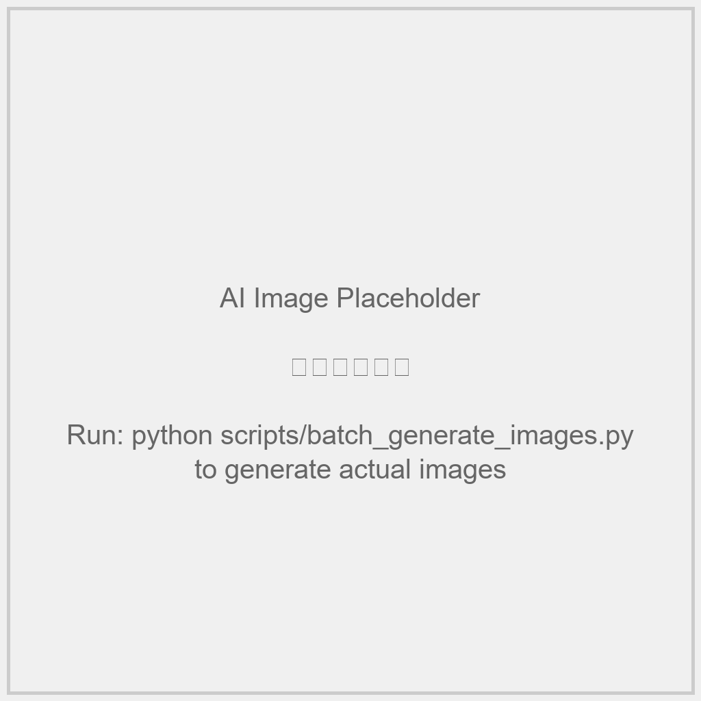
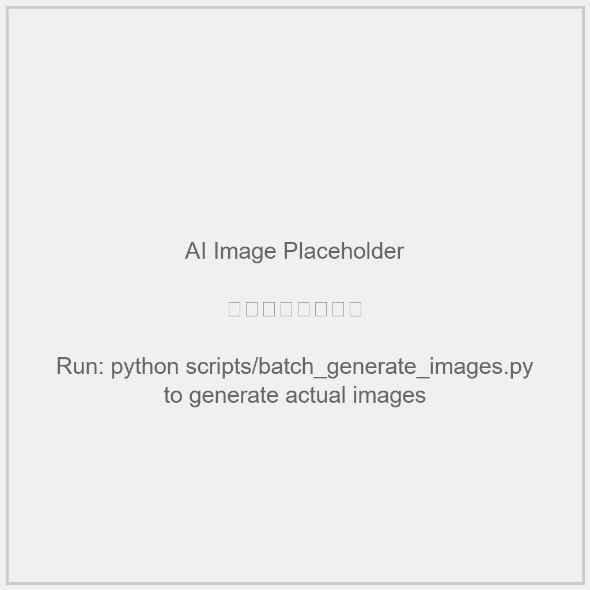
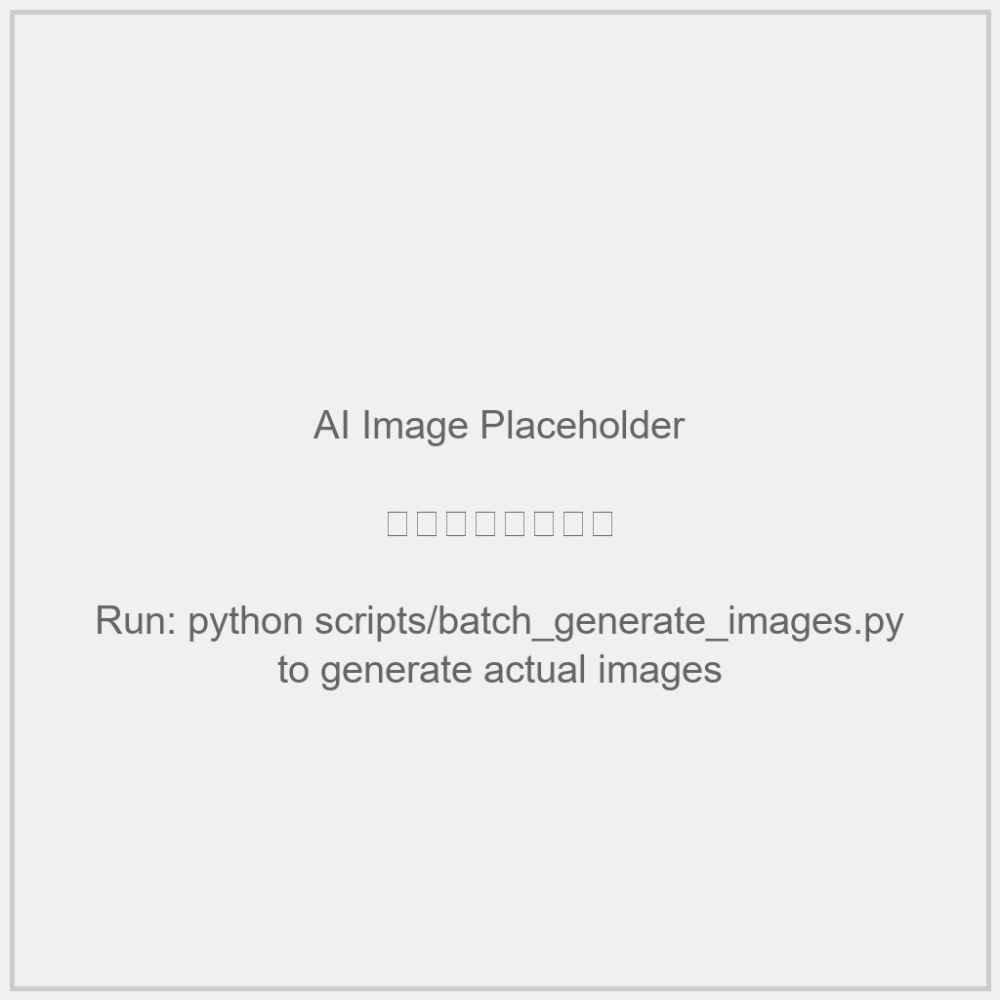
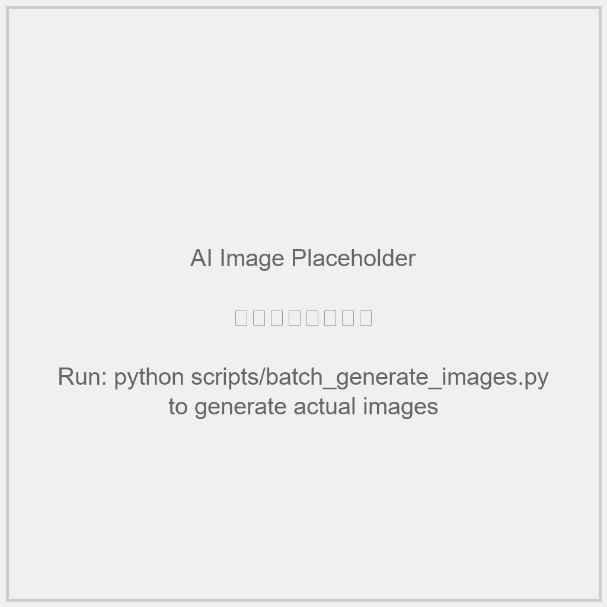
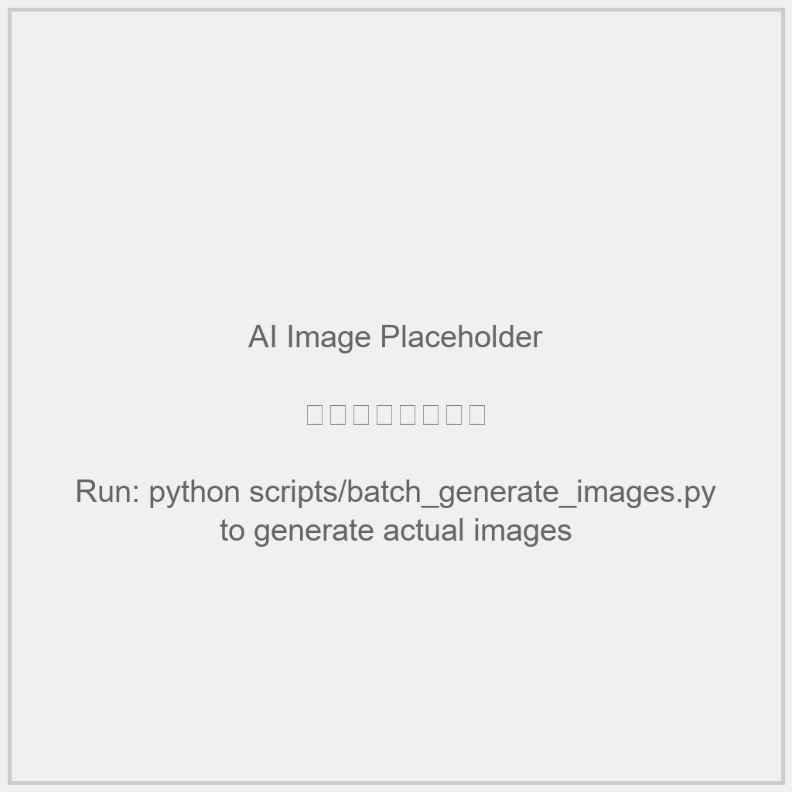

# 羽毛球握拍与基本步法 | Grip and Footwork Basics (7-9岁)

## 训练目标 | Training Objectives

本训练方案专为7-9岁儿童设计，旨在建立正确的握拍技术和基础步法体系：

1. **掌握正确握拍法** - 熟练掌握正手握拍和反手握拍，能在击球时快速转换
2. **建立步法基础** - 学习前场、后场、中场移动步法，形成完整移动体系
3. **培养手感意识** - 通过握拍练习建立球拍控制感和击球手感
4. **提升移动效率** - 掌握启动、制动、回位等步法要素，提高场地覆盖能力
5. **形成技术基础** - 为后续技术学习（发球、击球）打下坚实基础

---

## 科学依据 | Scientific Basis

### 7-9岁儿童技术学习特点

**生理发育特点**:
- **精细动作能力提升** - 手指灵活性和协调性明显增强，适合学习握拍技术
- **空间感知发展** - 对场地空间和移动距离的判断能力提升
- **平衡能力稳定** - 能够完成复杂的移动和急停动作
- **学习能力强** - 模仿能力强，技术动作定型快

**技术学习原则**:
1. **正确性第一** - 宁慢勿快，确保握拍和步法动作标准
2. **反复强化** - 通过大量重复形成肌肉记忆
3. **循序渐进** - 从静态到动态，从简单到复杂
4. **实战结合** - 尽早将技术应用到实际击球和移动中
5. **个性化调整** - 根据手型大小、身高等个体差异调整

### 握拍与步法的重要性

**握拍技术的基础作用**:
- **决定击球质量** - 正确握拍是所有击球技术的前提
- **影响力量传递** - 合理握拍使力量从身体传递到球拍
- **关系受伤风险** - 错误握拍易导致手腕、肘部损伤
- **限制技术发展** - 握拍不正确会限制后续技术提升

**步法的核心地位**:
- **羽毛球三大要素** - "步法、手法、身法"，步法排在首位
- **决定击球位置** - 好的步法能到达最佳击球位置
- **节省体能** - 高效步法减少无效移动，延长比赛时间
- **战术执行基础** - 没有步法，任何战术都无法执行

---

## 训练内容 | Training Content

### 第一部分：握拍技术教学 (25-30分钟)

#### 1. 球拍结构认识 (5分钟)

在学习握拍前，先让孩子了解球拍各部分名称：

**球拍部位**:
- **拍头 (Racket Head)** - 击球的网面部分
- **拍框 (Frame)** - 拍头的边框
- **拍杆 (Shaft)** - 连接拍头和拍柄的杆身
- **拍柄 (Handle/Grip)** - 手握的部分
- **锥盖 (End Cap)** - 拍柄底部的帽子

**拍柄形状** (重点):
- 拍柄是**八角形**，不是圆形
- 有**宽面**和**窄面**
- 宽面有**2个**，窄面有**2个**，斜面有**4个**

**教学方法**:
- 让孩子用手触摸感受八角形
- 用彩色贴纸标记宽面和窄面
- 讲解:"就像一个八边形的铅笔"

#### 2. 正手握拍技术 (10分钟)

**标准动作要领**:

**步骤1: 虎口对准**
- 拍面与地面垂直
- 虎口(拇指和食指间)对准拍柄内侧宽面
- 就像"握手"一样自然

**步骤2: 手指分布**
- 拇指和食指呈"V"字形
- 中指、无名指、小指自然并拢握住拍柄
- 食指稍微分开，起支撑作用

**步骤3: 握拍力度**
- 放松握拍，不要过紧
- 像握住一只小鸟，既不让它飞走也不弄伤它
- 击球瞬间才需要握紧

**检查标准**:
- ✅ 拍面垂直地面
- ✅ 虎口对准内侧宽面
- ✅ 手指自然分布
- ✅ 拍柄和手臂不在一条直线(略有角度)
- ✅ 手腕可以灵活转动

**常见错误**:
- ❌ 虎口对准拍面(拍面平行地面) - "苍蝇拍握法"
- ❌ 握拍过紧，手臂僵硬
- ❌ 手指握在拍柄太靠上或太靠下
- ❌ 拍柄和手臂在一条直线

**练习方法**:
1. **镜子练习** (3分钟)
   - 对着镜子检查握拍姿势
   - 教练逐个检查并纠正

2. **转拍练习** (3分钟)
   - 握好拍后，用手腕转动拍面
   - 正面、反面、正面、反面...
   - 检验握拍是否灵活

3. **握拍放松练习** (2分钟)
   - 握拍-放松-握拍-放松
   - 体会不同力度的感觉

#### 3. 反手握拍技术 (10分钟)

**标准动作要领**:

**从正手转换到反手**:
1. 从正手握拍开始
2. 拇指从侧面移动到后面
3. 拇指顶在拍柄外侧宽面上
4. 其他四指自然握住拍柄

**关键要点**:
- **拇指顶推** - 拇指第一关节顶在拍柄宽面上
- **拇指位置** - 指向拍头方向，略微斜向
- **手指力量** - 主要靠拇指和食指发力
- **灵活转换** - 正反手握拍要能快速切换

**检查标准**:
- ✅ 拇指顶在外侧宽面
- ✅ 拇指第一关节略弯
- ✅ 其余四指握住另一侧
- ✅ 拍面与正手握拍成90度

**练习方法**:
1. **正反手转换练习** (4分钟)
   - 正手-反手-正手-反手
   - 慢速练习，确保每次都正确
   - 逐渐加快速度

2. **拇指顶推练习** (3分钟)
   - 用反手握拍，拇指向前顶
   - 感受拇指的推力
   - 模拟反手击球发力

3. **盲握练习** (3分钟)
   - 闭上眼睛做正反手转换
   - 培养手感和肌肉记忆

---

### 第二部分：基础步法教学 (30-35分钟)

#### 1. 准备姿势与启动 (5分钟)

**标准准备姿势**:
- **站位** - 双脚与肩同宽，略宽于肩
- **重心** - 前脚掌着地，脚跟微抬
- **膝盖** - 微屈，保持弹性
- **上身** - 稍前倾，保持平衡
- **手臂** - 持拍手在体前，非持拍手自然抬起
- **视线** - 注视对方和来球

**启动步**:
- 小垫步或原地小跳
- 保持双脚活动状态
- 任何方向都能快速启动

**练习方法**:
- 保持准备姿势30秒
- 教练喊"启动"，原地小跳3-5次
- 反复练习，形成习惯

#### 2. 前场步法 (网前移动) (8分钟)

**前场移动步法 (中场到网前)**:

**基本步法 (三步上网)**:
1. **第一步** - 右脚(持拍脚)向前跨一小步
2. **第二步** - 左脚跟上，超过右脚
3. **第三步** - 右脚大步跨出，形成弓步

**动作要领**:
- 启动快，第一步要及时
- 第二步左脚不要过大，保持节奏
- 第三步右脚大步，到位击球
- 上身保持平衡，不要前倾过度

**网前弓步姿势**:
- 右腿弯曲成弓，左腿伸直成箭
- 上身微前倾
- 重心在右腿上
- 左脚掌内侧着地

**回位步法**:
1. 右脚蹬地发力
2. 身体向后移动
3. 小步调整回到中心位置
4. 恢复准备姿势

**练习方法**:
1. **无球上网练习** (3分钟)
   - 反复做中场到网前移动
   - 强调弓步到位
   - 注意回位速度

2. **捡球练习** (3分钟)
   - 教练在网前放球
   - 学员上网"捡球"(用拍子挑起球)
   - 练习到位和回位

3. **喂球练习** (2分钟)
   - 教练手抛球到网前
   - 学员上网击球
   - 结合步法和击球

#### 3. 后场步法 (后场移动) (10分钟)

**后场移动步法 (中场到后场)**:

**基本步法 (交叉步+跳步)**:
1. **启动** - 准备姿势，判断来球
2. **转身** - 身体向右后转(右手持拍)
3. **交叉步** - 左脚从右脚后交叉迈出
4. **调整步** - 右脚跟进，调整位置
5. **最后一步** - 右脚起跳或大步到位

**动作要领**:
- 转身要快，尽早侧身
- 交叉步步幅大，移动快
- 最后一步有小跳跃(腾空)
- 击球时身体侧向，不是正面对网

**侧身姿势** (重要):
- 左肩指向网，右肩向后
- 身体与球网成45-90度
- 重心在右腿，左腿辅助
- 为挥拍留出空间

**回位步法**:
1. 击球后右脚着地
2. 左脚向前迈，调整方向
3. 小步快速回到中心
4. 恢复准备姿势

**练习方法**:
1. **后退步法练习** (4分钟)
   - 不拿球拍,练习后退步法
   - 从中场到后场反复移动
   - 强调侧身和交叉步

2. **定点挥拍练习** (3分钟)
   - 后退到后场,做挥拍动作
   - 检查侧身是否到位
   - 体会击球位置

3. **喂球练习** (3分钟)
   - 教练抛高球到后场
   - 学员后退击球
   - 结合步法和击球

#### 4. 侧身步法 (左右移动) (8分钟)

**侧向移动步法 (中场到边线)**:

**并步移动 (Shuffle Step)**:
1. 判断来球方向(左或右)
2. 一侧脚先向侧方迈出
3. 另一只脚快速跟上,并拢
4. 重复"迈-并、迈-并"直到到位

**右侧移动** (以右手持拍为例):
- 右脚向右侧跨
- 左脚跟上并拢
- 保持准备姿势,身体不要起伏

**左侧移动**:
- 左脚向左侧跨
- 右脚跟上并拢
- 上身保持平衡

**动作要领**:
- 脚步轻快,前脚掌着地
- 膝盖始终保持微屈
- 身体重心平稳,不要跳跃
- 视线保持水平

**练习方法**:
1. **侧向滑步练习** (3分钟)
   - 沿底线左右移动
   - 从左边线到右边线
   - 保持准备姿势不变

2. **四点移动练习** (3分钟)
   - 设定4个点:左前、右前、左后、右后
   - 从中心点向4个方向移动
   - 练习方向转换

3. **触线练习** (2分钟)
   - 从中场侧向移动到边线
   - 用球拍触碰边线
   - 快速回中心

#### 5. 综合步法训练 (10分钟)

**六点步法训练**:

**六个移动点**:
1. 左前网(正手网前)
2. 右前网(反手网前)
3. 左中场
4. 右中场
5. 左后场
6. 右后场

**训练方法**:
1. **按顺序移动** (5分钟)
   - 中心点 → 左前网 → 回中心
   - 中心点 → 右前网 → 回中心
   - 中心点 → 左后场 → 回中心
   - 中心点 → 右后场 → 回中心
   - 每个方向2-3次

2. **随机移动** (3分钟)
   - 教练随机喊点位
   - 学员快速移动到该点
   - 考验反应和步法熟练度

3. **计时挑战** (2分钟)
   - 完成六点移动各一次,计时
   - 记录时间,追求进步
   - 注意动作质量,不只求快

---

## 安全注意事项 | Safety Guidelines

::: warning 安全第一
握拍和步法训练虽然不涉及大强度对抗,但仍需注意避免运动损伤!
:::

### 握拍训练安全

1. **选择合适球拍**
   - 拍柄粗细适合孩子手型
   - 球拍重量适中(75-85克为宜)
   - 避免成人球拍,过重易损伤手腕

2. **握拍力度控制**
   - 不要长时间紧握球拍
   - 每10分钟放松一次手部
   - 避免手指、手腕酸痛

3. **手部保护**
   - 可佩戴护腕
   - 手部出汗及时擦干
   - 使用吸汗握把布

### 步法训练安全

1. **场地要求**
   - 羽毛球专用地板或塑胶地面
   - 地面干燥,无水渍
   - 清除场地杂物

2. **鞋子要求**
   - 专业羽毛球鞋,防滑性好
   - 鞋子大小合适,不过大或过小
   - 鞋带系紧,避免绊倒

3. **热身充分**
   - 步法训练前充分热身(10分钟)
   - 重点活动踝关节、膝关节
   - 做动态拉伸

4. **循序渐进**
   - 从慢速到快速
   - 从单一步法到组合步法
   - 不要一开始就全速冲刺

5. **疲劳管理**
   - 出现疲劳立即休息
   - 每15分钟休息1-2分钟
   - 及时补水

### 损伤预防

**常见损伤**:
- 脚踝扭伤
- 膝盖疼痛
- 手腕劳损
- 肌肉拉伤

**预防措施**:
- ✅ 穿戴护具(护腕、护踝)
- ✅ 充分热身和拉伸
- ✅ 动作规范,避免错误姿势
- ✅ 适度训练,避免过量
- ✅ 感觉不适立即停止

---

## 训练效果评估 | Progress Assessment

### 握拍技术评估标准

**正手握拍评分**:
| 评分项 | 优秀 | 良好 | 合格 | 需改进 |
|--------|------|------|------|--------|
| 虎口对准宽面 | 完全正确 | 基本正确 | 略有偏差 | 错误 |
| 手指自然分布 | 标准 | 基本标准 | 不够自然 | 错误 |
| 握拍放松程度 | 很放松 | 较放松 | 略紧 | 很紧 |
| 拍面垂直性 | 完全垂直 | 基本垂直 | 略有倾斜 | 明显倾斜 |

**反手握拍评分**:
| 评分项 | 优秀 | 良好 | 合格 | 需改进 |
|--------|------|------|------|--------|
| 拇指顶推位置 | 准确 | 基本准确 | 略有偏差 | 错误 |
| 正反手转换速度 | <1秒 | 1-2秒 | 2-3秒 | >3秒 |
| 拇指发力感觉 | 明确 | 较明确 | 不太明确 | 没有感觉 |

### 步法技术评估标准

**前场步法评分**:
- **优秀** - 三步到位,弓步标准,回位迅速
- **良好** - 三步到位,弓步基本标准
- **合格** - 能到位,但步数或姿势略有问题
- **需改进** - 到位困难或姿势明显错误

**后场步法评分**:
- **优秀** - 侧身及时,交叉步流畅,到位准确
- **良好** - 能侧身,交叉步基本正确
- **合格** - 能后退到位,但侧身不充分
- **需改进** - 后退困难或背对球网

**侧身步法评分**:
- **优秀** - 并步流畅,重心平稳,速度快
- **良好** - 并步基本正确,重心较稳
- **合格** - 能侧向移动,但略有跳跃
- **需改进** - 移动笨拙或重心不稳

### 综合能力测试

**六点移动测试**:
1. 中心 → 6个点各一次 → 回中心
2. 记录总用时
3. 观察动作质量

**评分标准** (7-9岁):
- **优秀** - <35秒,动作标准
- **良好** - 35-45秒,动作基本标准
- **合格** - 45-60秒,能完成
- **需改进** - >60秒或动作明显错误

---

## 教练指导建议 | Coaching Tips

### 握拍教学技巧

1. **形象化比喻**
   - "像握手一样自然"
   - "拇指像一根柱子顶住拍柄"
   - "手指像弹钢琴一样放松"

2. **触觉反馈**
   - 让孩子闭眼感受拍柄形状
   - 教练手把手纠正握拍
   - 用标记贴纸辅助记忆

3. **常见错误纠正**
   - 错误:"苍蝇拍握法" → 让孩子感受拍面方向
   - 错误:握太紧 → 做放松握拍练习
   - 错误:虎口位置不对 → 用标记线对准

### 步法教学技巧

1. **分解教学**
   - 先教单个步法
   - 再教组合步法
   - 最后结合击球

2. **节奏训练**
   - 用口令辅助:"1-2-3,蹬!"(上网)
   - 用节拍器或音乐
   - 让孩子跟着节奏移动

3. **视觉辅助**
   - 地面标记移动路线
   - 使用标志盘标记六个点
   - 录像回放,让孩子看自己的动作

4. **渐进难度**
   - 慢速移动 → 中速 → 快速
   - 定点移动 → 随机移动
   - 无球步法 → 击球结合

### 常见问题解决

**问题1: 孩子总是握不对拍**
- 原因: 肌肉记忆未形成
- 解决: 每次训练前都检查握拍,反复强化
- 工具: 使用握拍模型或标记贴纸

**问题2: 步法移动时身体僵硬**
- 原因: 过度紧张或准备姿势不对
- 解决: 强调放松,做准备姿势练习
- 方法: 原地小跳,保持活力

**问题3: 后退时总是正面对网**
- 原因: 没有侧身意识
- 解决: 单独练习侧身转体
- 方法: 让孩子后退时看着场边某个目标

**问题4: 移动后不回中心位置**
- 原因: 缺乏回位意识
- 解决: 强调"击球-回中"的循环
- 方法: 每次移动后必须回到中心标记

---

## 家庭延伸训练 | Home Training

### 握拍练习 (每天5-10分钟)

**练习1: 正反手转换**
- 坐着或站着都可以
- 反复做正手-反手-正手-反手
- 100次/组,每天2-3组

**练习2: 握拍对镜练习**
- 对着镜子检查握拍
- 自我纠正
- 每天3-5分钟

**练习3: 握拍挥拍**
- 原地做挥拍动作
- 注意握拍不要变形
- 正手挥拍20次,反手挥拍20次

### 步法练习 (每天10-15分钟)

**练习1: 原地步法**
- 在家里空地做原地步法
- 上网步法、后退步法各10次

**练习2: 楼梯练习**
- 上楼梯用上网步法(一级一级)
- 下楼梯用后退步法(注意安全)

**练习3: 六点触物练习**
- 在房间设置6个点(用玩具或纸杯)
- 从中心点出发,依次触摸6个点
- 每天2-3组

### 亲子互动

**游戏1: 握拍接力**
- 家长和孩子轮流握拍并检查
- 互相纠正错误
- 增加趣味性和互动

**游戏2: 步法比赛**
- 家长和孩子一起做六点移动
- 比谁又快又标准
- 营造运动氛围

---

## 延伸阅读 | Further Reading

1. **《羽毛球技术图解》** - 详细的握拍和步法图解
2. **《羽毛球基础训练》** - 系统的基础技术训练方法
3. **《儿童羽毛球教学法》** - 针对7-12岁儿童的教学策略
4. **林丹、李宗伟技术视频** - 观摩世界冠军的握拍和步法

---

## 专业术语表 | Glossary

- **虎口 (Tiger Mouth)** - 拇指和食指之间的V形区域
- **宽面 (Wide Surface)** - 拍柄的两个较宽的平面
- **窄面 (Narrow Surface)** - 拍柄的两个较窄的平面
- **弓箭步 (Lunge)** - 前场击球时的弓步姿势
- **交叉步 (Cross Step)** - 一只脚从另一只脚后交叉迈出
- **并步 (Shuffle Step)** - 两脚交替迈出并拢的移动方式
- **回位 (Recovery)** - 击球后回到中心位置
- **中心位置 (Center Position)** - 场地中央偏后的准备位置

---

## 参考文献 | References

1. 陈文斌, 钟波 (2016). 《羽毛球运动教程》(第3版). 人民体育出版社.
2. 中国羽毛球协会 (2020). 《青少年羽毛球训练大纲》.
3. Grice, T. (2016). *Badminton: Steps to Success* (4th ed.). Human Kinetics.
4. 肖杰 (2018). 《羽毛球技术与战术》. 北京体育大学出版社.
5. 李玲蔚, 田秉毅 (2015). 《羽毛球基础教学》. 高等教育出版社.

---

**训练提示**: 握拍和步法是羽毛球的基石,宁愿慢一点、稳一点,也要把基础打牢!每天坚持练习10分钟,3个月后你会看到明显进步! 🏸
