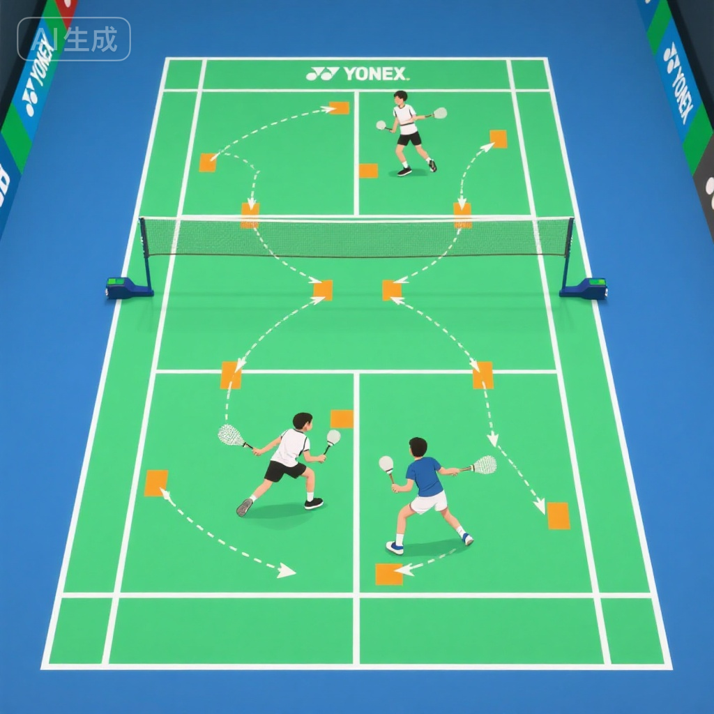
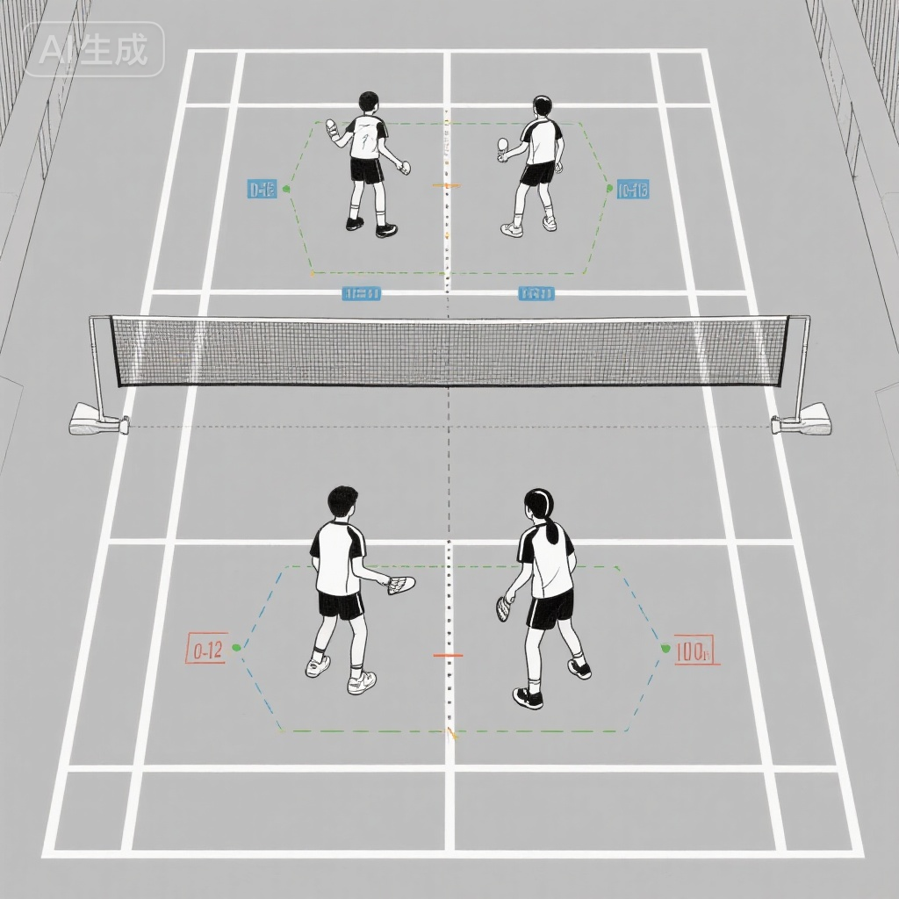
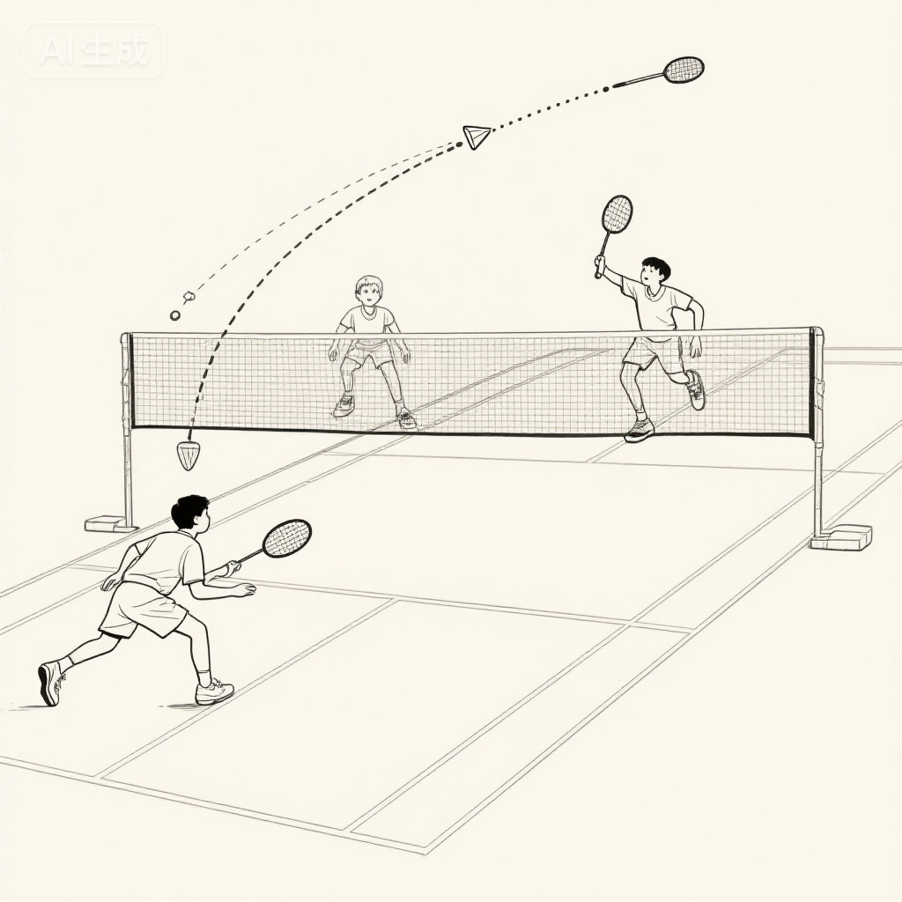
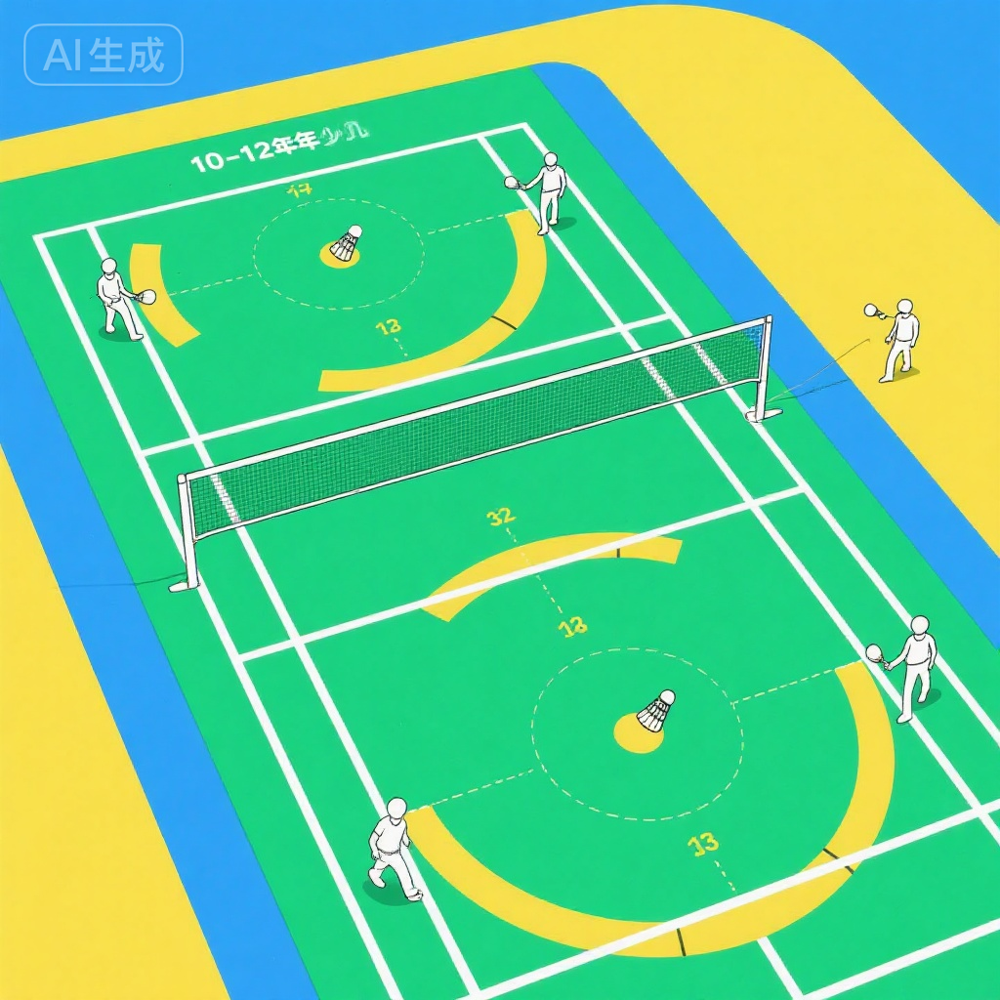
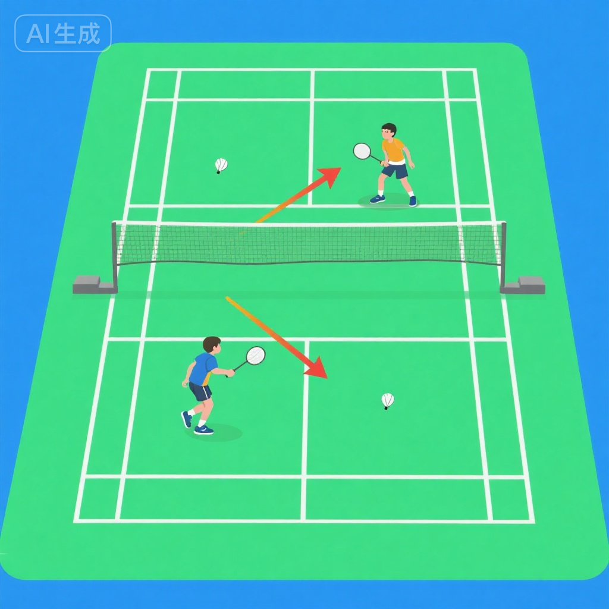

# 双打战术基础

## 训练目标

双打与单打有着本质区别，需要两人默契配合。本方案旨在：

1. **掌握基本站位** - 理解前后场站位、左右站位的应用场景和转换
2. **建立配合意识** - 培养与搭档的沟通、补位、轮转配合能力
3. **学习发接发战术** - 掌握双打发球、接发球的基本战术套路
4. **理解轮转移动** - 学会根据球路和战术进行前后场轮转
5. **培养战术思维** - 建立双打战术意识，学会分析和应对对手

---

## 科学依据

### 10-12岁战术认知特点

**认知发展水平**:
- **抽象思维萌芽** - 开始理解战术概念和空间关系
- **团队协作能力提升** - 能够与队友进行有效沟通和配合
- **战术意识初步形成** - 可以理解简单的战术套路和应对策略
- **空间感知增强** - 能够判断场上位置和移动路线

**双打训练价值**:
- 培养团队合作精神和沟通能力
- 提升战术理解和应变能力
- 减少单人体能消耗，适合长时间训练
- 增加比赛趣味性和参与度

### 双打战术基本原则

**进攻原则**:
1. **争取网前控制权** - 前场压制，后场进攻
2. **制造下压球** - 通过杀球、吊球压迫对手
3. **快速轮转** - 进攻后迅速调整站位
4. **集中火力** - 重点进攻对手弱点位置

**防守原则**:
1. **前后站位** - 一人封网，一人防守后场
2. **平抽快挡** - 通过快速平抽寻找反击机会
3. **挑高解围** - 被动时通过高远球调整站位
4. **积极补位** - 队友被调动时及时补位

---

## 训练内容

### 第一部分：双打站位基础 (20-25分钟)

#### 1. 前后站位

**站位特点**:
- **前场队员**: 站在发球线附近，负责封网和扑球
- **后场队员**: 站在中后场，负责进攻和防守高球
- **距离**: 前后相距约4-5米

**应用场景**:
- **进攻时**: 一人杀球后前压封网，另一人准备连续进攻
- **发球时**: 发球方保持前后站位，便于快速进攻
- **接发球后**: 接发球方通过起高球转为前后站位

**训练1: 前后站位固定练习**
- **设置**: 两人一组，固定前后站位
- **方法**:
  - 前场队员负责处理网前球（放网、扑球、推球）
  - 后场队员负责处理后场球（高远、杀球、吊球）
  - 教练随机喂球到不同位置
- **时长**: 5分钟×3组，轮换前后场角色
- **要点**: 明确分工，不越位抢球

**训练2: 前后站位进攻练习**
- **方法**:
  - 后场队员杀球或吊球
  - 前场队员立即前压封网
  - 对方回球后，前场队员处理网前，后场队员准备连续进攻
- **价值**: 建立进攻节奏和前压意识

#### 2. 左右站位

**站位特点**:
- **平行站位**: 两人左右平行，各负责半场
- **中间空当**: 场地中间略有间隙，需要快速补位
- **责任区**: 每人负责自己半场的前后场球

**应用场景**:
- **防守时**: 面对对方进攻，左右平行防守
- **被动时**: 被压制时采用左右站位，分担防守压力
- **过渡时**: 从进攻转防守的过渡阶段

**训练1: 左右站位防守练习**
- **设置**: 两人左右站位，对方两人进攻
- **方法**:
  - 对方连续杀球、吊球进攻
  - 防守方左右站位接球
  - 尽量通过挑高球或平抽解围
- **时长**: 连续防守30秒×5组
- **要点**: 各守半场，及时补中间空当

**训练2: 平抽快挡练习**
- **方法**:
  - 四人在中前场进行快速平抽
  - 保持左右站位，快速反应
  - 寻找对方空当或失误
- **价值**: 提升防守反击能力

#### 3. 站位转换

**转换原则**:
- **进攻→防守**: 前后站位→左右站位
- **防守→进攻**: 左右站位→前后站位
- **快速轮转**: 根据球路和战术快速调整

**训练: 站位转换综合练习**
- **设置**: 两组对打，教练指定战术
- **方法**:
  - 开始时前后站位进攻
  - 对方防守反击后转为左右站位防守
  - 找到机会后再转为前后站位进攻
- **时长**: 连续对打5分钟×3组
- **要点**: 转换迅速，沟通明确

---

### 第二部分：前后场配合 (20-25分钟)

#### 1. 杀吊上网配合

**配合流程**:
1. **后场队员**: 杀球或吊球到对方前场
2. **前场队员**: 立即前压封网
3. **对方回球**: 前场队员扑球或推球得分
4. **继续进攻**: 如对方挑高球，后场队员继续杀吊

**训练1: 杀球封网练习**
- **设置**: 一组进攻，一组防守
- **方法**:
  - 教练喂高球到后场
  - 后场队员杀球
  - 前场队员立即封网
  - 防守方回球后，前场队员处理网前球
- **要点**: 杀球后立即前压，封网要快

**训练2: 吊球上网练习**
- **方法**:
  - 后场队员吊球到对方网前
  - 前场队员快速跟进
  - 对方放网后，前场队员扑球或挑球
- **价值**: 培养吊球后的网前跟进意识

#### 2. 挑球补位配合

**配合流程**:
1. **前场被动**: 前场队员被迫挑高球
2. **后场补位**: 后场队员快速后退准备防守
3. **前场撤退**: 前场队员挑球后快速后撤
4. **转为防守**: 两人形成左右站位或前后防守站位

**训练: 挑球轮转练习**
- **设置**: 模拟被动局面
- **方法**:
  - 前场队员网前挑高球
  - 后场队员立即后退防守
  - 前场队员快速撤回中场
  - 两人调整为防守站位
- **时长**: 10次×5组
- **要点**: 挑球质量要高，轮转要快

#### 3. 接杀防守配合

**配合要点**:
- **分工明确**: 一人接杀，一人准备补位或反击
- **通过防守**: 接杀后尽量通过挑球或平抽调整站位
- **寻找反击**: 对方杀球质量下降时果断平抽反击

**训练: 接杀防守练习**
- **设置**: 一方连续杀球，一方防守
- **方法**:
  - 进攻方连续杀球
  - 防守方左右站位接杀
  - 通过挑球或平抽寻找反击机会
- **时长**: 连续防守45秒×4组

---

### 第三部分：发接发战术 (20-25分钟)

#### 1. 发球战术

**发球类型与目的**:

**发球类型1: 发小球（网前短球）**
- **目的**: 限制对方进攻，争取主动权
- **落点**: T点附近，尽量贴网
- **配合**: 发球后保持前后站位，准备封网

**发球类型2: 发平快球（偷袭）**
- **目的**: 打乱对方节奏，直接得分
- **落点**: 对方反手后场或身体位置
- **注意**: 不宜频繁使用，容易被抓住节奏

**发球类型3: 发后场高远球（偶尔使用）**
- **目的**: 变化发球节奏，迫使对方后退
- **时机**: 对方站位过于靠前时
- **风险**: 给对方进攻机会，需谨慎使用

**训练1: 发小球精准练习**
- **设置**: 在T点附近设置目标区域
- **方法**:
  - 连续发10个小球，争取落在目标区
  - 记录命中率
  - 发球后立即准备封网
- **目标**: 80%以上命中率

**训练2: 发球变化练习**
- **方法**:
  - 按照"小球-小球-平快球"的节奏发球
  - 观察对方站位，选择合适的发球类型
  - 发球后与搭档配合进攻
- **价值**: 培养发球变化意识

#### 2. 接发球战术

**接发球方式与目的**:

**方式1: 放网（控制网前）**
- **目的**: 争夺网前主动权
- **要求**: 贴网、低、准确
- **配合**: 放网后立即前压，搭档准备封网

**方式2: 推球（压制对方）**
- **目的**: 快速压制对方后场，限制进攻
- **落点**: 对方两腰、反手位
- **配合**: 推球后准备防守对方反击

**方式3: 挑后场（保守）**
- **目的**: 争取时间调整站位
- **时机**: 被动或准备不足时
- **风险**: 给对方进攻机会

**方式4: 扑球（抢攻）**
- **目的**: 对方发球过高时直接进攻
- **要求**: 反应快，下压有力
- **配合**: 扑球后立即前压封网

**训练1: 接发球多球练习**
- **设置**: 教练连续发10个小球
- **方法**:
  - 学员选择不同接发球方式（放网、推球、挑球）
  - 接发球后与搭档配合进攻或防守
- **时长**: 10球×5组，轮换接发球

**训练2: 接发球实战练习**
- **方法**:
  - 两组对打，只打发接发前3拍
  - 发球方发小球，接发球方自由选择回球方式
  - 分析哪种回球方式更有效
- **价值**: 培养接发球选择能力

---

### 第四部分：轮转移动训练 (15-20分钟)

#### 1. 进攻轮转

**轮转原则**:
- **谁在前谁封网** - 靠近网前的队员负责封网
- **谁在后谁进攻** - 后场队员负责杀吊进攻
- **快速补位** - 一人调动时另一人及时补位

**训练: 进攻轮转练习**
- **设置**: 两组对打，教练指定进攻方
- **方法**:
  - 进攻方通过杀吊压制对方
  - 根据球路快速轮转站位
  - 例如：右场杀球后右侧队员前压，左侧队员补到右后场
- **时长**: 连续进攻30秒×5组
- **要点**: 轮转迅速，不留空当

#### 2. 防守轮转

**轮转原则**:
- **左右分担** - 防守时左右平行站位
- **就近防守** - 谁离球近谁处理
- **补位及时** - 一人被调动时另一人快速补位

**训练: 防守轮转练习**
- **设置**: 一组进攻，一组防守
- **方法**:
  - 进攻方连续杀吊到不同位置
  - 防守方左右站位，就近防守
  - 被调动后快速轮转调整
- **时长**: 连续防守40秒×4组

---

### 第五部分：战术意识培养 (10-15分钟)

#### 1. 沟通与喊球

**沟通重要性**:
- 避免撞拍和漏球
- 明确责任和分工
- 增强配合默契度

**喊球原则**:
- **"我的"** - 明确自己处理这个球
- **"你的"** - 告诉搭档由他处理
- **"让"** - 这个球放弃，让它出界
- **"后面"/"前面"** - 提醒搭档球的位置

**训练: 喊球练习**
- **设置**: 两人对墙练习或多球训练
- **方法**:
  - 每次击球前必须喊球
  - 搭档根据喊球做出反应
  - 记录沟通失误次数
- **目标**: 每10球沟通失误` <1次`

#### 2. 观察与分析

**观察对象**:
- **对手站位**: 是前后还是左右，有无空当
- **对手弱点**: 反手弱、移动慢、网前技术差等
- **对手习惯**: 喜欢杀直线还是斜线，喜欢回什么球

**战术应对**:
- **针对弱点**: 重点进攻对手反手或移动慢的队员
- **制造空当**: 通过调动对手创造空当，然后进攻空当
- **破坏节奏**: 改变球速和节奏，打乱对手配合

**训练: 战术分析练习**
- **设置**: 观看双打比赛视频或现场比赛
- **方法**:
  - 暂停视频，分析当前站位和战术
  - 预测下一拍会打哪里
  - 讨论为什么这样打
- **价值**: 培养战术分析能力

---

## 安全注意事项

::: warning 双打训练安全提示
双打训练中两人距离近，需特别注意安全防护！
:::

### 训练前
1. **明确分工** - 训练前明确每个人的责任区域
2. **充分热身** - 15-20分钟热身，包括肩膀、手腕、脚踝
3. **场地检查** - 确保场地干燥，无障碍物

### 训练中
1. **避免撞拍** - 通过喊球明确分工，避免同时击球
2. **注意距离** - 移动时注意与搭档的距离，避免碰撞
3. **控制力量** - 练习时适当控制力量，避免误伤搭档
4. **及时沟通** - 任何不确定的球都要喊球

### 预防损伤
- **防止碰撞** - 快速移动时注意搭档位置
- **避免挥拍伤人** - 挥拍时确认搭档不在挥拍范围内
- **保护关节** - 急停、转身时注意保护膝盖和脚踝

---

## 训练效果评估

### 站位与配合测试

**前后站位配合测试**:
- 教练随机喂10个球到不同位置
- 观察前后场分工是否明确
- **优秀** - 分工明确，无越位抢球，配合流畅
- **良好** - 偶尔有越位，但整体配合较好
- **合格** - 分工基本明确，需加强配合

**轮转移动测试**:
- 连续进攻或防守30秒
- 观察轮转速度和站位调整
- **优秀** - 轮转迅速，站位合理，无明显空当
- **良好** - 轮转基本及时，偶有空当
- **合格** - 能够轮转，但速度较慢

### 发接发战术测试

**发球质量测试**:
- 连续发10个小球
- **优秀** - 8个以上贴网且准确
- **良好** - 6-7个贴网且准确
- **合格** - 4-5个贴网且准确

**接发球选择测试**:
- 连续接10个发球
- 观察回球方式选择是否合理
- **优秀** - 选择合理，成功率80%以上
- **良好** - 选择基本合理，成功率60-79%
- **合格** - 能够接发球，成功率40-59%

### 战术意识测试

**沟通与喊球**:
- 连续对打20球
- 统计沟通失误次数（撞拍、漏球）
- **优秀** - 无沟通失误
- **良好** - 1-2次失误
- **合格** - 3-4次失误

**战术应用**:
- 实战对抗5分钟
- 观察是否能主动运用战术
- **优秀** - 能主动变化战术，针对对手弱点
- **良好** - 有战术意识，但应用不够灵活
- **合格** - 了解战术，但实战应用较少

---

## 教练指导建议

### 教学要点

1. **循序渐进** - 先固定站位练习，再动态轮转练习
2. **强调沟通** - 每次训练都要求学员喊球
3. **及时反馈** - 发现问题立即指出并纠正
4. **鼓励配合** - 表扬配合好的组合，树立榜样

### 常见问题与解决

**问题1: 两人都去接同一个球**
- **原因**: 沟通不足，分工不明确
- **解决**: 强化喊球训练，明确责任区域

**问题2: 场上出现空当**
- **原因**: 轮转不及时，补位意识不足
- **解决**: 专项轮转训练，强调"谁调动谁补位"原则

**问题3: 发接发质量差**
- **原因**: 技术不熟练，战术意识薄弱
- **解决**: 增加发接发专项训练，分析优秀运动员视频

**问题4: 搭档配合不默契**
- **原因**: 相互不了解，练习时间不足
- **解决**: 固定搭档组合，增加配合训练时间

### 搭档组合建议

**配对原则**:
- **性格互补**: 一人稳健、一人积极
- **技术互补**: 一人进攻强、一人防守好
- **身高搭配**: 高个子适合后场，矮个子适合前场
- **默契培养**: 尽量固定搭档，长期配合

---

## 家庭延伸训练

### 日常小练习 (每天10-15分钟)

**练习1: 站位模拟**
- 在家中客厅用物品标记场地
- 两人模拟前后、左右站位
- 家长喊"进攻"或"防守"，孩子快速调整站位

**练习2: 沟通练习**
- 玩抛接球游戏
- 每次抛球前必须喊"我的"或"你的"
- 培养喊球习惯

**练习3: 战术分析**
- 观看专业双打比赛视频
- 家长和孩子一起分析战术
- 讨论为什么这样站位、这样打

---

## 延伸阅读

1. **《羽毛球双打战术大全》** - 系统学习各种双打战术
2. **《优秀双打组合分析》** - 研究世界冠军的配合模式
3. **《双打心理学》** - 了解搭档之间的心理沟通

---

## 专业术语表

- **前后站位 (Front-Back Formation)** - 一人在前一人在后的站位方式
- **左右站位 (Side-by-Side Formation)** - 两人左右平行的站位方式
- **轮转 (Rotation)** - 根据球路和战术快速调整站位
- **封网 (Net Coverage)** - 在网前拦截对方回球
- **补位 (Cover)** - 队友被调动后填补空位
- **T点 (T-Point)** - 发球线与中线交叉点，双打发球目标区域

---

**训练提示**: 双打的关键是默契配合，多练习、多沟通、多总结。固定搭档长期配合，才能建立真正的默契！🏸👥
