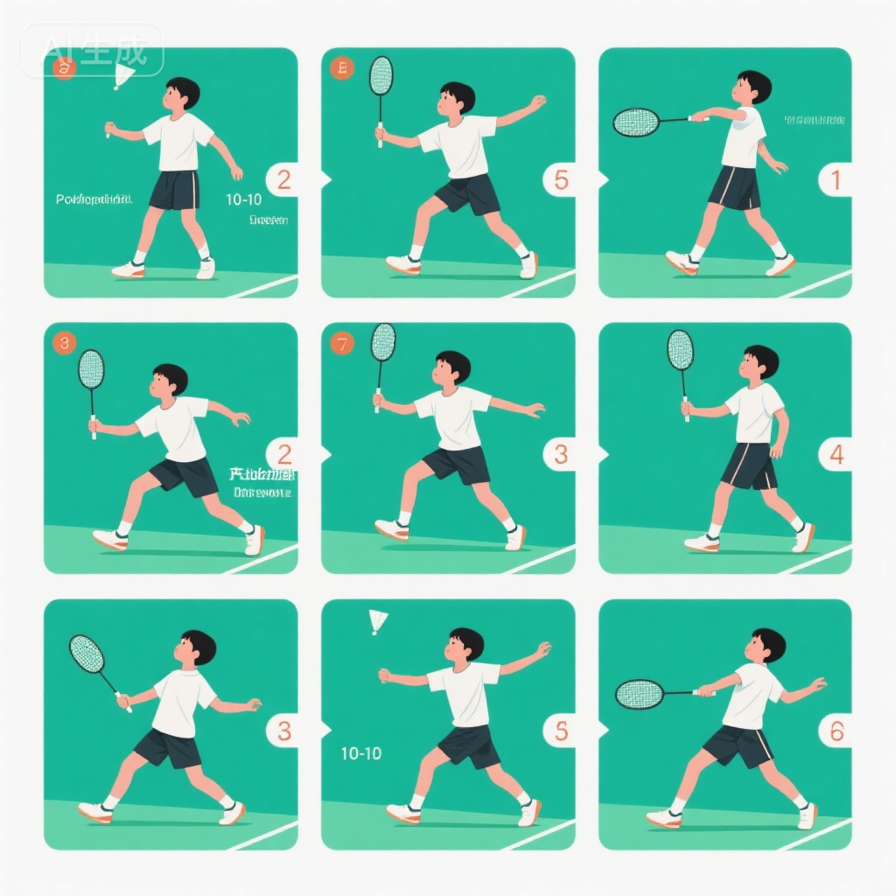
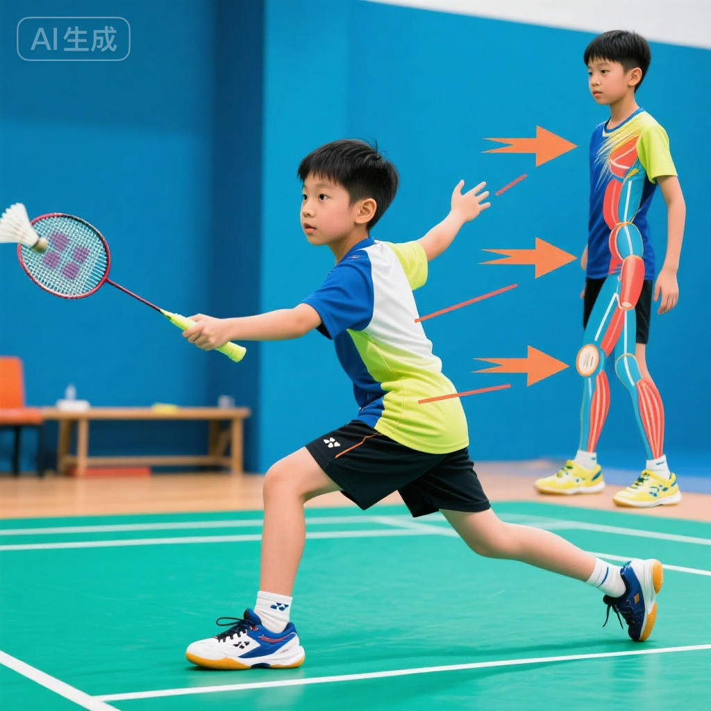
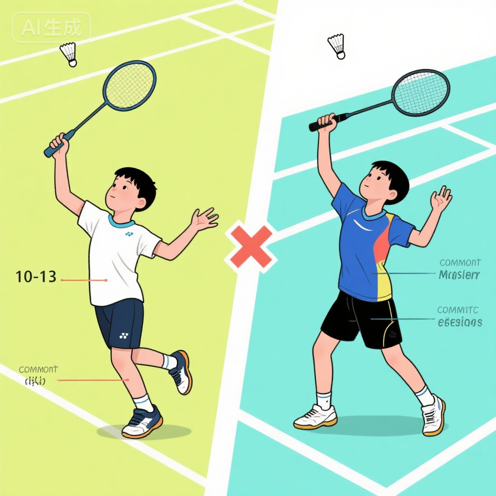
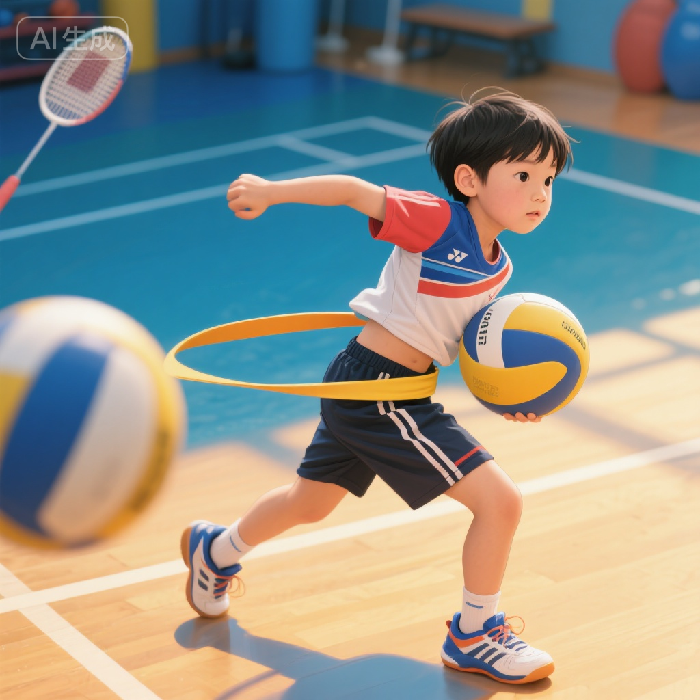
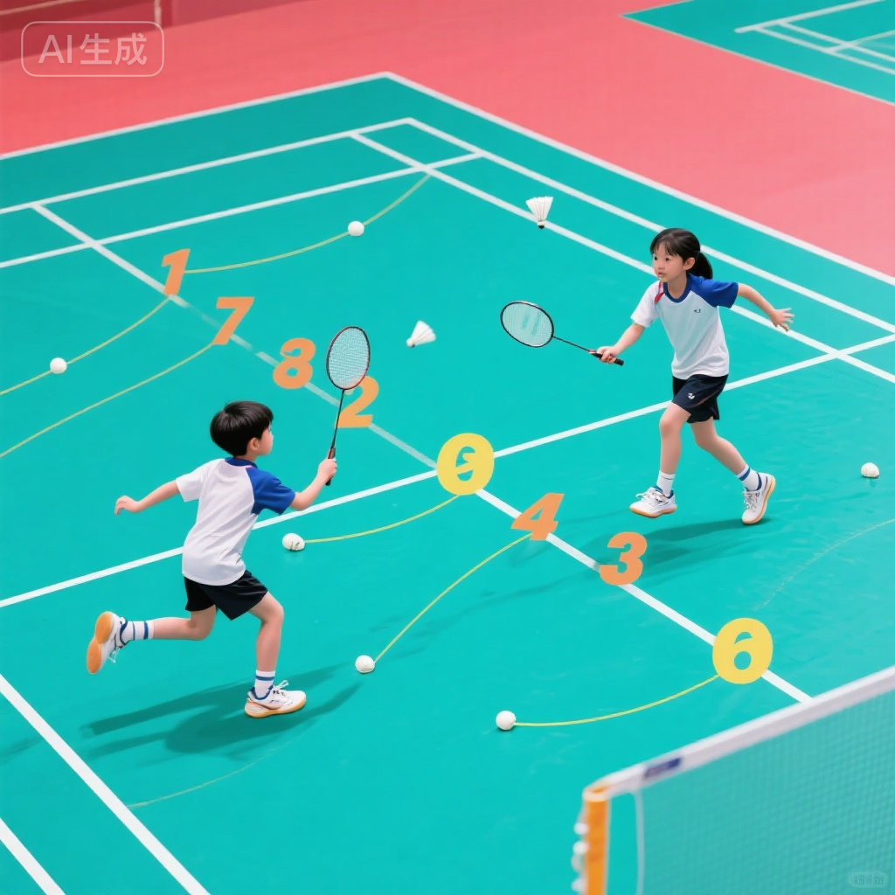

# 高远球技术训练

## 训练目标

高远球是羽毛球后场技术的基础，也是比赛中使用频率最高的技术之一。本训练方案旨在：

1. **掌握正手高远球技术** - 建立标准的正手高远球击球动作和发力模式
2. **学习头顶高远球技术** - 熟练运用头顶区域击球，扩大防守范围
3. **提升击球质量** - 确保高远球飞行弧线高、落点深、威胁大
4. **强化后场步法** - 后场移动与高远球技术的有机结合
5. **培养战术意识** - 理解高远球在实战中的战术运用和时机选择

---

## 科学依据

### 10-12岁技术学习特点

**生理发育优势**:
- **力量基础建立** - 核心力量和上肢力量初步发展，能够完成完整发力动作
- **协调性成熟** - 全身协调发力能力显著提升
- **技术定型期** - 这个年龄段建立的技术动作将影响终身
- **理解能力增强** - 能够理解技术原理和战术意图

**技术训练原则**:
1. **完整动作建立** - 从准备、引拍、发力到随挥，建立完整技术链
2. **发力机制培养** - 强调全身协调发力，而非单纯手臂力量
3. **多球强化训练** - 通过大量重复建立稳定的肌肉记忆
4. **实战情境模拟** - 尽早将技术应用到实战对抗中

### 高远球的技术地位

**基础性**:
- 所有后场技术(杀球、吊球、平高球)的基础
- 掌握高远球后其他技术学习事半功倍

**实战价值**:
- 争取主动:压制对手到后场
- 调整节奏:赢得时间调整位置和呼吸
- 消耗体能:迫使对手大范围移动
- 战术串联:为进攻或防守创造机会

---

## 训练内容

### 第一部分:正手高远球技术 (40-50分钟)

#### 1. 技术动作分解

**准备阶段**:
- **站位**: 侧身对网，左肩指向球网
- **重心**: 在右腿，左腿自然抬起或微屈
- **握拍**: 正手握拍，拍头指向后上方
- **视线**: 注视来球轨迹

**引拍阶段**:
- **转体**: 肩膀充分转动，背对球网
- **举拍**: 拍子从下向后上方引，形成"拉弓"姿势
- **肘部**: 抬高至肩膀或稍高，肘关节保持一定角度
- **非持拍手**: 指向来球，保持平衡

**击球阶段**:
- **转体发力**: 腰腹带动转体，从下向上鞭打发力
- **击球点**: 右肩前上方，手臂几乎伸直
- **击球瞬间**: 手腕、手指爆发式发力
- **拍面**: 正面触球，向斜上方击打

**随挥阶段**:
- **自然随挥**: 拍子自然向左下方落下
- **还原**: 迅速回到中心位置
- **准备**: 恢复准备姿势，准备下一拍

#### 2. 分步训练方法

**训练1: 原地挥拍练习 (10分钟)**
- **目的**: 建立完整挥拍动作记忆
- **方法**:
  - 不拿球拍,做完整挥拍动作
  - 强调侧身、引拍、转体、挥拍
  - 每组20次,做3-4组
- **关键**: 动作要流畅连贯,不要僵硬

**训练2: 定点击球练习 (15分钟)**
- **目的**: 建立击球点和发力感觉
- **设置**: 教练在网前定点喂高球
- **方法**:
  - 学员在后场固定位置击球
  - 集中注意力在击球点和发力
  - 每组10-15球,做5-6组
- **要求**: 球要飞得高且深,过网后下降

**训练3: 移动击球练习 (15分钟)**
- **目的**: 结合步法的击球训练
- **方法**:
  - 从中场移动到后场击球
  - 强调步法到位、侧身充分
  - 击球后回中场
- **进阶**: 增加移动距离和速度

#### 3. 常见错误与纠正

**错误1: 正面对网击球**
- **表现**: 没有侧身,正面对网挥拍
- **后果**: 发力不充分,球飞不远
- **纠正**:
  - 强调侧身动作
  - 用标志物提示肩膀方向
  - 练习侧身步法

**错误2: 击球点太低或太靠后**
- **表现**: 在肩膀或头顶后方击球
- **后果**: 球的弧线低平,容易下网或飞不远
- **纠正**:
  - 用悬挂的球标记正确击球点
  - 练习"够"球击打
  - 后退步法训练

**错误3: 只用手臂发力**
- **表现**: 转体不明显,全靠手臂挥拍
- **后果**: 容易疲劳,发力不足,易受伤
- **纠正**:
  - 徒手做转体练习
  - 强调"用腰打球"
  - 看专业选手慢动作视频

**错误4: 击球后不随挥**
- **表现**: 击球后突然停止动作
- **后果**: 发力不完整,易伤肘部和肩部
- **纠正**:
  - 强调自然随挥
  - 模仿"甩鞭子"动作
  - 放松练习

---

### 第二部分:头顶高远球技术 (30-40分钟)

#### 1. 技术动作要领

**与正手高远球的区别**:
- **击球区域**: 头顶偏左侧位置
- **步法**: 通常需要更大范围的后退和侧移
- **转体幅度**: 更大,身体几乎背对球网
- **发力方式**: 更强调腰腹和背部力量

**完整动作流程**:

**1. 判断与移动**:
- 快速判断球落点(左后场)
- 用交叉步或并步后退
- 到位时完成侧身

**2. 准备击球**:
- 左肩指向网,背对或侧对球网
- 举拍,拍头指向后上方
- 重心在右腿

**3. 击球发力**:
- 击球点在头顶偏右前方
- 转体、展胸、挥拍连贯完成
- 手腕、手指最后发力

**4. 随挥回位**:
- 自然随挥
- 迅速回到中心位置

#### 2. 专项训练方法

**训练1: 头顶区域步法练习 (10分钟)**
- 从中场后退到左后场
- 重点练习交叉步和最后一步调整
- 到位后完成侧身动作

**训练2: 头顶定点击球 (10分钟)**
- 教练定点喂球到头顶位置
- 学员固定位置击球
- 强调击球点和转体发力

**训练3: 移动击球组合 (10分钟)**
- 中场→头顶高远球→回中场
- 连续击球,保持节奏
- 逐步加快速度

---

### 第三部分:发力技术专项训练 (20-25分钟)

#### 1. 核心力量发力训练

**训练1: 转体发力练习**
- **无球转体**: 模拟击球转体动作,感受腰腹发力
- **持拍转体**: 拿球拍做完整转体挥拍
- **阻力转体**: 使用弹力带增加阻力

**训练2: 鞭打发力练习**
- **甩毛巾**: 像甩鞭子一样甩毛巾,体会发力顺序
- **空挥加速**: 拿拍子快速空挥,强调加速
- **击网练习**: 击打球网,感受爆发力

#### 2. 手腕手指发力训练

**训练1: 手腕屈伸练习**
- 握拍,仅用手腕做屈伸动作
- 体会手腕的"扣腕"发力
- 每组30次,3-4组

**训练2: 手指拨球练习**
- 用手指拨动球拍,使拍头转动
- 培养手指的爆发力
- 结合到击球瞬间

---

### 第四部分:实战应用训练 (15-20分钟)

#### 1. 对抗性练习

**训练1: 高远球对抗**
- 两人后场互相击高远球
- 要求:弧线高,落点深
- 连续对抗,保持30拍以上

**训练2: 四方球练习**
- 一人定点喂球到四个角
- 另一人移动击高远球回中场
- 锻炼步法和高远球结合

#### 2. 战术意识培养

**什么时候打高远球**:
- ✅ 被动防守时,争取时间
- ✅ 对手压网时,调动到后场
- ✅ 需要调整节奏时
- ✅ 为进攻创造机会时

**什么时候不打高远球**:
- ❌ 对手后场能力强时(易被攻击)
- ❌ 自己主动进攻时(浪费机会)
- ❌ 对手体能充沛时(消耗战不利)

---

## 安全注意事项

::: warning 重要安全提示
高远球训练需要大幅度挥拍和全身发力,必须注意安全防护!
:::

### 训练前准备
1. **充分热身** (15-20分钟)
   - 肩关节、肘关节、腕关节活动
   - 腰腹核心激活
   - 动态拉伸

2. **场地检查**
   - 后场区域无障碍物
   - 地面干燥防滑
   - 充足的空间挥拍

3. **装备检查**
   - 球拍线无松动
   - 握把布不滑
   - 合适的球拍重量(85-88克为宜)

### 训练中注意
1. **避免过度疲劳**
   - 感觉肩部、肘部疼痛立即停止
   - 每15-20分钟休息一次
   - 充分补水

2. **动作规范性**
   - 不要为了打远而过度发力
   - 保持动作流畅,不要僵硬
   - 正确的发力顺序

3. **循序渐进**
   - 从定点到移动
   - 从慢速到快速
   - 逐步增加训练量

---

## 训练效果评估

### 技术动作评估

**正手高远球动作评分**:
| 评分项 | 优秀 | 良好 | 合格 | 需改进 |
|--------|------|------|------|--------|
| 侧身充分 | 完全侧身 | 基本侧身 | 侧身不足 | 正面对网 |
| 引拍到位 | 完全拉开 | 基本到位 | 引拍不足 | 无引拍 |
| 击球点正确 | 前上方 | 基本正确 | 略偏后 | 明显偏后 |
| 转体发力 | 明显 | 较明显 | 不明显 | 无转体 |
| 随挥自然 | 流畅 | 基本流畅 | 僵硬 | 无随挥 |

### 击球质量评估

**高远球质量标准** (10-12岁):
- **优秀**:
  - 弧线最高点在对方场区上空
  - 落点在底线附近(距底线1米内)
  - 下降角度陡峭

- **良好**:
  - 弧线较高
  - 落点在后场区域
  - 有一定威胁

- **合格**:
  - 能飞过对方后场
  - 弧线基本达标
  - 落点不够深

### 实战能力测试

**连续高远球测试**:
- 与教练对抗,连续击高远球
- **优秀**: 30拍以上,质量稳定
- **良好**: 20-29拍
- **合格**: 10-19拍

---

## 教练指导建议

### 教学重点

1. **侧身意识培养** (最重要)
   - 反复强调"用肩膀对球"
   - 用视觉标志提示
   - 侧身不到位绝不允许击球

2. **发力顺序教学**
   - 下肢蹬地 → 转体 → 挥臂 → 手腕手指
   - 用慢动作演示
   - 分解练习各环节

3. **击球点强化**
   - 用悬挂球标记正确击球点
   - "够着球打"的概念
   - 后退步法充分

### 常见教学难点

**难点1: 学员总是打不远**
- **原因分析**:
  - 发力不协调,只用手臂
  - 击球点不对
  - 拍面角度问题
- **解决方案**:
  - 强化转体发力练习
  - 调整击球点位置
  - 检查拍面是否正对来球

**难点2: 头顶球总是打不好**
- **原因分析**:
  - 步法不到位
  - 侧身不够充分
  - 不习惯用头顶区域击球
- **解决方案**:
  - 单独练习头顶步法
  - 多球强化头顶定点击球
  - 建立信心,克服心理障碍

### 训练组织建议

**多球训练法** (推荐):
- 教练持续喂球,学员连续击打
- 高效,训练量大
- 每组15-20球,间隔1分钟

**一对一教学**:
- 适合初学和纠正错误
- 教练及时反馈
- 针对性强

**分组对抗**:
- 学员两两一组互相练习
- 提高兴趣,增加实战性
- 教练巡回指导

---

## 家庭延伸训练

### 徒手练习 (每天10-15分钟)

**练习1: 镜前挥拍**
- 对着镜子做完整高远球动作
- 检查侧身、引拍、挥拍
- 每天50-100次

**练习2: 转体发力练习**
- 不拿拍,做转体挥臂动作
- 体会腰腹发力
- 每天3-5组,每组20次

**练习3: 手腕力量练习**
- 握小哑铃或水瓶做手腕屈伸
- 增强手腕力量
- 每天2-3组,每组15-20次

### 辅助训练

**柔韧性训练**:
- 肩关节拉伸
- 腰部柔韧性
- 每天5-10分钟

**力量训练**:
- 俯卧撑(胸肌、肱三头肌)
- 平板支撑(核心)
- 深蹲(下肢)

---

## 延伸阅读

1. **《羽毛球高远球技术精讲》** - 深入理解高远球原理
2. **《林丹技术分析》** - 学习世界冠军的高远球
3. **《羽毛球力学原理》** - 从物理学角度理解击球
4. **《青少年羽毛球专项体能训练》** - 配套体能训练

---

## 专业术语表

- **高远球 (Clear/Lob)** - 飞行弧线高,落点靠近底线的后场球
- **正手高远球 (Forehand Clear)** - 右后场区域用正手击打的高远球
- **头顶高远球 (Overhead Clear)** - 头顶区域用正手握拍方式击打的高远球
- **击球点 (Impact Point)** - 球拍触球的空间位置
- **鞭打发力 (Whip Action)** - 像甩鞭子一样的连贯发力方式
- **侧身 (Side-on Position)** - 身体侧对球网的姿势
- **转体 (Body Rotation)** - 以腰为轴的身体旋转动作

---

## 参考文献

1. 陈文斌, 钟波 (2016). 《羽毛球运动教程》(第3版). 人民体育出版社.
2. 中国羽毛球协会 (2020). 《青少年羽毛球训练大纲》.
3. Grice, T. (2016). *Badminton: Steps to Success* (4th ed.). Human Kinetics.
4. 李玲蔚 (2018). 《羽毛球技术图解》. 北京体育大学出版社.
5. 肖杰 (2019). 《羽毛球后场技术训练法》. 高等教育出版社.

---

**训练提示**: 高远球是羽毛球的基础,也是最难掌握的技术之一。不要急于求成,重视每一个技术细节,建立正确的动作模式比打得远更重要! 🏸
