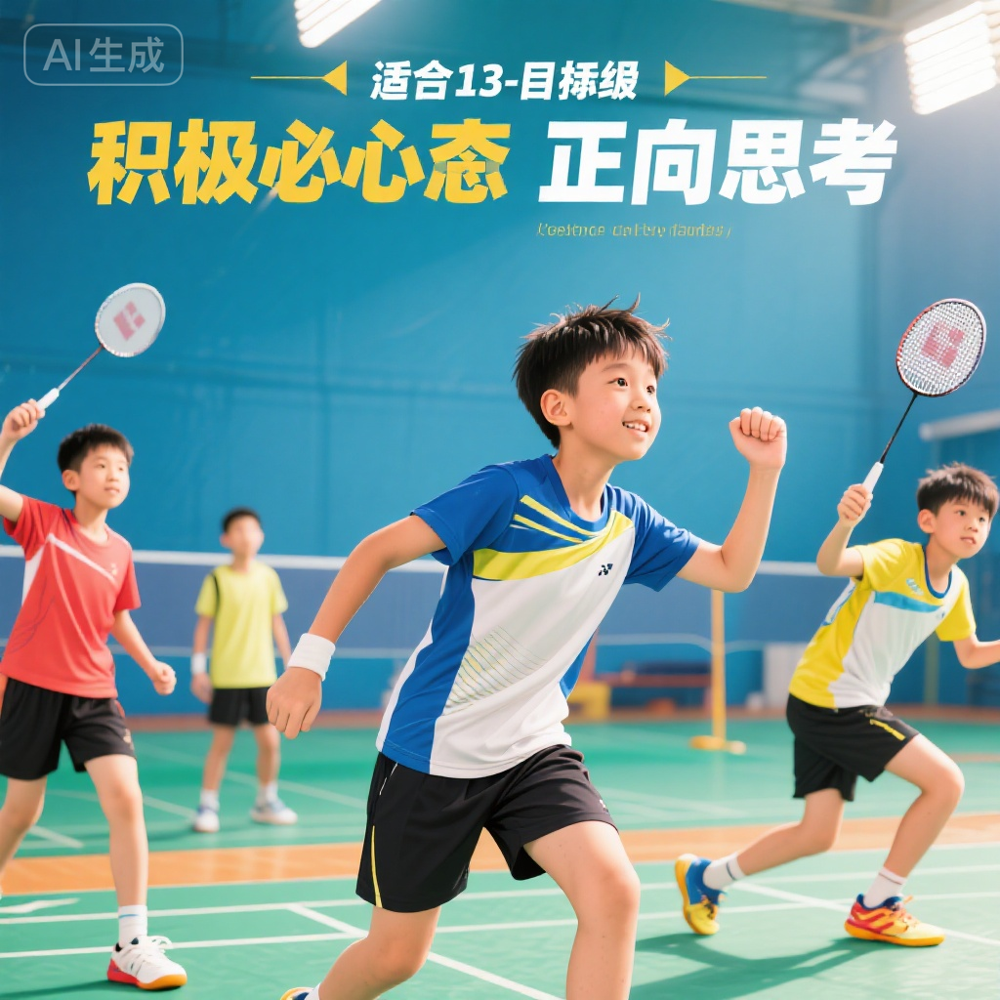
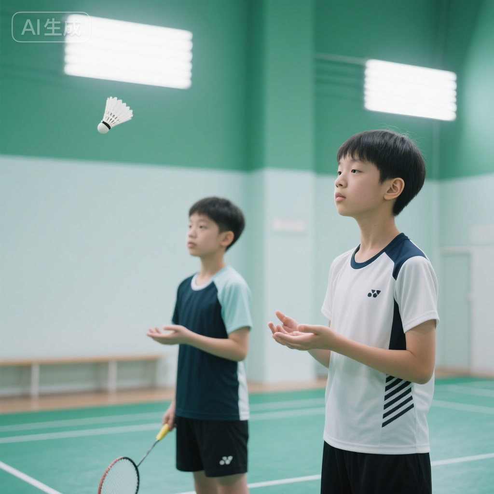
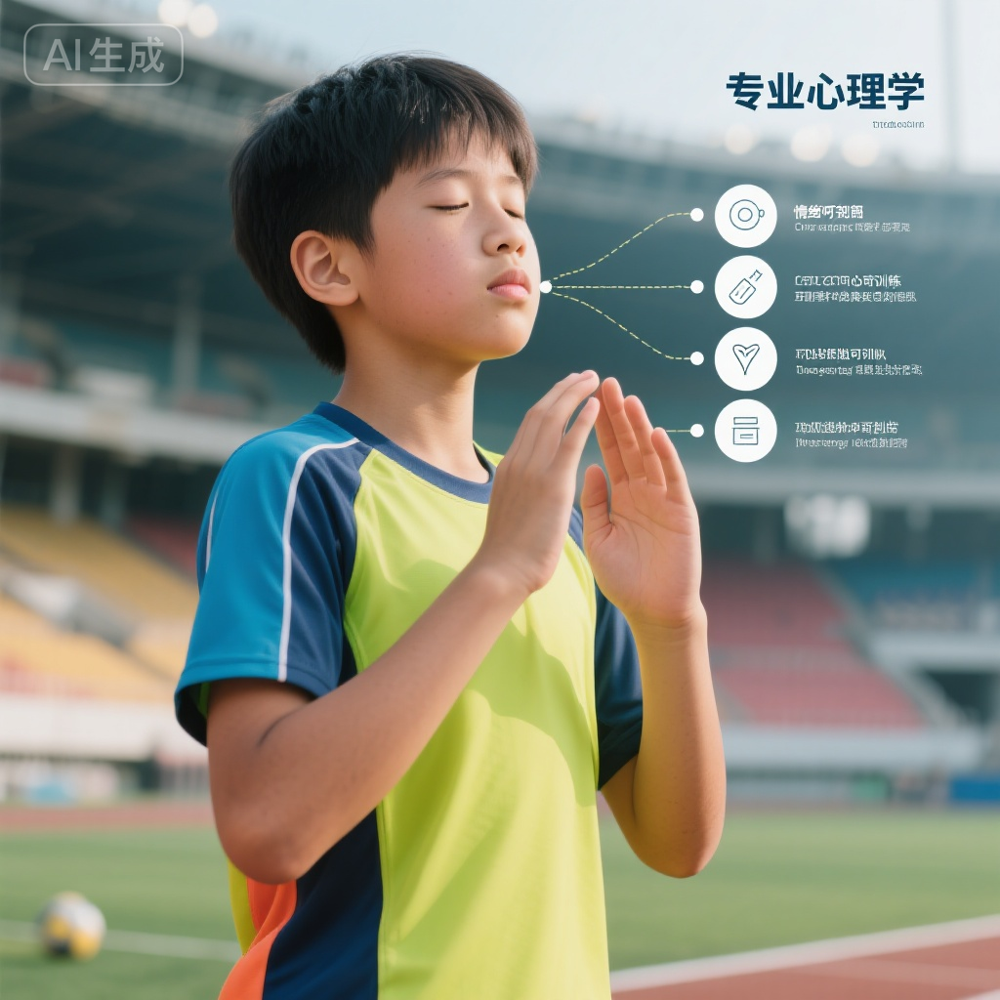

# 竞技心理训练

## 训练目标

竞技心理素质是决定比赛胜负的关键因素之一。本方案旨在：

1. **培养良好比赛心态** - 建立积极、稳定的竞技心理状态
2. **提升压力管理能力** - 学会在压力下保持冷静和专注
3. **增强注意力控制** - 提高比赛中的专注度和注意力分配能力
4. **建立运动自信心** - 培养对自己能力的信心和积极期待
5. **掌握情绪调节技巧** - 学会管理比赛中的情绪波动

---

## 科学依据

### 13-15岁心理发展特点

**心理成熟度提升**:
- **自我意识增强** - 开始关注自我评价和他人看法
- **情绪波动加大** - 青春期情绪变化明显，易受外界影响
- **抗压能力提升** - 心理承受能力逐步增强，但仍需培养
- **目标意识形成** - 开始有明确的竞技目标和成就动机

**竞技心理重要性**:
- **决定比赛表现** - 心理状态直接影响技术发挥和战术执行
- **影响训练效果** - 良好心态提升训练投入度和效果
- **促进长期发展** - 心理韧性是运动员长期发展的基础
- **应对挫折能力** - 帮助运动员从失败中恢复并成长

### 竞技心理核心要素

**认知层面**:
1. **注意力** - 集中、分配、转移注意力的能力
2. **决策力** - 快速准确的判断和决策能力
3. **战术思维** - 比赛中的战术分析和应变能力

**情感层面**:
1. **自信心** - 对自己能力的信任和积极期待
2. **情绪稳定性** - 控制和调节情绪波动的能力
3. **动机水平** - 参与训练和比赛的内在驱动力

**意志层面**:
1. **坚韧性** - 面对困难和挫折的毅力
2. **自控力** - 控制自己行为和情绪的能力
3. **竞争性** - 追求胜利和超越对手的意愿

---

## 训练内容

### 第一部分：比赛心态培养 (15-20分钟)

#### 1. 积极心态建立

**核心理念**:
- **过程导向** - 关注自己的表现而非结果
- **成长思维** - 把挑战看作成长机会而非威胁
- **自我对话** - 用积极的内在语言鼓励自己

**训练1: 积极自我对话练习**
- **方法**:
  - 列出10句积极的自我鼓励语
    - "我已经准备好了"
    - "我会全力以赴"
    - "每一分都很重要"
    - "我能应对任何挑战"
  - 每天训练前默念3-5遍
  - 比赛前在更衣室或场边重复
- **价值**: 建立积极心理暗示

**训练2: 成功经验回顾**
- **设置**: 每周训练结束后10分钟
- **方法**:
  - 回顾本周训练或比赛中的成功瞬间
  - 记录在训练日志中
  - 描述当时的感受和状态
  - 比赛前重温这些成功记忆
- **价值**: 增强自信心和积极期待

#### 2. 目标设定训练

**SMART目标原则**:
- **S (Specific)** - 具体明确
- **M (Measurable)** - 可衡量
- **A (Achievable)** - 可实现
- **R (Relevant)** - 相关性强
- **T (Time-bound)** - 有时间限制

**训练: 短期目标设定**
- **设置**: 每次比赛或重要训练前
- **方法**:
  - 设定3个过程目标（如"保持积极心态"、"每分全力以赴"）
  - 设定1-2个表现目标（如"发球失误` <3次"、"主动进攻得分`> 5分"）``
  - 比赛后评估目标完成情况
- **价值**: 将注意力集中在可控因素上

#### 3. 失败重新定义

**认知重构**:
- **失败≠失败者** - 比赛输了不代表你是失败者
- **失败是反馈** - 每次失败都提供改进信息
- **暂时性** - 这次失败是暂时的，不是永久的

**训练: 失败分析练习**
- **设置**: 比赛失利后24小时内
- **方法**:
  1. **情绪释放** (5分钟) - 允许自己难过、失望
  2. **理性分析** (10分钟):
     - 这场比赛我哪些方面做得好？
     - 哪些方面需要改进？
     - 下次比赛我可以做什么改变？
  3. **行动计划** (5分钟) - 制定具体改进措施
- **价值**: 从失败中学习而非沉浸在负面情绪中

---

### 第二部分：压力管理训练 (15-20分钟)

#### 1. 认识压力

**压力来源**:
- **外部压力**: 观众期待、对手实力、比赛重要性
- **内部压力**: 自我期待、担心失败、过度在意结果

**压力的两面性**:
- **适度压力** - 提升专注度和表现
- **过度压力** - 导致紧张、失误增加

#### 2. 放松技巧训练

**技巧1: 深呼吸法**
- **方法**:
  - **吸气** (4秒) - 通过鼻子深吸气，腹部隆起
  - **屏息** (4秒) - 保持呼吸
  - **呼气** (6秒) - 通过嘴缓慢呼气，腹部收缩
  - 重复5-10次
- **应用**: 比赛间歇、关键分前、感觉紧张时
- **效果**: 降低心率，平复情绪

**技巧2: 渐进性肌肉放松**
- **方法**:
  1. 紧握拳头5秒，然后放松
  2. 耸肩5秒，然后放松
  3. 收紧腹部5秒，然后放松
  4. 绷紧腿部5秒，然后放松
- **应用**: 赛前15分钟、训练前
- **效果**: 释放肌肉紧张，提升身体放松度

**技巧3: 冥想与正念**
- **方法**:
  - 找安静地方坐下或躺下
  - 闭眼，关注自己的呼吸
  - 当思绪飘走时，温和地把注意力拉回呼吸
  - 持续5-10分钟
- **应用**: 每天睡前或早上
- **效果**: 提升专注力和情绪稳定性

**训练: 压力应对演练**
- **设置**: 模拟高压比赛场景
- **方法**:
  - 教练营造压力情境（如落后、关键分、决胜局）
  - 学员使用放松技巧应对
  - 观察心率、呼吸、身体紧张度变化
- **时长**: 5分钟×3组，不同压力场景

---

### 第三部分：注意力训练 (15-20分钟)

#### 1. 注意力类型

**宽度维度**:
- **宽广注意** - 同时关注多个信息（如双打时关注搭档和对手）
- **狭窄注意** - 集中在单一对象（如发球时只关注球）

**方向维度**:
- **外部注意** - 关注外部环境（如对手动作、球的位置）
- **内部注意** - 关注内在感受（如身体状态、情绪）

**理想状态**: 根据比赛需要灵活切换注意力类型

#### 2. 注意力集中训练

**训练1: 单点注视训练**
- **方法**:
  - 盯着墙上一个点或球
  - 持续盯住60秒，不移开视线
  - 当注意力飘走时，温和拉回
- **进阶**: 增加干扰（如噪音、他人走动）
- **应用**: 提升专注持久度
- **时长**: 60秒×5组

**训练2: 球路追踪训练**
- **方法**:
  - 观看比赛视频，用眼睛追踪球的路线
  - 每次球过网后在心中默念"看球"
  - 不要去想结果或评判，只专注看球
- **价值**: 训练比赛中的注意力聚焦
- **时长**: 5分钟

**训练3: 数字记忆游戏**
- **方法**:
  - 教练快速说出一串数字（如"3-7-2-9"）
  - 学员立即重复
  - 逐渐增加数字数量和速度
- **价值**: 提升注意力和短期记忆
- **时长**: 5分钟

#### 3. 注意力转移训练

**训练: 快速切换练习**
- **设置**: 模拟比赛中的注意力切换
- **方法**:
  - **发球前** - 内部注意（专注发球动作和策略）
  - **球在空中** - 外部注意（盯球、观察对手）
  - **得分后** - 内部注意（调整情绪和状态）
  - **准备下一分** - 外部注意（观察对手站位）
- **价值**: 训练注意力灵活转换

---

### 第四部分：自信心建设 (10-15分钟)

#### 1. 自信心来源

**成就经验** - 过去的成功经历
**替代经验** - 看到同水平队员成功
**言语说服** - 教练、家长、队友的鼓励
**生理唤醒** - 良好的身体状态

#### 2. 自信心提升策略

**策略1: 成功日志**
- **方法**:
  - 每天记录3件成功的事（技术、战术、心态等）
  - 具体描述成功的过程和感受
  - 每周回顾，强化成功记忆
- **价值**: 积累成就经验，建立自信基础

**策略2: 技术视频回顾**
- **方法**:
  - 录制训练或比赛中技术发挥好的片段
  - 比赛前反复观看
  - 在脑海中重现那种感觉
- **价值**: 强化技术自信

**策略3: 心理暗示卡片**
- **方法**:
  - 制作小卡片，写上自己的优势和长处
    - "我的反应很快"
    - "我的体能很好"
    - "我的网前技术很细腻"
  - 放在球包里，赛前阅读
- **价值**: 提醒自己的优势，增强信心

**训练: 自信宣言练习**
- **设置**: 每次训练开始前
- **方法**:
  - 全队或个人大声说出自信宣言
  - "今天我会全力以赴！"
  - "我相信我的能力！"
  - "我已经准备好迎接挑战！"
- **价值**: 通过语言和行为强化自信

---

### 第五部分：情绪调节训练 (10-15分钟)

#### 1. 认识比赛情绪

**常见负面情绪**:
- **焦虑/紧张** - 担心失败、过度激活
- **愤怒/沮丧** - 失误后的不满和挫败感
- **恐惧** - 害怕对手、害怕失败
- **压抑** - 情绪无法表达，压在心里

**情绪的影响**:
- **生理** - 心率加快、肌肉紧张、呼吸急促
- **认知** - 注意力分散、决策失误
- **行为** - 动作僵硬、失误增加

#### 2. 情绪调节技巧

**技巧1: 暂停-呼吸-重启法**
- **暂停** (1秒) - 意识到情绪波动，告诉自己"停"
- **呼吸** (5-10秒) - 深呼吸2-3次，平复情绪
- **重启** (3秒) - 重新聚焦，准备下一分

**应用**: 失误后、丢关键分后、感觉情绪失控时

**技巧2: 积极重新评价**
- **方法**:
  - 将负面事件重新解释为中性或积极
  - 例如: "他打得确实好" → "这是检验我防守的机会"
  - "我又失误了" → "我正在学习，失误是进步的一部分"
- **价值**: 改变对事件的认知，减少负面情绪

**技巧3: 情绪表达规则**
- **允许的表达**: 握拳、喊"来"、跺脚（释放能量）
- **不允许的**: 摔拍、骂人、发泄到对手或队友
- **原则**: 情绪需要释放，但要有建设性

**训练: 情绪调节模拟**
- **设置**: 模拟失误或落后情境
- **方法**:
  - 教练故意制造失误情境（如连续丢分）
  - 学员使用情绪调节技巧应对
  - 教练观察并反馈调节效果
- **时长**: 3-5分钟×3场景

#### 3. 赛后情绪管理

**赢球后**:
- 庆祝但保持谦虚
- 总结做得好的地方
- 不要过度膨胀

**输球后**:
- 允许自己难过（5-10分钟）
- 理性分析问题
- 制定改进计划
- 快速走出阴影

---

### 第六部分：心理韧性培养 (10-15分钟)

#### 1. 心理韧性的重要性

**定义**: 在逆境、失败、压力下快速恢复并成长的能力

**核心特质**:
- **坚韧不拔** - 不轻易放弃
- **适应能力** - 灵活应对变化
- **积极乐观** - 保持希望和信心
- **快速恢复** - 从挫折中迅速振作

#### 2. 韧性培养训练

**训练1: 逆境模拟**
- **设置**: 故意制造不利情境
  - 比分落后（如0-10开始）
  - 裁判判罚不利
  - 天气或场地条件不佳
- **方法**:
  - 学员在逆境中坚持比赛
  - 关注自己的应对方式和心态变化
  - 赛后讨论如何更好应对
- **价值**: 增强逆境承受能力

**训练2: 挫折教育**
- **方法**:
  - 分享优秀运动员克服困难的故事
  - 讨论自己经历过的挫折和如何克服
  - 建立"挫折是成长机会"的认知
- **时长**: 每月1次，30分钟小组讨论

**训练3: 毅力挑战**
- **设置**: 设定困难但可实现的训练目标
  - 连续500次颠球
  - 连续10分钟高强度体能训练
  - 一周完成10小时训练量
- **方法**:
  - 学员坚持完成挑战
  - 过程中会遇到疲劳、想放弃等困难
  - 教练鼓励并见证完成
- **价值**: 培养坚持和毅力

---

## 安全注意事项

::: warning 心理训练注意事项
心理训练需要专业指导，避免造成心理压力！
:::

### 训练原则
1. **循序渐进** - 不要一开始就进行高强度心理训练
2. **个体差异** - 尊重每个人的心理承受能力
3. **积极为主** - 多鼓励少批评，建立积极心态
4. **专业指导** - 严重心理问题需寻求专业心理咨询师

### 注意信号
如发现以下情况，应立即停止训练并寻求帮助：
- 持续失眠或噩梦
- 对训练和比赛完全失去兴趣
- 严重焦虑或抑郁情绪
- 自我伤害倾向

---

## 训练效果评估

### 心理状态评估

**赛前状态评估** (每次比赛前):
- **焦虑水平** (1-10分): 5-7分为最佳（适度紧张）
- **自信水平** (1-10分): 7-9分为良好
- **专注度** (1-10分): 8-10分为优秀

**赛后自我评估**:
- 我的注意力是否集中？
- 我是否保持了积极心态？
- 我如何应对了压力和挫折？
- 我的情绪控制如何？

### 心理素质测试

**压力测试**:
- 模拟高压情境（如决胜局、关键分）
- **优秀** - 保持冷静，正常发挥
- **良好** - 略有紧张，但能控制
- **需提升** - 明显紧张，发挥失常

**情绪恢复测试**:
- 失误后多久能恢复正常状态
- **优秀** - ` <10秒`
- **良好** - 10-30秒
- **需提升** - `> 30秒`

**专注力测试**:
- 比赛中注意力集中时长
- **优秀** - 全场保持专注
- **良好** - 偶尔走神但能快速拉回
- **需提升** - 频繁走神，难以集中

---

## 教练指导建议

### 教学要点

1. **树立榜样** - 教练自己要保持积极心态
2. **个性化指导** - 了解每个运动员的心理特点
3. **及时反馈** - 发现心理问题及时沟通
4. **鼓励为主** - 多表扬进步，少批评失误
5. **营造氛围** - 创造积极、支持的训练环境

### 与运动员沟通技巧

**倾听**: 给运动员表达的空间，认真倾听他们的想法和感受
**共情**: 理解他们的压力和困难，表达同理心
**引导**: 用问题引导他们自己思考解决方案
**鼓励**: 相信他们的能力，给予积极期待

### 家长配合建议

**给予支持**:
- 关注过程而非结果
- 鼓励努力和进步
- 接纳失败和挫折

**避免压力**:
- 不要过高期待
- 不要与他人比较
- 不要批评和指责

---

## 家庭延伸训练

### 日常心理练习 (每天5-10分钟)

**练习1: 感恩日记**
- 每天睡前写下3件值得感恩的事
- 可以是训练进步、队友帮助、家人支持等
- 培养积极心态

**练习2: 冥想呼吸**
- 每天早上或睡前5分钟冥想
- 关注呼吸，让思绪安静下来
- 提升专注力和情绪稳定性

**练习3: 积极对话**
- 家长和孩子分享今天积极的事情
- 讨论如何应对遇到的困难
- 强化积极思维模式

---

## 延伸阅读

1. **《运动心理学》** - 系统了解运动心理学知识
2. **《心理韧性训练手册》** - 学习培养心理韧性的方法
3. **《冠军心态》** - 优秀运动员的心理素质分析

---

## 专业术语表

- **心理韧性 (Mental Toughness)** - 在压力和逆境下保持高水平表现的能力
- **注意力 (Attention)** - 有选择地集中精力于某些信息的能力
- **自我效能感 (Self-Efficacy)** - 个人对自己能力的信心和期待
- **情绪调节 (Emotion Regulation)** - 监控、评估和调整情绪反应的过程
- **心理暗示 (Mental Imagery)** - 在脑海中想象成功表现的心理技能
- **目标设定 (Goal Setting)** - 为自己设定具体、可实现的目标

---

**训练提示**: 心理训练和身体训练同样重要！坚持每天练习，你会发现自己的心理素质不断提升。记住：强大的内心是成为优秀运动员的关键！💪🧠
