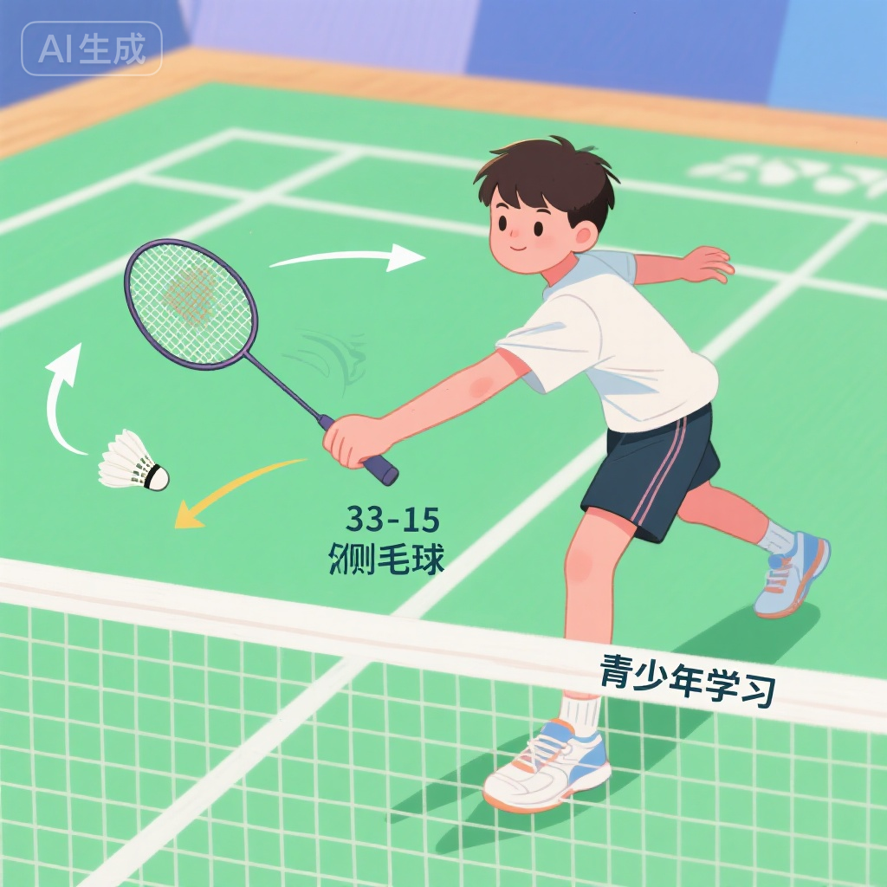
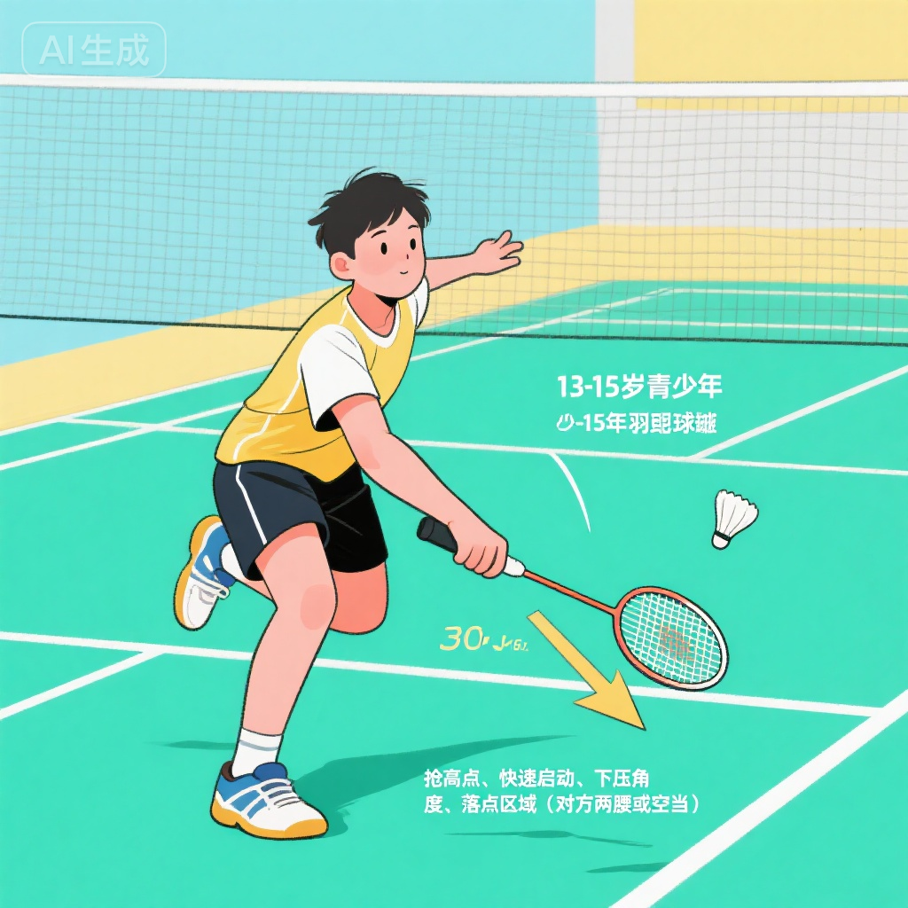
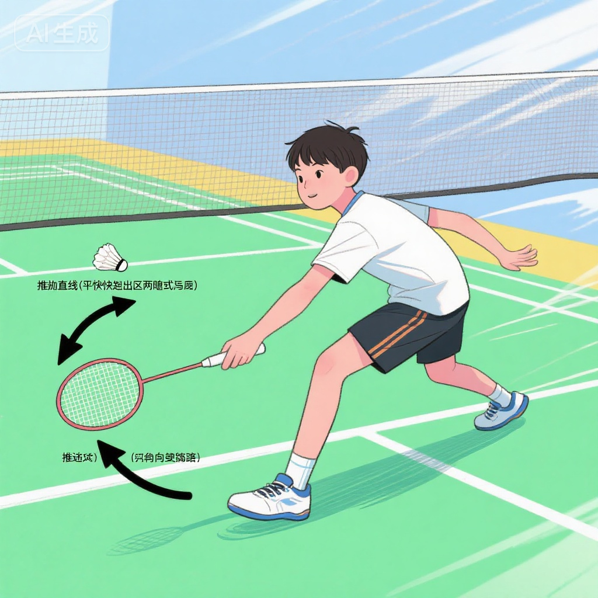

# 网前技术进阶

## 训练目标

网前技术是羽毛球比赛的关键环节，网前控制能力直接影响比赛胜负。本方案旨在：

1. **精细化网前技术** - 掌握搓球、勾对角、扑球、推球等高级网前技术
2. **提升网前控制力** - 学会通过网前技术控制节奏和主动权
3. **增强网前意识** - 培养网前快速判断和决策能力
4. **掌握网前战术** - 理解网前技术在实战中的战术应用
5. **提高网前速度** - 提升网前反应速度和处理球速度

---

## 科学依据

### 13-15岁网前技术发展特点

**技术能力提升**:
- **手指力量增强** - 能够精细控制球的旋转和落点
- **手腕灵活性** - 手腕快速发力和精准控制能力提升
- **反应速度快** - 网前快速反应和处理能力达到高峰
- **技术稳定性** - 技术动作定型，能够承受高强度训练

**网前技术重要性**:
- **得分手段** - 直接得分或创造进攻机会
- **节奏控制** - 通过网前控制改变比赛节奏
- **战术变化** - 网前技术多样化增加战术选择
- **心理压制** - 高质量网前球给对手心理压力

### 网前技术分类

**进攻性网前技术**:
1. **扑球** - 快速下压得分
2. **推球** - 平推两腰或后场
3. **挑球** - 攻击性挑后场

**控制性网前技术**:
1. **搓球** - 制造旋转，贴网过球
2. **勾对角** - 改变球路，调动对手
3. **放网** - 贴网放小球

---

## 训练内容

### 第一部分：搓球技术 (20-25分钟)

#### 1. 正手搓球

**技术要领**:

**准备动作**:
- 侧身对网，重心前倾
- 手臂自然前伸，拍面斜向上
- 手腕放松，准备发力

**击球动作**:
- **击球点**: 在网前尽可能高的位置，最好高于网带
- **拍面**: 斜切球托底部，与地面呈45-60度
- **发力**: 手指、手腕轻微发力，制造侧旋或下旋
- **球路**: 球旋转翻滚过网，落在对方网前贴网

**技术要点**:
- **贴网**: 球过网后尽快下落，越贴网越好
- **旋转**: 通过斜切制造旋转，增加球的控制难度
- **柔和**: 发力要柔和，避免球飞太远
- **快速**: 动作要快，不给对手反应时间

**训练1: 搓球定点练习**
- **设置**: 教练在网前固定喂球
- **方法**:
  - 连续搓10个球
  - 要求每个球过网后贴网下落
  - 记录贴网成功率
- **目标**: 80%以上贴网率
- **时长**: 10球×5组

**训练2: 搓球质量练习**
- **方法**:
  - 教练喂不同高度和速度的球
  - 学员根据来球调整搓球力度和拍面
  - 争取每个球都旋转翻滚过网
- **价值**: 提升搓球质量和控制力

#### 2. 反手搓球

**技术要领**:
- **握拍调整**: 拇指顶住拍柄宽面，增加控制力
- **拍面**: 斜向上，与正手类似
- **发力**: 拇指和食指捻动拍柄，制造旋转
- **击球点**: 身体左前方，尽量高点击球

**训练: 反手搓球练习**
- **设置**: 教练喂球到反手网前
- **方法**:
  - 反手搓球10次
  - 每次击球后快速回位
  - 观察球的旋转和落点
- **时长**: 10球×5组

#### 3. 搓球组合练习

**训练: 正反手搓球组合**
- **设置**: 教练随机喂球到正反手网前
- **方法**:
  - 学员根据来球选择正手或反手搓球
  - 连续20个球不失误
  - 每个球都要求质量（贴网、旋转）
- **价值**: 提升网前灵活转换能力

---

### 第二部分：勾对角技术 (20-25分钟)

#### 1. 正手勾对角

**技术要领**:

**击球动作**:
- **准备**: 类似搓球准备动作，侧身对网
- **拍面**: 击球瞬间拍面斜向对角方向
- **手腕**: 手腕快速切削，由内向外发力
- **球路**: 球贴网飞向对角网前

**与搓球的区别**:
- **球路不同**: 搓球直线，勾对角斜线
- **拍面角度**: 勾对角拍面更斜
- **隐蔽性**: 勾对角需要更好的隐蔽性

**技术要点**:
- **隐蔽**: 准备动作与搓球相同，击球瞬间才改变方向
- **贴网**: 球过网后要贴网，避免被对方扑球
- **落点**: 争取落在对角网前靠近边线位置
- **速度**: 动作要快，不给对手判断时间

**训练1: 勾对角定点练习**
- **设置**: 教练固定喂球到正手网前
- **方法**:
  - 连续勾对角10个球
  - 要求落在对角网前区域（网前2米内）
  - 记录准确率
- **目标**: 70%以上准确率
- **时长**: 10球×5组

**训练2: 搓球与勾对角结合**
- **方法**:
  - 教练喂球，学员随机选择搓直线或勾对角
  - 强调隐蔽性，对方无法提前判断
  - 20球×3组
- **价值**: 提升网前变化能力和隐蔽性

#### 2. 反手勾对角

**技术要领**:
- **拍面**: 反手位勾对角，拍面由内向外切
- **发力**: 拇指向外顶，食指向内勾
- **球路**: 从反手网前勾到对方正手网前

**训练: 反手勾对角练习**
- **设置**: 教练喂球到反手网前
- **方法**:
  - 反手勾对角10次
  - 要求球贴网且落点准确
- **时长**: 10球×5组

---

### 第三部分：扑球技术 (20-25分钟)

#### 1. 扑球技术要领

**击球动作**:

**判断与启动**:
- **判断**: 对方回球过网较高时立即判断
- **启动**: 快速向前跨步，抢高点
- **时机**: 球刚过网或略高于网时击球

**击球技术**:
- **击球点**: 尽可能高，最好在网带上方
- **拍面**: 正面下压，与地面呈30-45度
- **发力**: 前臂和手腕爆发式下压
- **球路**: 向下压向对方场地

**技术要点**:
- **抢高点**: 击球点越高，下压角度越大，得分率越高
- **快速**: 动作要快，不给对手反应时间
- **准确**: 压向对方两腰或空当位置
- **连贯**: 扑球后立即准备下一拍

**训练1: 扑球定点练习**
- **设置**: 教练喂高球到网前
- **方法**:
  - 学员快速上前扑球
  - 下压到对方场地指定区域
  - 连续10个球
- **目标**: 80%下压成功且有力
- **时长**: 10球×5组

**训练2: 扑球反应练习**
- **方法**:
  - 教练随机喂网前高球和低球
  - 学员判断后选择扑球或其他处理方式
  - 强调判断速度和扑球时机
- **价值**: 提升网前判断和反应能力

#### 2. 扑球战术应用

**应用场景**:
- **对方放网过高** - 立即扑球得分
- **对方挑球不到位** - 抢高点扑球
- **对方网前失误** - 果断扑球施压

**训练: 扑球实战练习**
- **设置**: 两组对打，重点练习网前扑球
- **方法**:
  - 一方放网，另一方根据质量选择搓球或扑球
  - 放网过高立即被扑球
  - 统计扑球得分率
- **时长**: 5分钟×4组

---

### 第四部分：推球技术 (20-25分钟)

#### 1. 推球技术要领

**击球动作**:

**推直线**:
- **击球点**: 在身体前方较高位置
- **拍面**: 正面触球，略带前倾
- **发力**: 前臂快速前推，手腕固定
- **球路**: 平快推向对方两腰或后场

**推对角**:
- **拍面**: 击球瞬间拍面斜向对角
- **手腕**: 手腕切削，改变球路
- **球路**: 平快推向对角两腰或后场

**技术要点**:
- **平快**: 球速要快，弧线要平
- **突然**: 动作要突然，不给对手准备时间
- **落点**: 推向对方两腰、反手位或空当
- **变化**: 直线和对角交替使用，增加变化

**训练1: 推球定点练习**
- **设置**: 教练喂球到网前
- **方法**:
  - 推直线5球，推对角5球
  - 要求球速快且落点准确
  - 记录落点准确率
- **目标**: 70%以上准确率
- **时长**: 10球×5组

**训练2: 推球变化练习**
- **方法**:
  - 教练喂球，学员随机推直线或对角
  - 强调隐蔽性和突然性
  - 对方难以判断推球方向
- **价值**: 提升推球变化和战术应用能力

#### 2. 推球战术应用

**战术目的**:
- **压制对手** - 快速推向两腰，限制对手反击
- **制造空当** - 推向一侧后，准备进攻另一侧空当
- **改变节奏** - 从搓球节奏突然加快推球

**训练: 推球实战练习**
- **设置**: 两组对打
- **方法**:
  - 网前连续搓球2-3拍后，突然推球
  - 观察对方反应和得分效果
  - 分析哪种推球方式更有效
- **时长**: 5分钟×4组

---

### 第五部分：网前综合训练 (15-20分钟)

#### 1. 网前多球组合

**训练1: 搓勾扑组合**
- **设置**: 教练连续喂10个网前球
- **方法**:
  - 根据球的高度和位置选择技术
    - 低球 → 搓球或勾对角
    - 高球 → 扑球
    - 中等高度 → 推球
  - 强调技术选择的合理性
- **时长**: 10球×5组

**训练2: 网前快速转换**
- **设置**: 教练快速连续喂球到正反手网前
- **方法**:
  - 学员快速移动处理
  - 正反手技术灵活运用
  - 连续20球不失误
- **价值**: 提升网前移动和快速转换能力

#### 2. 网前实战对抗

**训练: 网前对搓练习**
- **设置**: 两人网前对搓
- **方法**:
  - 只在网前进行搓球、勾对角、推球
  - 谁失误或球过高被扑谁输
  - 先得5分获胜
- **价值**: 提升网前控制力和实战应用能力

**训练: 网前抢网练习**
- **设置**: 两人同时从中场起动
- **方法**:
  - 教练发球到网前
  - 两人抢网处理
  - 谁先到且处理质量高谁得分
- **价值**: 提升网前意识和抢网速度

---

### 第六部分：网前战术意识 (10-15分钟)

#### 1. 网前技术选择

**选择原则**:

**根据来球高度**:
- **高球** (高于网带) → 扑球
- **中等高度** (接近网带) → 推球
- **低球** (低于网带) → 搓球、勾对角

**根据对手站位**:
- **对手靠前** → 推后场或挑后场
- **对手靠后** → 放网或搓球
- **对手偏一侧** → 回另一侧空当

**根据比赛节奏**:
- **控制节奏** → 搓球、放网
- **加快节奏** → 推球、扑球
- **改变节奏** → 从慢突然快，或从快突然慢

**训练: 网前决策练习**
- **设置**: 教练喂不同高度、速度的球
- **方法**:
  - 学员根据来球快速决策
  - 选择最合理的网前技术
  - 教练点评选择是否合理
- **价值**: 培养网前判断和决策能力

#### 2. 网前隐蔽性训练

**隐蔽性原则**:
- **准备动作相同** - 搓球、勾对角准备动作一致
- **最后时刻改变** - 击球瞬间才改变拍面方向
- **身体掩护** - 用身体掩护击球动作
- **表情管理** - 不通过表情暴露意图

**训练: 隐蔽性练习**
- **设置**: 对方猜测你会打哪个方向
- **方法**:
  - 你做网前技术，对方猜直线还是对角
  - 猜对得1分，猜错你得1分
  - 看谁隐蔽性更好
- **价值**: 提升网前技术隐蔽性

---

## 安全注意事项

::: warning 网前训练安全提示
网前训练动作快速、距离近，需特别注意安全！
:::

### 训练前
1. **充分热身** - 重点热身手腕、手指、肩膀
2. **检查器材** - 确保球拍拍线没有断裂
3. **场地检查** - 网前地面干燥防滑

### 训练中
1. **控制力量** - 练习时适当控制力量，避免受伤
2. **保持距离** - 多人练习时保持安全距离
3. **注意拍子** - 挥拍时避免打到他人
4. **及时休息** - 网前训练强度大，及时休息

### 预防损伤
- **手腕保护** - 网前技术手腕负担大，注意保护
- **手指拉伸** - 训练后手指拉伸放松
- **避免过度** - 感觉手腕疼痛立即停止

---

## 训练效果评估

### 技术质量测试

**搓球质量测试**:
- 连续搓10个球
- **优秀** - 8个以上贴网且有旋转
- **良好** - 6-7个贴网
- **合格** - 4-5个贴网

**勾对角准确率测试**:
- 连续勾对角10个球
- **优秀** - 7个以上落在对角网前区域
- **良好** - 5-6个准确
- **合格** - 3-4个准确

**扑球成功率测试**:
- 教练喂10个网前高球
- **优秀** - 8个以上成功下压且有力
- **良好** - 6-7个成功
- **合格** - 4-5个成功

### 实战应用测试

**网前对搓测试**:
- 两人网前对搓，先失误者输
- **优秀** - 连续10拍以上不失误
- **良好** - 连续6-9拍
- **合格** - 连续3-5拍

**网前综合测试**:
- 教练连续喂20个网前球
- 学员根据来球选择合理技术
- **优秀** - 技术选择合理率90%以上
- **良好** - 70-89%
- **合格** - 50-69%

---

## 教练指导建议

### 教学要点

1. **细节第一** - 网前技术讲究细节，手指、手腕每个细节都要抠
2. **多球训练** - 网前技术需要大量重复练习形成肌肉记忆
3. **质量优先** - 宁可慢一点也要保证质量，速度是建立在质量基础上的
4. **实战结合** - 单项技术练习后要进行实战对抗

### 常见错误与纠正

**错误1: 搓球不贴网**
- **原因**: 发力过大，拍面角度不对
- **纠正**: 减小发力，调整拍面更斜向上

**错误2: 勾对角不隐蔽**
- **原因**: 准备动作就暴露意图
- **纠正**: 准备动作与搓球保持一致，最后时刻改变

**错误3: 扑球没有下压**
- **原因**: 击球点过低，拍面角度不对
- **纠正**: 抢高点击球，拍面向下压

**错误4: 推球无力**
- **原因**: 前臂发力不充分
- **纠正**: 强化前臂爆发力训练，击球瞬间快速前推

### 进阶训练建议

**初级阶段** (第1-2个月):
- 掌握搓球、放网基本技术
- 能够稳定控制网前球
- 目标: 技术动作规范

**中级阶段** (第3-4个月):
- 掌握勾对角、推球技术
- 网前技术开始有变化
- 目标: 技术多样化

**高级阶段** (第5-6个月及以后):
- 所有网前技术熟练掌握
- 能够根据实战需要灵活运用
- 目标: 实战应用能力

---

## 家庭延伸训练

### 日常小练习 (每天10-15分钟)

**练习1: 手指力量训练**
- 使用握力器或橡皮球
- 每天握100次
- 增强手指和前臂力量

**练习2: 手腕灵活性训练**
- 手持轻物（如矿泉水瓶）
- 做手腕旋转、上下摆动
- 每个方向20次×3组

**练习3: 对墙搓球练习**
- 在墙上画一条线代表网带
- 对墙做搓球动作
- 要求球打在线下方且贴墙

---

## 延伸阅读

1. **《羽毛球网前技术精解》** - 详细分析各种网前技术
2. **《世界冠军网前技术分析》** - 学习顶尖选手的网前技巧
3. **《网前战术应用》** - 了解网前技术的战术运用

---

## 专业术语表

- **搓球 (Spin Net Shot)** - 斜切球托底部，制造旋转的网前技术
- **勾对角 (Cross-court Net Shot)** - 从直线改为对角的网前变化球
- **扑球 (Net Kill)** - 抢高点快速下压的网前进攻技术
- **推球 (Push Shot)** - 平快推向对方两腰或后场的网前技术
- **贴网 (Close to Net)** - 球过网后紧贴网带落下
- **隐蔽性 (Deception)** - 击球前不暴露击球意图

---

**训练提示**: 网前技术是羽毛球的艺术，需要耐心和细心。每天坚持练习，注重质量而非数量。网前技术好的运动员，比赛中会占据很大优势！🎯
