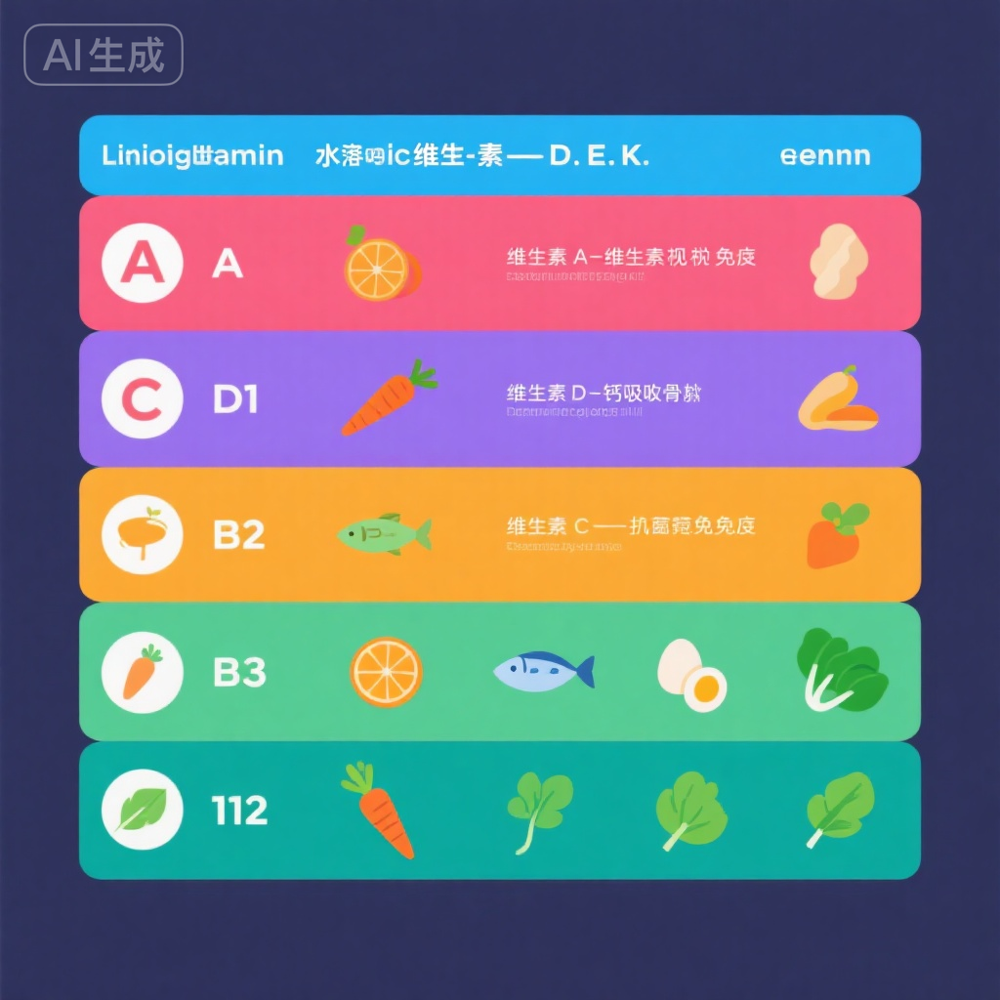

---
title: 青少年运动营养基础
description: 青少年羽毛球运动员营养指南，科学讲解碳水化合物、蛋白质、脂肪、维生素、矿物质等营养素作用，合理膳食搭配，训练期、比赛期、恢复期营养策略，助力健康成长和运动表现
keywords: ["运动营养", "青少年营养", "膳食搭配", "训练营养", "比赛营养", "恢复营养", "营养补充"]
age_group: 理论知识
training_type: 理论学习
difficulty: 基础-中级
duration: 建议分章节学习
frequency: 配合日常饮食实践
author: 青少年羽毛球训练知识库
date: 2025-11-10
---

# 青少年运动营养基础

## 学习目标

合理的营养是青少年健康成长和运动表现的基础。本文旨在：

1. **理解营养基础知识** - 掌握各种营养素的作用和来源
2. **学会膳食搭配** - 建立科学合理的日常饮食习惯
3. **掌握运动营养策略** - 了解训练前中后的营养补充
4. **优化运动表现** - 通过营养提升训练效果和比赛表现
5. **促进健康成长** - 保障青少年身体健康发育

---

## 第一章：营养素基础知识

### 1.1 三大供能营养素

#### 碳水化合物 (Carbohydrates)

**作用与重要性**:
- **主要能量来源** - 提供50-60%的日常能量
- **大脑燃料** - 大脑只能使用葡萄糖供能
- **高强度运动** - 羽毛球等爆发性运动主要依赖碳水
- **节约蛋白质** - 充足碳水避免蛋白质被分解供能

**分类**:

**简单碳水** (快速吸收):
- **糖类**: 葡萄糖、果糖、蔗糖
- **来源**: 水果、蜂蜜、糖果、运动饮料
- **特点**: 快速升高血糖，适合运动中快速补充能量
- **缺点**: 血糖波动大，不宜大量摄入

**复合碳水** (慢速吸收):
- **淀粉**: 多糖链结构
- **来源**: 米饭、面食、全麦面包、燕麦、红薯、土豆
- **特点**: 缓慢释放能量，血糖稳定
- **优点**: 持久供能，适合日常和训练前

**膳食纤维**:
- **作用**: 促进消化，控制血糖，增加饱腹感
- **来源**: 蔬菜、水果、全谷物、豆类
- **建议**: 每天25-30克

**青少年碳水需求**:
- **日常**: 5-7克/公斤体重/天
- **大强度训练期**: 7-10克/公斤体重/天
- **例子**: 50kg运动员，训练期需要350-500克碳水/天

**优质碳水来源**:
- **主食**: 糙米、全麦面包、燕麦、意大利面、荞麦面
- **薯类**: 红薯、紫薯、土豆、山药
- **杂粮**: 玉米、小米、高粱米
- **水果**: 香蕉、苹果、橙子、葡萄

#### 蛋白质 (Protein)

**作用与重要性**:
- **肌肉合成** - 运动后肌肉修复和生长
- **免疫功能** - 抗体、免疫细胞的组成成分
- **酶和激素** - 参与各种生理功能
- **生长发育** - 青少年生长的必需营养素

**优质蛋白来源**:

**动物性蛋白** (完全蛋白):
- **肉类**: 鸡胸肉、瘦牛肉、瘦猪肉、鱼肉
- **蛋类**: 鸡蛋（尤其是蛋白）
- **奶制品**: 牛奶、酸奶、奶酪
- **特点**: 氨基酸比例完整，吸收率高

**植物性蛋白** (部分不完全蛋白):
- **豆类**: 大豆、黑豆、豆腐、豆浆
- **坚果**: 杏仁、腰果、花生
- **谷物**: 藜麦、燕麦
- **特点**: 部分氨基酸不足，需搭配食用

**青少年蛋白质需求**:
- **日常**: 1.2-1.5克/公斤体重/天
- **力量训练期**: 1.6-2.0克/公斤体重/天
- **例子**: 50kg运动员，训练期需要80-100克蛋白质/天

**蛋白质摄入时机**:
- **训练后30分钟内** - 肌肉合成窗口期
- **均匀分布** - 每餐20-30克，而非一餐大量摄入
- **睡前摄入** - 夜间肌肉修复

#### 脂肪 (Fats)

**作用与重要性**:
- **能量储备** - 长时间运动的能量来源
- **激素合成** - 性激素、生长激素原料
- **脂溶性维生素吸收** - 帮助维生素A/D/E/K吸收
- **保护器官** - 内脏保护层

**分类**:

**不饱和脂肪** (健康脂肪):
- **单不饱和脂肪**: 橄榄油、花生油、牛油果、坚果
- **多不饱和脂肪**: 深海鱼（三文鱼、金枪鱼）、亚麻籽、核桃
- **Omega-3脂肪酸**: 减少炎症，促进恢复
- **建议**: 优先选择

**饱和脂肪**:
- **来源**: 肥肉、黄油、全脂奶、椰子油
- **建议**: 适量摄入，`<总能量的10%`

**反式脂肪** (不健康):
- **来源**: 油炸食品、加工食品、人造黄油
- **危害**: 增加心血管疾病风险
- **建议**: 尽量避免

**青少年脂肪需求**:
- **占总能量**: 25-30%
- **优先**: 不饱和脂肪为主
- **例子**: 50kg运动员每天需要约60-70克脂肪

### 1.2 维生素

**脂溶性维生素**:

**维生素A**:
- **作用**: 视力、免疫、生长发育
- **来源**: 胡萝卜、南瓜、菠菜、肝脏、蛋黄
- **缺乏**: 夜盲症、免疫力下降

**维生素D**:
- **作用**: 钙吸收、骨骼健康、免疫调节
- **来源**: 阳光照射、鱼肝油、蛋黄、强化牛奶
- **缺乏**: 骨骼发育不良、易骨折
- **建议**: 每天晒太阳15-20分钟

**维生素E**:
- **作用**: 抗氧化、减少运动损伤
- **来源**: 坚果、植物油、深绿色蔬菜
- **运动员**: 需求略高于普通人

**维生素K**:
- **作用**: 凝血、骨骼健康
- **来源**: 绿叶蔬菜、西兰花、卷心菜
- **缺乏**: 易出血、骨质疏松

**水溶性维生素**:

**维生素B族**:
- **B1 (硫胺素)**: 能量代谢，来源：全谷物、猪肉、豆类
- **B2 (核黄素)**: 能量代谢，来源：奶制品、鸡蛋、瘦肉
- **B3 (烟酸)**: 能量代谢，来源：肉类、鱼、坚果
- **B6**: 蛋白质代谢，来源：肉类、香蕉、土豆
- **B12**: 红细胞生成，来源：肉类、鱼、蛋、奶（植物无）
- **叶酸**: 细胞分裂、DNA合成，来源：绿叶蔬菜、豆类、橙子

**维生素C**:
- **作用**: 抗氧化、免疫、胶原蛋白合成、促进铁吸收
- **来源**: 柑橘类、猕猴桃、草莓、西兰花、辣椒
- **运动员**: 需求增加（100-200mg/天）
- **注意**: 易流失，需每天补充

### 1.3 矿物质

**宏量矿物质**:

**钙**:
- **作用**: 骨骼和牙齿、肌肉收缩、神经传导
- **来源**: 奶制品、豆制品、深绿色蔬菜、芝麻
- **青少年需求**: 1200-1500mg/天（生长发育期）
- **搭配**: 维生素D促进吸收

**镁**:
- **作用**: 能量代谢、肌肉松弛、骨骼健康
- **来源**: 坚果、全谷物、绿叶蔬菜、香蕉
- **缺乏**: 肌肉痉挛、疲劳

**钾**:
- **作用**: 水电解质平衡、心脏功能、肌肉收缩
- **来源**: 香蕉、土豆、橙汁、酸奶
- **运动**: 出汗流失，需及时补充

**钠**:
- **作用**: 水平衡、神经传导、肌肉功能
- **来源**: 盐、酱油、加工食品
- **运动**: 大量出汗时需补充

**微量矿物质**:

**铁**:
- **作用**: 血红蛋白、氧气运输、能量代谢
- **来源**:
  - **血红素铁**（吸收率高）: 红肉、猪肝、鸡肝
  - **非血红素铁**（吸收率低）: 菠菜、豆类、坚果
- **青少年女性**: 需求更高（月经期）
- **提升吸收**: 与维生素C同食

**锌**:
- **作用**: 免疫、生长、伤口愈合、蛋白质合成
- **来源**: 牡蛎、红肉、坚果、全谷物
- **运动员**: 需求增加

---

## 第二章：日常膳食搭配

### 2.1 膳食金字塔与运动员餐盘

**运动员餐盘比例**:

**碳水化合物** (40-50%):
- **主食**: 糙米、全麦面、燕麦、红薯
- **分量**: 一餐约1-1.5碗米饭（150-225克）

**蛋白质** (25-30%):
- **肉类**: 鸡胸肉、鱼肉、瘦牛肉（掌心大小×1.5）
- **蛋类**: 1-2个鸡蛋
- **豆制品**: 豆腐、豆浆

**蔬菜** (20-25%):
- **绿叶菜**: 菠菜、西兰花、油菜
- **其他**: 胡萝卜、西红柿、黄瓜
- **分量**: 每餐200-300克（约2碗）

**水果** (10-15%):
- **每天**: 2-3个中等大小水果
- **选择**: 香蕉、苹果、橙子、蓝莓

**健康脂肪**:
- **烹饪油**: 橄榄油、茶籽油
- **坚果**: 一小把（20-30克）
- **牛油果**: 半个

### 2.2 一日三餐搭配示例

**早餐** (占全天能量30%):

**示例1: 中式早餐**
- 燕麦粥（1碗）+ 鸡蛋（2个）+ 全麦面包（2片）
- 牛奶（250ml）+ 香蕉（1根）

**示例2: 西式早餐**
- 全麦吐司（2片）+ 花生酱 + 煎蛋（1个）
- 酸奶（200ml）+ 蓝莓（一小碗）+ 坚果（一小把）

**营养要点**:
- 必须包含碳水+蛋白质
- 提供上午训练能量
- 不要空腹训练

**午餐** (占全天能量40%):

**示例: 均衡午餐**
- 糙米饭（1.5碗）
- 清蒸鱼/鸡胸肉（掌心大小×1.5）
- 西兰花/菠菜（1碗）
- 胡萝卜炒木耳（半碗）
- 番茄鸡蛋汤（1碗）

**营养要点**:
- 训练日增加碳水比例
- 优质蛋白质促进恢复
- 多样化蔬菜补充维生素

**晚餐** (占全天能量30%):

**示例: 恢复晚餐**
- 紫薯/红薯（1个中等大小）或米饭（1碗）
- 瘦牛肉/三文鱼（掌心大小）
- 菠菜/油菜（1碗）
- 豆腐汤（1碗）
- 水果（1个苹果或橙子）

**营养要点**:
- 训练日增加蛋白质促进恢复
- 非训练日减少总能量
- 睡前2-3小时完成用餐

### 2.3 加餐与零食

**上午加餐** (10:00-10:30):
- 水果（香蕉、苹果）+ 坚果（一小把）
- 或: 全麦面包 + 牛奶

**下午加餐** (15:00-16:00):
- 酸奶 + 水果
- 或: 全麦饼干 + 牛奶
- 或: 能量棒（运动前）

**睡前加餐** (可选):
- 牛奶（250ml）
- 或: 酸奶 + 少量坚果
- **作用**: 夜间肌肉修复

**健康零食推荐**:
✅ 水果、坚果、酸奶、全麦面包、能量棒
❌ 薯片、糖果、碳酸饮料、油炸食品、高糖零食

---

## 第三章：训练期营养策略

### 3.1 训练前营养 (3-4小时前)

**目标**:
- 储备糖原，提供充足能量
- 避免低血糖
- 避免胃肠不适

**食物选择**:
- **碳水为主**: 米饭、面条、面包、香蕉
- **适量蛋白**: 鸡蛋、鸡胸肉、酸奶
- **低脂低纤维**: 避免消化负担

**示例**:
- 米饭（1碗）+ 鸡胸肉（掌心大小）+ 少量蔬菜
- 全麦面包（2片）+ 鸡蛋（1个）+ 牛奶（250ml）

### 3.2 训练前营养 (1小时内)

**目标**:
- 快速能量补充
- 不造成胃部不适

**食物选择**:
- **简单碳水**: 香蕉、能量棒、运动饮料、蜂蜜
- **少量**: 50-100克碳水
- **易消化**: 液体或软质食物

**示例**:
- 香蕉（1根）+ 运动饮料（250ml）
- 能量棒（1根）+ 水

### 3.3 训练中营养

**短时训练** (` 灏戜簬60分钟`):
- **补充**: 只需补水
- **水量**: 每15-20分钟100-150ml

**长时训练** (`> 60分钟`):
- **补充**: 水 + 碳水
- **运动饮料**: 含6-8%碳水浓度
- **频率**: 每15-20分钟补充

**高强度/多场比赛**:
- **能量胶**: 快速碳水补充
- **香蕉**: 中场休息时
- **电解质**: 含钠钾的运动饮料

### 3.4 训练后营养 (黄金30分钟)

**目标**:
- 补充糖原
- 修复肌肉
- 促进恢复

**营养比例**:
- **碳水:蛋白 = 3:1 或 4:1**
- **碳水**: 1-1.5克/公斤体重
- **蛋白**: 0.3-0.4克/公斤体重

**食物选择**:
- **碳水**: 白米饭、面包、香蕉、运动饮料
- **蛋白**: 鸡蛋、鸡胸肉、酸奶、乳清蛋白粉

**快速恢复餐示例**:
- 香蕉（2根）+ 酸奶（200ml）
- 白米饭（1碗）+ 鸡蛋（2个）
- 能量棒（1根）+ 巧克力牛奶（250ml）

**训练后1-2小时**:
- 正式恢复餐
- 均衡碳水、蛋白质、蔬菜

---

## 第四章：比赛期营养策略

### 4.1 赛前3天 (碳水负荷)

**碳水负荷目的**:
- 最大化肌糖原储备
- 提升比赛持久力

**方法**:
- **增加碳水**: 8-10克/公斤体重/天
- **减少训练量**: 降低消耗，促进储存
- **保持水分**: 每克糖原储存需3克水

**食物选择**:
- 米饭、面条、土豆、面包、香蕉
- 减少脂肪和纤维

### 4.2 赛前1天

**目标**:
- 维持糖原水平
- 避免胃肠不适
- 保持水分充足

**饮食原则**:
- **熟悉的食物**: 避免尝试新食物
- **易消化**: 减少油腻和高纤维
- **充足碳水**: 7-8克/公斤体重
- **适量蛋白**: 不过量

**避免**:
- 辛辣、油腻、生冷食物
- 高纤维食物（易产气）
- 大量脂肪（消化慢）

### 4.3 比赛当天

**早餐** (比赛前3-4小时):
- **碳水为主**: 白米粥、白面包、香蕉
- **少量蛋白**: 鸡蛋、牛奶
- **低脂低纤维**: 避免不适

**赛前1小时**:
- 香蕉（1根）+ 运动饮料（250ml）
- 或: 能量棒（1根）+ 水

**赛前15-30分钟**:
- 少量运动饮料（100-150ml）
- 避免固体食物

### 4.4 比赛中营养

**单场比赛间歇**:
- **补水**: 每场间歇100-200ml
- **快速碳水**: 能量胶、运动饮料
- **轻量**: 不影响下一场状态

**多场比赛**:
- **第1-2场间隙**: 运动饮料 + 香蕉/能量棒
- **午餐时段** (如有): 白米饭 + 易消化蛋白（鸡胸肉、鸡蛋）
- **下午场次间隙**: 能量胶 + 运动饮料

### 4.5 赛后恢复

**立即恢复** (30分钟内):
- 碳水:蛋白 = 3:1
- 香蕉 + 酸奶
- 或: 能量棒 + 巧克力牛奶

**赛后1-2小时**:
- 均衡恢复餐
- 高碳水 + 适量优质蛋白

---

## 第五章：水分补充

### 5.1 水分重要性

**水分功能**:
- **体温调节**: 通过出汗散热
- **营养运输**: 血液主要成分
- **关节润滑**: 关节液的组成
- **代谢废物排出**: 尿液排泄

**脱水危害**:
- **2%体重脱水**: 运动能力下降10-20%
- **5%体重脱水**: 严重影响表现，出现疲劳、头晕
- **`> 7%体重脱水**:` 危及健康

### 5.2 补水策略

**日常补水**:
- **总量**: 每天1.5-2升（约6-8杯）
- **颜色**: 尿液呈淡黄色为宜
- **分次**: 少量多次，不要一次大量

**训练前**:
- **2-3小时前**: 400-600ml
- **15-30分钟前**: 200-300ml

**训练中**:
- **频率**: 每15-20分钟
- **水量**: 100-150ml/次
- **总量**: 600-1000ml/小时

**训练后**:
- **补充量**: 体重每减少1kg，补水1.5升
- **方法**: 称体重前后对比
- **时间**: 2-4小时内补足

### 5.3 电解质补充

**出汗流失**:
- **钠**: 主要流失的电解质
- **钾**: 肌肉功能相关
- **镁**: 肌肉松弛

**运动饮料**:
- **含量**: 含钠460-1150mg/升
- **浓度**: 碳水6-8%
- **适用**: 持续运动`> 60分钟`

**自制运动饮料**:
- 水（1升）+ 食盐（1/4茶匙）+ 蜂蜜（2勺）+ 柠檬汁（半个柠檬）

---

## 第六章：营养补剂

### 6.1 是否需要补剂？

**优先原则**:
1. **食物优先**: 天然食物是最佳营养来源
2. **评估需求**: 确定是否真的缺乏
3. **专业指导**: 在教练或营养师指导下使用
4. **年龄考虑**: ` 灏戜簬16岁尽量不用补剂`

### 6.2 常见补剂

**运动营养补剂**:

**乳清蛋白粉**:
- **作用**: 快速补充蛋白质
- **使用**: 训练后难以立即进食时
- **剂量**: 20-30克/次
- **注意**: 不能替代正常饮食

**肌酸**:
- **作用**: 提升爆发力和力量
- **效果**: 科学证实有效
- **使用**: 需专业指导
- **青少年**: 一般不推荐` 灏戜簬18岁使用`

**支链氨基酸 (BCAA)**:
- **作用**: 减少肌肉分解，促进恢复
- **使用**: 长时间训练中或训练后
- **必要性**: 正常饮食蛋白质充足时不必需

**维生素矿物质补充剂**:
- **多维片**: 保险补充，非必需
- **维生素D**: 北方冬季可能需要
- **铁剂**: 女性运动员，需医生诊断后使用
- **钙片**: 奶制品摄入不足时考虑

### 6.3 禁用物质警告

::: danger 兴奋剂警告
青少年运动员绝对禁止使用兴奋剂！
:::

**禁用类别**:
- 合成代谢类固醇
- 生长激素
- 促红细胞生成素 (EPO)
- 利尿剂

**危害**:
- 健康损害（心脏、肝脏、内分泌）
- 违反体育道德
- 终身禁赛

**安全原则**:
- 使用任何补剂前咨询专业人士
- 选择可信品牌，避免污染产品
- 警惕"快速增肌"、"大幅提升表现"的产品

---

## 第七章：特殊情况营养

### 7.1 减重期营养

**健康减重原则**:
- **缓慢减重**: 每周0.5-1kg
- **保持营养**: 不要极端节食
- **维持训练**: 保持肌肉量

**营养策略**:
- **控制总能量**: 减少300-500卡/天
- **高蛋白**: 1.8-2.0克/公斤体重
- **中等碳水**: 4-6克/公斤体重
- **健康脂肪**: 0.8-1.0克/公斤体重

**避免**:
- 极低碳水饮食
- 跳餐（尤其早餐）
- 过度有氧运动

### 7.2 增重/增肌期营养

**增重原则**:
- **热量盈余**: 增加300-500卡/天
- **优质食物**: 避免垃圾食品
- **力量训练**: 配合系统力量训练

**营养策略**:
- **高碳水**: 6-8克/公斤体重
- **高蛋白**: 1.6-2.0克/公斤体重
- **足够脂肪**: 1.0-1.2克/公斤体重

**增加摄入方法**:
- 增加正餐分量
- 加餐（3-4次）
- 液体卡路里（奶昔、果汁）

### 7.3 伤病期营养

**营养支持**:
- **充足蛋白**: 促进组织修复（1.6-2.0克/公斤）
- **抗炎食物**: 深海鱼、坚果、姜黄
- **维生素C**: 促进胶原蛋白合成
- **锌**: 伤口愈合

**骨折特殊需求**:
- **钙**: 1500mg/天
- **维生素D**: 促进钙吸收
- **蛋白质**: 充足供应

---

## 第八章：实用工具与资源

### 8.1 快速营养评估

**自我评估问卷**:
1. 我每天吃3-4餐吗？ ☐ 是 ☐ 否
2. 我每餐都有碳水+蛋白+蔬菜吗？ ☐ 是 ☐ 否
3. 我每天喝够1.5-2升水吗？ ☐ 是 ☐ 否
4. 我训练后30分钟内补充营养吗？ ☐ 是 ☐ 否
5. 我避免垃圾食品和高糖饮料吗？ ☐ 是 ☐ 否

**3个以下"是"**: 营养习惯需要大幅改善
**4-5个"是"**: 营养习惯良好

### 8.2 营养日志

**记录内容**:
- 日期和时间
- 食物名称和分量
- 训练内容和强度
- 身体感受和表现

**分析要点**:
- 能量摄入是否充足
- 三大营养素比例
- 补水是否足够
- 训练表现与营养的关系

### 8.3 常见食物营养成分

**碳水化合物食物** (每100克):
- 白米饭: 116卡, 26克碳水
- 全麦面包: 247卡, 41克碳水
- 香蕉: 89卡, 23克碳水
- 红薯: 86卡, 20克碳水

**蛋白质食物** (每100克):
- 鸡胸肉: 165卡, 31克蛋白
- 鸡蛋: 155卡, 13克蛋白
- 三文鱼: 208卡, 20克蛋白
- 牛奶: 61卡, 3.2克蛋白

**脂肪食物**:
- 橄榄油: 每勺120卡, 14克脂肪
- 牛油果: 半个160卡, 15克脂肪
- 坚果: 一小把（30克）180卡, 15克脂肪

---

## 延伸阅读

1. **《运动营养学》** - 系统学习运动营养知识
2. **《青少年运动员营养指南》** - 针对青少年的营养建议
3. **《中国居民膳食指南》** - 了解基础营养知识

---

## 专业术语表

- **糖原 (Glycogen)** - 碳水化合物在肌肉和肝脏中的储存形式
- **氨基酸 (Amino Acids)** - 蛋白质的组成单位
- **电解质 (Electrolytes)** - 钠、钾、镁等矿物质离子
- **脱水 (Dehydration)** - 体液流失导致的水分不足
- **碳水负荷 (Carbohydrate Loading)** - 赛前增加碳水摄入以最大化糖原储备
- **恢复窗口期 (Recovery Window)** - 训练后30-60分钟营养吸收最佳时期

---

**营养提示**: 营养是运动表现的基础！良好的营养习惯不仅提升运动表现，更重要的是促进健康成长。从今天开始，建立科学的饮食习惯！🍎🥗🏸
