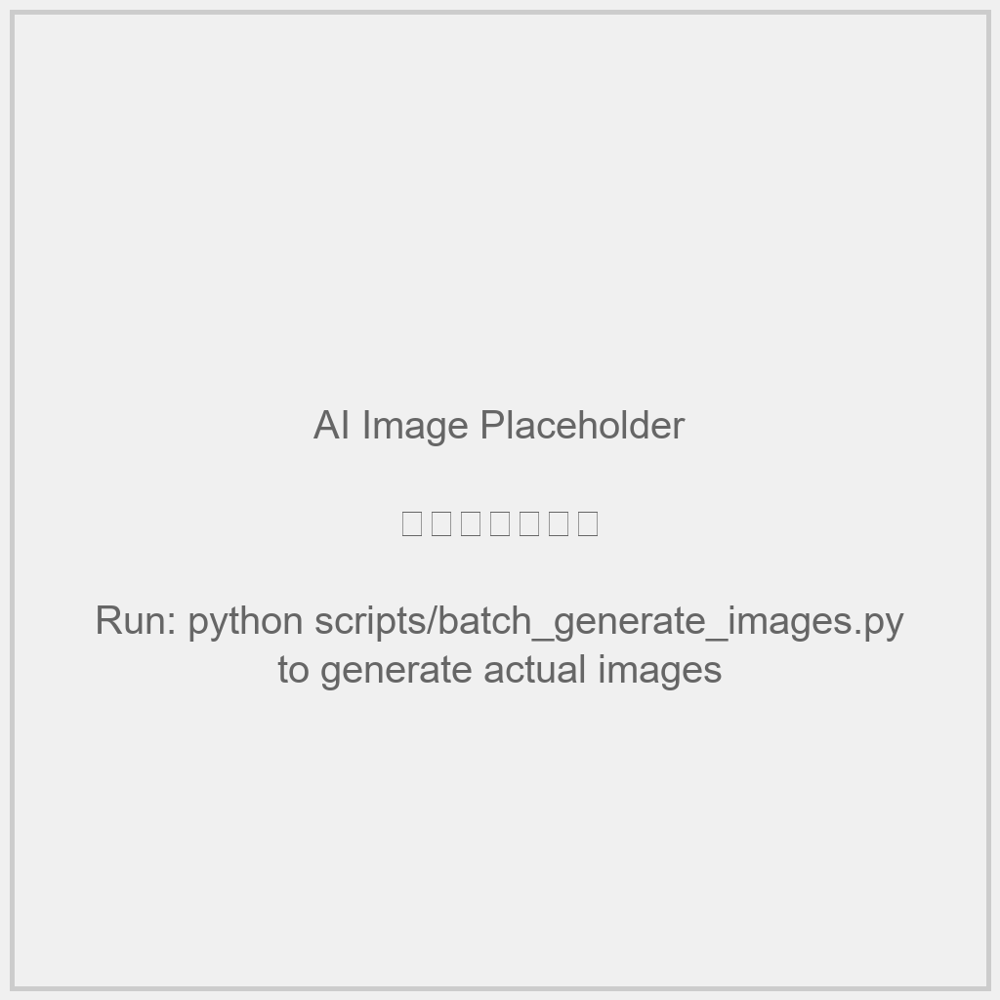

# 羽毛球技术原理详解 | Badminton Technique Principles

## 学习目标 | Learning Objectives

理解技术背后的科学原理能够帮助你更好地掌握和优化技术。本文旨在：

1. **理解力学原理** - 掌握力、速度、旋转等基本物理概念在羽毛球中的应用
2. **掌握生物力学** - 了解人体运动链、发力顺序、能量传递等生理机制
3. **明白击球原理** - 理解不同击球技术的科学原理和优化方法
4. **应用于实践** - 将理论知识运用到训练和比赛中，提升技术水平

---

## 第一章：基础力学原理

### 1.1 力的三要素

**力的大小 (Magnitude)**:
- **定义**: 力量的强弱程度
- **羽毛球应用**:
  - 杀球需要更大的力
  - 放网需要较小的力
  - 力的大小影响球速和飞行距离

**力的方向 (Direction)**:
- **定义**: 力作用的指向
- **羽毛球应用**:
  - 杀球向下的力产生下压
  - 高远球向上的力产生抛物线
  - 推球水平的力产生平飞

**力的作用点 (Point of Application)**:
- **定义**: 力作用的具体位置
- **羽毛球应用**:
  - 击球点影响球路
  - 拍面触球位置影响旋转
  - 作用点偏离中心产生偏转

**实战应用**:
- **杀球**: 大力量 + 向下方向 + 球托中心作用点 = 快速下压
- **吊球**: 中等力量 + 斜向下方向 + 球托底部作用点 = 过网即落
- **搓球**: 小力量 + 切削方向 + 球托边缘作用点 = 旋转翻滚

### 1.2 速度与加速度

**速度 (Velocity)**:
- **定义**: 单位时间内位移的大小
- **羽毛球最快速度**: 杀球可达493 km/h（世界纪录）
- **影响因素**:
  - 发力大小
  - 挥拍速度
  - 击球点位置

**加速度 (Acceleration)**:
- **定义**: 单位时间内速度的变化量
- **羽毛球应用**:
  - 启动加速度 - 从静止到快速移动
  - 挥拍加速度 - 从后引到击球的加速
  - 急停加速度 - 快速移动到突然停止

**鞭打效应**:
- **原理**: 身体各部分依次加速，最终将速度传递到拍头
- **顺序**: 腿部蹬地 → 腰部转动 → 肩部前送 → 上臂加速 → 前臂加速 → 手腕爆发
- **效果**: 拍头速度远大于身体移动速度

### 1.3 动量与冲量

**动量 (Momentum)**:
- **公式**: 动量 = 质量 × 速度
- **羽毛球应用**:
  - 球拍质量×挥拍速度 = 击球动量
  - 动量越大，击球力量越大

**冲量 (Impulse)**:
- **公式**: 冲量 = 力 × 作用时间
- **羽毛球应用**:
  - **杀球**: 大力短时间作用 → 爆发力
  - **高远球**: 中等力量较长时间作用 → 远距离
  - **放网**: 小力量极短时间 → 柔和控制

---

## 第二章：生物力学原理

### 2.1 人体运动链

**开放式运动链**:
- **定义**: 远端（如手臂）可自由移动
- **羽毛球应用**: 所有击球动作都属于开放式运动链
- **特点**: 远端速度最大，控制难度较高

**能量传递原则**:
1. **近端到远端** - 从腿部到手腕逐级传递
2. **大肌群到小肌群** - 从大腿到手指逐级细化
3. **慢到快** - 基础速度逐级加速到最终爆发

**正手高远球运动链**:
1. **腿部蹬地** (40%) - 提供基础动力
2. **腰部转体** (30%) - 传递旋转力量
3. **肩部前送** (15%) - 增加挥拍幅度
4. **前臂加速** (10%) - 加快挥拍速度
5. **手腕爆发** (5%) - 最终击球爆发

### 2.2 肌肉收缩类型

**向心收缩 (Concentric)**:
- **定义**: 肌肉缩短同时产生力量
- **羽毛球应用**:
  - 挥拍击球时的手臂收缩
  - 起跳时的腿部收缩

**离心收缩 (Eccentric)**:
- **定义**: 肌肉拉长同时控制力量
- **羽毛球应用**:
  - 落地缓冲时的腿部控制
  - 后引动作的肌肉拉伸

**等长收缩 (Isometric)**:
- **定义**: 肌肉长度不变但产生力量
- **羽毛球应用**:
  - 准备姿势的核心稳定
  - 击球瞬间的握拍控制

**拉伸-缩短周期 (SSC)**:
- **原理**: 肌肉先被拉长（储能）再快速收缩（释能）
- **羽毛球应用**:
  - 后引动作拉伸肌肉
  - 挥拍动作快速收缩
  - **效果**: 产生更大的爆发力

### 2.3 杠杆原理

**人体杠杆系统**:
- **支点**: 关节
- **动力臂**: 肌肉附着点到关节的距离
- **阻力臂**: 负荷（如球拍）到关节的距离

**前臂杠杆**:
- **肘关节** 为支点
- **肱二头肌** 提供动力
- **球拍** 作为阻力
- **原理**: 增加阻力臂长度（球拍延长）会增加旋转半径，提高拍头速度

**手腕杠杆**:
- **腕关节** 为支点
- **前臂肌群** 提供动力
- **手指控制** 调整力的方向
- **应用**: 网前技术主要靠手腕杠杆完成

---

## 第三章：击球技术原理

### 3.1 击球力量来源

**地面反作用力**:
- **原理**: 蹬地时地面给予的向上推力
- **贡献**: 约占总力量的30-40%
- **优化**: 强化腿部力量，提升蹬地效率

**核心旋转力**:
- **原理**: 腰腹核心的旋转带动上肢
- **贡献**: 约占总力量的25-30%
- **优化**: 加强核心力量训练

**上肢挥拍力**:
- **原理**: 肩、臂、腕依次发力
- **贡献**: 约占总力量的30-35%
- **优化**: 提升上肢协调性和爆发力

**握拍调整力**:
- **原理**: 击球瞬间手指收紧增加力量传递
- **贡献**: 约占总力量的5-10%
- **优化**: 练习放松-收紧的节奏

### 3.2 高远球原理

**抛物线运动**:
- **初速度**: 击球时给予球的速度
- **角度**: 击球角度决定抛物线高度和远度
- **最佳角度**: 约45-50度角（综合高度和距离）

**能量转换**:
- **动能→势能**: 球向上飞行，速度转化为高度
- **势能→动能**: 球下落时，高度转化为速度
- **损失**: 空气阻力和球的形变造成能量损失

**击球要点**:
1. **击球点要高** - 减少能量损失，增加初速度
2. **发力要充分** - 利用全身运动链
3. **拍面角度** - 略仰角，给球向上和向前的分力

### 3.3 杀球原理

**下压力学**:
- **角度**: 向下的击球角度产生下压力
- **速度**: 高速度使球快速穿越空间
- **旋转**: 顶旋增强下落速度

**最大速度点**:
- **位置**: 击球点应在身体前上方最高点
- **原因**: 最高点时挥拍速度达到最大
- **效果**: 产生最快的杀球速度

**跳杀额外力量**:
- **腾空高度** - 增加下压角度
- **落地冲击** - 身体重量参与发力
- **时机把握** - 最高点击球

### 3.4 网前搓球原理

**摩擦与旋转**:
- **摩擦力**: 拍面与球托的切向力产生旋转
- **旋转方向**: 侧旋或下旋
- **效果**: 球翻滚过网，落点更靠近网前

**贴网原理**:
- **小力量**: 给球较小的初速度
- **短距离**: 球刚过网就开始下落
- **旋转控制**: 旋转帮助球快速下落

**角度控制**:
- **拍面斜向上**: 球向上翻过网
- **切削角度**: 45-60度斜切球托底部
- **手指微调**: 击球瞬间手指调整拍面

---

## 第四章：旋转原理

### 4.1 旋转类型

**顶旋 (Topspin)**:
- **旋转方向**: 球向前滚动
- **效果**: 增强下落力，球落地后弹起
- **应用**: 杀球带顶旋，增加下压效果

**下旋 (Backspin)**:
- **旋转方向**: 球向后滚动
- **效果**: 减缓前进速度，球落地后不弹
- **应用**: 网前放网、切球

**侧旋 (Sidespin)**:
- **旋转方向**: 球左右旋转
- **效果**: 球飞行轨迹产生侧向偏移
- **应用**: 网前搓球、勾对角

### 4.2 旋转的物理原理

**马格努斯效应 (Magnus Effect)**:
- **原理**: 旋转的球产生不对称气流，形成侧向力
- **公式**: 侧向力 ∝ 旋转速度 × 球速
- **羽毛球应用**:
  - 顶旋使球快速下落
  - 侧旋使球横向偏移
  - 下旋使球飘浮悬停

**旋转产生方法**:
1. **切削击球** - 拍面斜向切过球托
2. **摩擦击球** - 增加拍面与球的接触时间
3. **手腕发力** - 手腕快速旋转带动拍面

### 4.3 旋转在技术中的应用

**网前搓球旋转**:
- **目标**: 球旋转翻滚过网，贴网下落
- **方法**: 拍面斜向上切削球托底部
- **旋转**: 下旋+侧旋混合

**吊球旋转**:
- **目标**: 球快速下落，不给对手反应时间
- **方法**: 击球时带顶旋
- **效果**: 球过网后快速下落

---

## 第五章：能量与功率

### 5.1 能量系统

**磷酸原系统 (ATP-PC)**:
- **供能时间**: 0-10秒
- **特点**: 爆发力强，恢复快
- **羽毛球应用**: 杀球、扑球、快速启动
- **训练**: 短时间高强度间歇训练

**乳酸系统**:
- **供能时间**: 10秒-2分钟
- **特点**: 高强度，产生乳酸
- **羽毛球应用**: 长回合对抗（20-30秒回合）
- **训练**: 多球训练、高强度对抗

**有氧系统**:
- **供能时间**: 2分钟以上
- **特点**: 持久，恢复慢
- **羽毛球应用**: 整场比赛的基础体能
- **训练**: 长跑、游泳、自行车

**能量转换**:
- **化学能** (食物) → **肌肉收缩能** → **动能** (击球) → **球的动能** (飞行)
- **效率**: 人体运动效率约20-25%，大部分转化为热量

### 5.2 功率输出

**功率 (Power)**:
- **公式**: 功率 = 功 / 时间
- **羽毛球应用**: 短时间内输出最大力量
- **训练**: 爆发力训练（跳跃、短冲刺、爆发性挥拍）

**峰值功率与平均功率**:
- **峰值功率**: 杀球瞬间的最大功率
- **平均功率**: 整场比赛的平均输出
- **平衡**: 既要峰值高，也要平均功率稳定

---

## 第六章：空气动力学

### 6.1 羽毛球独特的飞行特性

**羽毛球 vs 其他球类**:
- **减速最快**: 羽毛球减速达80%（初速度300km/h → 60km/h）
- **原因**: 羽毛球16根羽毛产生巨大空气阻力
- **影响**: 击球力量和时机要求极高

**空气阻力**:
- **公式**: 阻力 ∝ 速度²
- **含义**: 速度越快，阻力增加越明显
- **应用**: 杀球初速度快但很快减速，需要提前判断

**飞行稳定性**:
- **锥形设计**: 羽毛球头重尾轻，保持头朝前飞行
- **羽毛作用**: 16根羽毛形成稳定气流
- **影响**: 羽毛球飞行轨迹相对稳定

### 6.2 不同击球的飞行轨迹

**高远球抛物线**:
- **特点**: 高弧线，落点后场底线
- **物理**: 抛物线运动，重力主导
- **能量**: 动能→势能→动能转换

**杀球直线**:
- **特点**: 低弧线，快速下压
- **物理**: 近似直线运动，向下分力大
- **能量**: 高速动能，快速减速

**吊球急落**:
- **特点**: 过网后快速下落
- **物理**: 抛物线顶点在网附近
- **能量**: 动能较小，重力主导下落

---

## 第七章：实战应用与优化

### 7.1 技术优化思路

**基于原理优化**:

**优化步骤**:
1. **理解原理** - 明白技术背后的"为什么"
2. **分析动作** - 找出不符合原理的地方
3. **针对性改进** - 调整动作使其符合科学原理
4. **验证效果** - 通过训练验证改进效果

**案例: 优化杀球力量**
1. **原理**: 鞭打效应，运动链传递
2. **分析**: 检查是否全身参与，有无环节中断
3. **改进**:
   - 加强腿部蹬地
   - 增加腰部旋转幅度
   - 优化手腕爆发时机
4. **验证**: 测量杀球速度提升

### 7.2 常见错误的原理解释

**错误1: 杀球无力**
- **原因**: 只用手臂发力，未利用运动链
- **原理**: 违反了能量传递原则
- **改正**: 从腿部开始发力，逐级传递

**错误2: 网前放网不贴网**
- **原因**: 发力过大或拍面角度不对
- **原理**: 冲量过大，角度偏离
- **改正**: 减小力量，调整拍面斜向上

**错误3: 高远球打不远**
- **原因**: 击球点低，力量传递效率低
- **原理**: 击球点影响能量利用效率
- **改正**: 提高击球点，充分伸展

### 7.3 科学训练建议

**针对性训练**:
- **力量训练**: 提升肌肉最大力量和爆发力
- **速度训练**: 提高挥拍速度和移动速度
- **柔韧性训练**: 增加关节活动范围，提高动作幅度
- **协调性训练**: 优化运动链，提高能量传递效率

**技术与理论结合**:
- 每次训练后思考技术背后的原理
- 遇到技术问题时从原理角度分析
- 观看优秀运动员视频，分析其技术符合哪些原理

---

## 第八章：科学测量与评估

### 8.1 运动学测量

**速度测量**:
- **击球速度**: 使用雷达测速仪
- **移动速度**: 使用光电计时系统
- **挥拍速度**: 使用高速摄像分析

**力量测量**:
- **最大力量**: 使用等速测力系统
- **爆发力**: 使用纵跳测试、立定跳远
- **握力**: 使用握力计

### 8.2 运动捕捉技术

**高速摄像分析**:
- **帧率**: 240-1000 fps
- **分析内容**:
  - 身体各部位速度和加速度
  - 运动链传递效率
  - 击球瞬间拍面角度

**三维动作捕捉**:
- **技术**: 多相机系统，红外标记点
- **数据**: 关节角度、速度、加速度
- **应用**: 精确分析动作细节，优化技术

---

## 延伸阅读 | Further Reading

1. **《运动生物力学》** - 深入学习人体运动力学
2. **《羽毛球技术分析》** - 专业技术原理解析
3. **《运动物理学》** - 运动中的物理原理

---

## 专业术语表 | Glossary

- **鞭打效应 (Whip Effect)** - 身体各部分依次加速，将速度传递到末端
- **运动链 (Kinetic Chain)** - 身体各部位协同运动的系统
- **拉伸-缩短周期 (SSC)** - 肌肉先拉伸再快速收缩产生更大力量
- **马格努斯效应 (Magnus Effect)** - 旋转物体在流体中产生侧向力
- **冲量 (Impulse)** - 力与作用时间的乘积
- **动量 (Momentum)** - 质量与速度的乘积

---

**学习提示**: 理论知识需要与实践结合。每次训练时，思考自己的动作是否符合这些原理，遇到技术问题时从原理角度分析原因。理解"为什么"能帮助你更好地掌握"怎么做"！📚🏸
